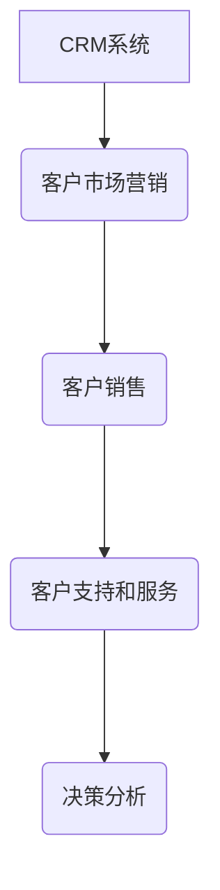

# 客户关系管理

## 是什么

客户关系管理是利用互联网技术协调企业与顾客在销售、营销和服务上的交互，提升管理方式，向客户提供个性化的客户交互服务的过程。提高了企业的核心竞争力。

是企业信息化的核心。

> 简而言之，CRM就是利用互联网技术为每一位客户提供个性化交互服务的过程。

最终目标是：

1. 增加市场份额：抓住新用户，保留老用户
2. 提高客户满意度、忠诚度：将老用户转化成忠实用户
3. 提高企业运行效率

## 系统功能

CRM系统应该能够实现对市场营销、销售、客户服务和支持的全面管理，能够实现客户基本数据的记录、跟踪、客户订单的流程追踪，客户市场的划分和趋势研究，以及对客户服务支持情况的分析，在一定程度上实现业务流程的自动化。也即能够追踪客户的整个生命周期。

### 1. 客户市场营销管理子系统

客户市场管理子系统能够提供完整的潜在客户的活动、事件等信息，从而使寻找潜在客户的工作效率更高、更加合理化。

### 2. 客户销售管理子系统

客户销售管理子系统能够快速获取和管理日常销售信息，能够为销售人员提供流畅、直观的工作流功能，跟踪和预测客户行为，同时保证每个客户都有机会和每个销售能够进行完全的沟通（如果一个跟进销售离职，接手的销售能够立刻获取最新的客户行为信息）。

### 3. 客户支持和服务管理子系统

客户支持和服务管理子系统能够将客户支持人员和销售、市场紧密的结合在一起，可以综合获取关键客户信息，并管理日常的客户服务活动和任务，在解决客户问题的同时，快速高效的存取关键客户管理信息。

## 系统分类

### 1. 分析型CRM

一般用于对客户进行分析。数据来源是各种系统交易数据或者计费信息，数据极为精准可靠。对客户进行分类，比如招商银行的金葵花卡对不同的客户进行不同的管理模式。

作用：输出数据，帮助销售人员来进行管理。

### 2. 操作性CRM

操作型CRM，数据来自于操作人员的手动录入，会存在数据不准确的情况，比如手动录入的名字填写错误。

### 总结

分析型CRM在大型企业应用的非常成功，是企业中非常重要的核心系统；

操作性CRM失败率非常非常的高。

## 问题

那么问题来了。

1. 如何才能够利用互联网技术为每一个客户提供个性化的交互服务呢？
2. 什么样的个性化交互服务才能够最大化的实现最终目标？

# 如何实现一个CRM系统

