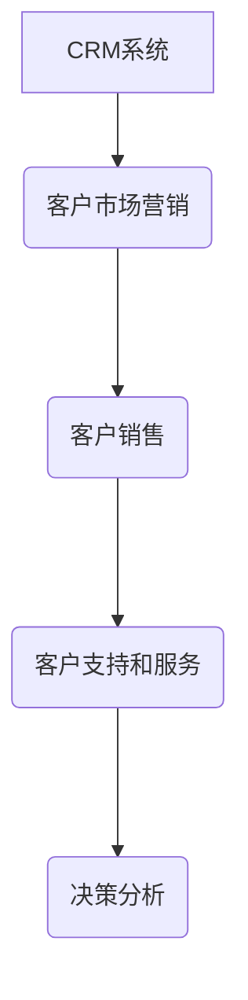

# 客户关系管理

## 是什么

客户关系管理是利用互联网技术协调企业与顾客在销售、营销和服务上的交互，提升管理方式，向客户提供个性化的客户交互服务的过程。提高了企业的核心竞争力。

是企业信息化的核心。

> 简而言之，CRM就是利用互联网技术为每一位客户提供个性化交互服务的过程。

最终目标是：

1. 增加市场份额：抓住新用户
2. 保留老用户：将老用户转化成忠实用户
3. 提高企业运行效率

## 系统功能

CRM系统应该能够实现对市场营销、销售、客户服务和支持的全面管理，能够实现客户基本数据的记录、跟踪、客户订单的流程追踪，客户市场的划分和趋势研究，以及对客户服务支持情况的分析，在一定程度上实现业务流程的自动化。也即能够追踪客户的整个生命周期。

### 1. 客户市场营销管理子系统

客户市场管理子系统能够提供完整的潜在客户的活动、事件等信息，从而使寻找潜在客户的工作效率更高、更加合理化。

### 2. 客户销售管理子系统

客户销售管理子系统能够快速获取和管理日常销售信息，能够为销售人员提供流畅、直观的工作流功能，跟踪和预测客户行为，同时保证每个客户都有机会和每个销售能够进行完全的沟通（如果一个跟进销售离职，接手的销售能够立刻获取最新的客户行为信息）。

### 3. 客户支持和服务管理子系统

客户支持和服务管理子系统能够将客户支持人员和销售、市场紧密的结合在一起，可以综合获取关键客户信息，并管理日常的客户服务活动和任务，在解决客户问题的同时，快速高效的存取关键客户管理信息。

## 系统类型

### 1. 运营型CRM

运营型CRM系统又称为操作型CRM系统。它面向的是营销、销售和服务等一线和前台的工作。它要求所有业务流程化自动化。它主要解决所有“以客户为中心”所带来的一系列问题，包括：销售信息管理、销售信息分析、销售过程定制、销售过程监控、销售预测功能、营销活动的环境分析、信息管理、计划预算、项目追踪、成本核算、回报预测、营销效果评估、客户服务请求、以及投诉反映机制的建立、分配、解决、跟踪、反馈和回访等。

改善和客户的接触流程，提高工作效率，使客户满意。

### 2. 分析型CRM

分析型CRM系统不需要直接和客户打交道，作用是分析理解发生在前台的客户活动，从运营型CRM系统所产生的大量交易数据中提取有价值的各种信息，为企业的经营管理提供量化的决策依据。

针对企业的特定业务主题，设计相应的数据库模型。提高决策效率和成功度。

### 3. 协作型CRM

协作型CRM由呼叫中心、传真信件、电子邮件、web站点、现场接触等服务共同组成。由服务人员和客户共同参与，是协作关系，这个要求服务人员能够快速记录客户请求并找到问题的答案，如果找不到，则该系统必须支持智能升级处理，及时做出任务转发的决定。

### 总结

运营型和协作型CRM系统解决内部工作效率以及交易数据采集问题；

分析型CRM系统具备信息分析能力，对于企业来说是最具有价值的。

## 问题

那么问题来了。

1. 如何才能够利用互联网技术为每一个客户提供个性化的交互服务呢？
2. 什么样的个性化交互服务才能够最大化的实现最终目标？

# 如何实现一个CRM系统

## 系统实体

### 一、线索

### 二、客户

### 三、联系人

### 四、产品

### 五、商机

### 六、合同

### 七、回款

### 八、商业智能（BI）

#### 客户画像分析

#### 销售漏斗分析

#### 员工业绩分析

#### 员工客户分析

#### 产品分析

## 实体流转

市场营销探索市场，导入一切或多或少有意向的企业，这些企业就是线索，每一个线索都应该有一个或多个联系人。将线索导入线索池中，进行分发给不同的销售，这个线索就成了对应销售的客户。销售对每一个客户进行跟进联系，如果给定期限内不进行联系就会收回该客户到公海中，所有销售都能够进行打捞这个线索。

# 业界产品案例

[悟空软件](https://gitee.com/wukongcrm/72crm)

[ZOHO](https://www.zoho.com.cn/)

[SALESFORCE](https://www.salesforce.com/cn/crm/)

[简信软件](http://www.crm.cc/)

# 资料

[CRM项目实战（一）：概念和业务篇](http://www.woshipm.com/pmd/1909335.html)

[CRM项目实战（二）：获取客户篇](http://www.woshipm.com/pd/1912623.html)

[CRM项目实战（三）：从0到1构建用户画像](http://www.woshipm.com/pd/2085106.html)

[CRM项目实战（四）：零售行业的几个核心商业逻辑](http://www.woshipm.com/it/2156137.html)

[MBA-客户关系管理](https://wiki.mbalib.com/wiki/Customer_Relationship_Management)

