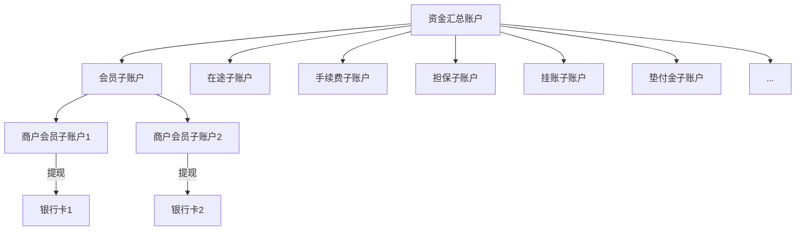

# 概念

## 清算中的D0、D1、T0、T1

D即Day，表示自然日，不区分节假日。

T即Trade，表示交易日，区分节假日。

明白上述两个概念之后，我们就能够明白D0、D1、T0、T1的含义了。

1. D0：自然日当天清算
2. D1：次日清算
3. T0：交易日当天清算。
4. T1：次日或者下一个工作日清算。

# 账户体系

# 模块

## 支付

### 快捷支付

### 网银支付

### 支付宝

#### 正扫-H5

#### 正扫-APP

#### 反扫

### 微信

#### 正扫-H5

#### 正扫-APP

#### 反扫

## 充值转账

## 清算

## 对账

## 提现

### 代扣

