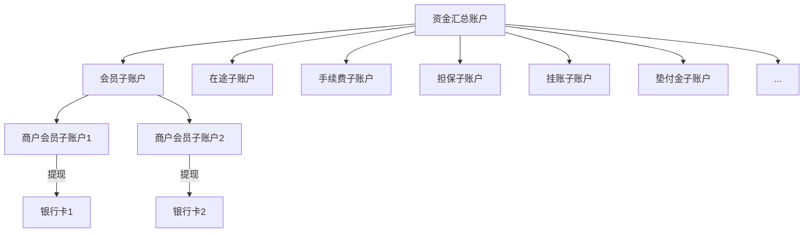

# 规则

1. 同一家公司既当渠道商，又当特约商户是违规的

# 概念

## 清算中的D0、D1、T0、T1

D即Day，表示自然日，不区分节假日。

T即Trade，表示交易日，区分节假日。

明白上述两个概念之后，我们就能够明白D0、D1、T0、T1的含义了。

1. D0：自然日当天清算
2. D1：次日清算
3. T0：交易日当天清算。
4. T1：次日或者下一个工作日清算。

## 复式记账法

- 为什么使用复式记账法？
  - 为了如实反映资金运动的来龙去脉
- 在借贷复式记账法中，账户在哪个方面登记增加或者减少取决于账户性质和所记录经济业务

资产成本类科目：借方登记增加数，贷方登记减少数

负债权益类科目：借方登记减少数，贷方登记增加数

损益类科目：属于收入登记在贷方，表示收入增加数；属于费用登记在借方，表示费用增加数

# 账户体系

# 模块

## 支付

### 快捷支付

### 网银支付

### 支付宝

#### 正扫-H5

#### 正扫-APP

#### 反扫

### 微信

#### 正扫-H5

#### 正扫-APP

#### 反扫

## 充值转账

## 清算

## 对账

## 提现

### 代扣

