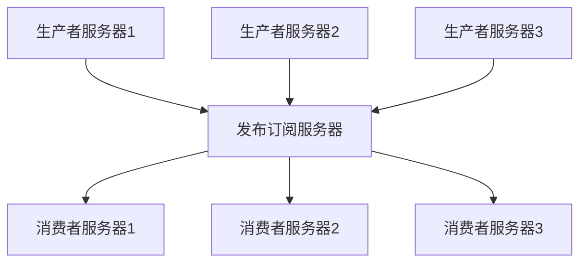

# 概览

数据为企业发展提供了基础。有了数据，就需要对数据进行分析，从而掌握更精准的信息。传统的面向用户的应用通常都是OLTP应用，采用的关系型数据库，不适合数据分析。因此需要对数据进行迁移，将数据从数据源头迁移到用以支持数据分析的地方。这就涉及到数据迁移的问题。而这个迁移的速度越快，对原有应用影响最小，就能够让专注于核心业务。

因此，在以数据为驱动力的企业，数据管道会成为一个关键性组件。如何移动数据变得和数据本身一样重要。

比如：当用户浏览淘宝网站上的商品时，后台会保存浏览记录，并对其进行分析处理，分析得出当前用户感兴趣的相关商品，并同步到商品推荐展示给用户。

**提取关键字：移动数据、数据管道、数据分析**


## 发布订阅消息系统是什么

在了解Kafka之前我们首先来了解下什么是发布订阅消息系统。

发布订阅消息系统就是消息生产者将消息进行分类并发布到一个统一的broker中，然后消费者订阅该消息并进行消费。这整个就是发布订阅消息系统。

**提取关键字：发布者、订阅者、broker**




## Kafka是什么以及做到了什么

Kafka就是一款分布式消息发布订阅系统，又被称为"分布式流处理平台"。Kafka的数据是按照一定的顺序持久化保存的，可以按需读取。


### 消息和批次


### 模式


### 主题和分区


### 生产者和消费者


### broker和集群


### 多集群


### Kafka的应用场景

- 日志收集
- 行为跟踪（结合Zipkin，实现链路追踪）


## 为什么使用Kafka


# 安装

 ```shell
wget http://mirror.bit.edu.cn/apache/kafka/2.2.0/kafka_2.11-2.2.0.tgz
tar -zxvf kafka_2.11-2.2.0.tgz
cd kafka_2.11-2.2.0
mkdir log
cd kafka_2.11-2.2.0/config
# 配置server.properties中的log路径和zookeeper路径
vim server.properties
cd ~/Documents/software/kafka_2.11-2.2.0
# 启动。Kafka默认占用9092端口
sh kafka-server-start.sh ../config/server.properties &
 ```


# 应用


# 原理

