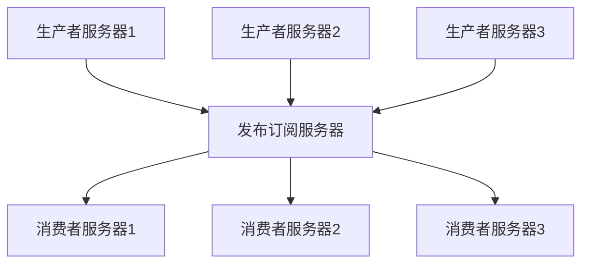

# 一、概览

数据为企业发展提供了基础。有了数据，就需要对数据进行分析，从而掌握更精准的信息。传统的面向用户的应用通常都是OLTP应用，采用的关系型数据库，不适合数据分析。因此需要对数据进行迁移，将数据从数据源头迁移到用以支持数据分析的地方。这就涉及到数据迁移的问题。而这个迁移的速度越快，对原有应用影响最小，就能够让专注于核心业务。

因此，在以数据为驱动力的企业，数据管道会成为一个关键性组件。如何移动数据变得和数据本身一样重要。

比如：当用户浏览淘宝网站上的商品时，后台会保存浏览记录，并对其进行分析处理，分析得出当前用户感兴趣的相关商品，并同步到商品推荐展示给用户。

**提取关键字：移动数据、数据管道、数据分析**


## 发布订阅消息系统是什么

在了解Kafka之前我们首先来了解下什么是发布订阅消息系统。

发布订阅消息系统就是消息生产者将消息进行分类并发布到一个统一的broker中，然后消费者订阅该消息并进行消费。这整个就是发布订阅消息系统。

**提取关键字：发布者、订阅者、broker**




## Kafka是什么以及做到了什么

Kafka就是一款分布式消息发布订阅系统，又被称为"分布式流处理平台"。Kafka的数据是按照一定的**顺序持久化保存**的，可以按需读取。

### 消息和批次

Kafka中的最小数据单元就是**消息**。每一条消息就像是关系型数据库中的一条记录或者数据行。对kafka而言，消息并没有特殊的数据格式或者含义，任何消息都以字节数组的形式顺序存储。消息的键也是字节数组存储。当消息被存储到不同的分区的时候，会根据这个键产生一个哈希值，并取模分配存储到对应的分区。这样保证一样的key一定在同一个分区。

为了提高效率，消息会被分批次写入到kafka。一个批次就是一组消息。批次越大，消息越多，单位时间内存储的消息越多，单个消息传输的网络时长越久。批次数据会被压缩，可以提高数据的传输和存储能力，但会增加计算。


### 模式

对于kafka而言，消息是字节数组，晦涩难懂。因此根据应用程序的需求，用了一些额外的结构来定义了消息内容，让其便于理解，方便我们理解kafka的消息结构。


### 主题、分区以及流式处理

kafka的消息通过**主题**进行分类。kafka的主题就类似mysql中的表，用来存储消息记录。主题可以分成若干个**分区**。无法保证消息在主题范围内的顺序，但可以保证消息在单个分区内的顺序。只要消息在一个分区内，就能够保证起顺序性。消息的顺序是先入先出的顺序读取。

分区的存在是为了提高数据的伸缩性。同个主题的分区可以分布在不同的服务器中，也就是说一个主题横跨多个服务器，以此来提升应用性能。


我们通常会使用**流**来形容kafka这类系统的数据。很多时候，人们把一个主题上的数据看成一个流，不论其有几个分区。**流是一组从生产者移动到消费者的数据。**当我们讨论**流式处理**时，一般都是这样描述消息的。kafka streams、apache samza和storm都是以**实时**的方式处理消息，也就是所谓的**流式处理**。


### 生产者和消费者

**生产者**创建消息。生产者又被称为**发布者**。一般情况下，一个消息会被发布到一个特定的主题上。生产者默认情况下会把消息均衡地分布到主题的所有分区上，而并不关心特定消息会被写到哪个分区。在某些情况下，生产者会把消息直接写到指定的分区。这通常是通过**消息键**和**分区器**来实现的，分区器为键生成一个哈希值，并将其映射到指定的分区上。这样可以保证包含同一个键的消息会被写到同一个分区上。生产者可以使用自定义的分区器，根据不同的业务规则将消息映射到分区。

**消费者**读取消息。消费者又被称为**订阅者**。消费者可以订阅一个或多个主题，并按照消息生成的顺序读取。消费者通过检查消息的**偏移量**判断是否读取过消息。**偏移量**是一种元数据，是不断递增的整数值，在创建消息时，kafka会把它添加到消息中。在给定的分区里，每个消息的偏移量都是唯一的。消费者把每个分区最后读取的消息偏移量保存到zookeeper或者kafka上，如果消费者关闭或者重启，他的读取状态不会丢失。

消费者是**消费者群组**的一部分，会有一个或者多个消费者共同读取一个主题。群组保证每个分区只能被一个消费者使用。消费者和分区之间的映射关系被称为消费者对分区的**所有权关系**。如下图所示：


### broker和集群

一个独立的kafka服务器被称为**broker**。broker接收来自生产者的消息，为消息设置偏移量，并提交消息到磁盘保存。broker为消费者提供服务，对读取分区的请求作出响应，返回已经提交到磁盘上的消息。单个broker可以轻松处理数千个分区以及每秒百万级的消息量。

broker是**集群**的组成部分。每个集群都有一个broker同时充当**集群控制器**的角色（自动从集群的活跃成员中选举出来）。控制器负责管理工作，包括将分区分配给broker和监控broker。在集群中，一个分区从属于一个broker，该broker被称为分区的**首领**。一个分区可以分配给多个broker，这个时候会发生分区复制。这种肤质机制为分区提供了消息冗余，如果一个broker失效，其他broker就可以接管领导权。相关的消费者和生产者都要重新连接到新的首领。


**保留消息**是kafka的一个重要特性。kafka默认消息保留策略：要么保留一段时间（比如7天），要么保留到消息达到一定大小的字节数（比如1G）。当消息数量达到上限时，旧消息就会过期并被删除。主题可以配置自己的保留策略。

### 多集群


### Kafka的应用场景

- 日志收集
- 异步通信
- 记录用户行为（结合Zipkin，实现链路追踪）


## 为什么使用Kafka


## 安装

 ```shell
wget http://mirror.bit.edu.cn/apache/kafka/2.2.0/kafka_2.11-2.2.0.tgz
tar -zxvf kafka_2.11-2.2.0.tgz
cd kafka_2.11-2.2.0
mkdir log
cd kafka_2.11-2.2.0/config
# 配置server.properties中的log路径和zookeeper路径
vim server.properties
cd ~/Documents/software/kafka_2.11-2.2.0
# 启动。Kafka默认占用9092端口
sh kafka-server-start.sh ../config/server.properties &
 ```


# 二、生产者


# 三、消费者


# 四、深入kafka


# 五、可靠的数据传递


# 六、构建数据管道


# 七、跨集群数据镜像


# 八、管理kafka


# 九、监控kafka


# 十、流式处理


# 附录


