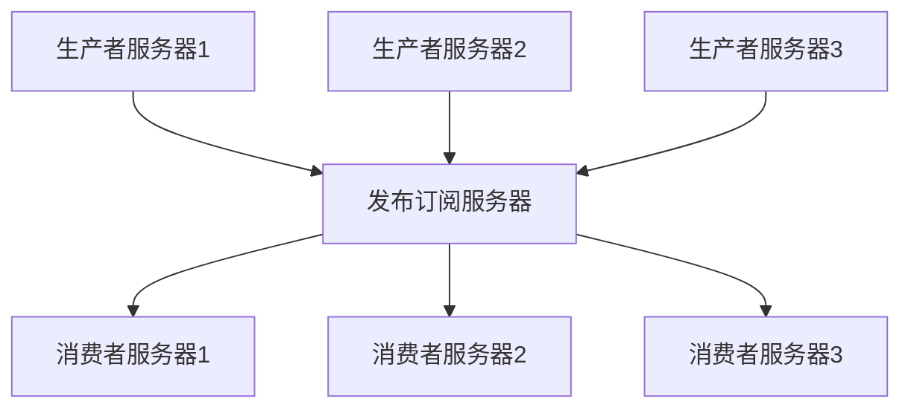

# 一、kafka是什么

## 介绍

Kafka是一款分布式流平台。

Kafka 起初是领英创建的用于收集用户活动数据，并处理持续数据流，本质是一款分布式流平台。后来交由Apache托管，成为一款热门的开源项目。

Kafka有以下三个特点：

1. Kafka以集群形式运行在一个或者多个跨多数据中心的服务器上
2. Kafka集群通过主题（Topics）对流数据进行分类
3. 每一条流数据都由三个部分组成：key、value、时间戳


Kafka目前有四个API：

1. [Producer API](http://kafka.apache.org/documentation.html#producerapi) 允许应用发布流数据到一个或多个Kafka主题上。
2. [Consumer API](http://kafka.apache.org/documentation.html#consumerapi) 允许应用订阅一个或多个主题，并处理该主题上的流数据。
3. [Streams API](http://kafka.apache.org/documentation/streams) 允许应用充当一个流式处理器，消费来自一个或多个主题上的输入流。并且可以向一个或多个主题上生产输出流，有效的将输入流转换成输出流。
4. [Connector API](http://kafka.apache.org/documentation.html#connect) 允许构建和运行可重用的生产者和消费者，该生产消费者连接kafka主题到现有的应用程序或者数据系统中。 比如，一个针对关系型数据库的连接器（Connector）可以捕获表的所有更改。


### Producer API

引入以下maven依赖来使用Producer API

```xml
<dependency>
    <groupId>org.apache.kafka</groupId>
    <artifactId>kafka-clients</artifactId>
    <version>1.0.0</version>
</dependency>
```


### Comsumer API

引入以下maven依赖来使用Comsumer API

```xml
<dependency>
    <groupId>org.apache.kafka</groupId>
    <artifactId>kafka-clients</artifactId>
    <version>1.0.0</version>
</dependency>
```


### Streams API

```xml
<dependency>
    <groupId>org.apache.kafka</groupId>
    <artifactId>kafka-streams</artifactId>
    <version>1.0.0</version>
</dependency>
```


## 分布式流平台

Kafka 设计的目的是为了处理持续数据流，kafka把数据看作是不断变化和持续增长的数据流，它就是基于此而构建的一套存储系统，因此，kafka其实是一款流平台。

一款流平台主要有以下三个特点：

1. 发布订阅流式数据。这一点和消息系统相似。
2. 以容错、持久的方式存储数据。这一点和存储系统相似。
3. 在记录流出现时对其进行处理。


### 消息系统

当然，kafka也是一款消息系统，允许发布订阅消息，Kafka的数据是按照一定的**顺序持久化保存**的，而消息系统理论上只是传递消息，不持久化消息。

消息系统就是消息生产者将消息进行分类并发布到一个统一的broker中，然后消费者订阅该消息并进行消费。这整个就是发布订阅消息系统。

**提取关键字：发布者、订阅者、broker**




# 二、Kafka做到了什么

## 主题（Topic）和日志

主题（Topic）是用于流数据的分类。可以被多个消费者订阅。对于每一个topic，kafka集群都会维持一个分区（partition）日志，如图所示：


每个分区都是有序且顺序不可变的记录集。这些记录集会持续不断的添加到结构化的提交日志（commit log）中。

每个分区上的记录集都会被分配一个序号，这个序号被叫做偏移量（offset），这个offset唯一标志记录集中的每一个记录。这个偏移量保证了在同一个分区内消息的顺序性。

kafka集群会根据配置的保留期限对所有发布了的数据进行持久化，无论该数据是否被消费过。例如：保留策略是两天，那么在两天内该记录可被消费，之后就会被释放。

kafka的性能不受数据存储的影响。如下图，可以知道：


## 消息和批次

Kafka中的最小数据单元就是**消息**。每一条消息就像是关系型数据库中的一条记录或者数据行。对kafka而言，消息并没有特殊的数据格式或者含义，任何消息都以字节数组的形式顺序存储。消息的键也是字节数组存储。当消息被存储到不同的分区的时候，会根据这个键产生一个哈希值，并取模分配存储到对应的分区。这样保证一样的key一定在同一个分区。

为了提高效率，消息会被分批次写入到kafka。一个批次就是一组消息。批次越大，消息越多，单位时间内存储的消息越多，单个消息传输的网络时长越久。批次数据会被压缩，可以提高数据的传输和存储能力，但会增加计算。


## 模式

对于kafka而言，消息是字节数组，晦涩难懂。因此根据应用程序的需求，用了一些额外的结构来定义了消息内容，让其便于理解，方便我们理解kafka的消息结构。


## 生产者和消费者

**生产者**创建消息。生产者又被称为**发布者**。一般情况下，一个消息会被发布到一个特定的主题上。生产者默认情况下会把消息均衡地分布到主题的所有分区上，而并不关心特定消息会被写到哪个分区。在某些情况下，生产者会把消息直接写到指定的分区。这通常是通过**消息键**和**分区器**来实现的，分区器为键生成一个哈希值，并将其映射到指定的分区上。这样可以保证包含同一个键的消息会被写到同一个分区上。生产者可以使用自定义的分区器，根据不同的业务规则将消息映射到分区。

**消费者**读取消息。消费者又被称为**订阅者**。消费者可以订阅一个或多个主题，并按照消息生成的顺序读取。消费者通过检查消息的**偏移量**判断是否读取过消息。**偏移量**是一种元数据，是不断递增的整数值，在创建消息时，kafka会把它添加到消息中。在给定的分区里，每个消息的偏移量都是唯一的。消费者把每个分区最后读取的消息偏移量保存到zookeeper或者kafka上，如果消费者关闭或者重启，他的读取状态不会丢失。

消费者是**消费者群组**的一部分，会有一个或者多个消费者共同读取一个主题。群组保证每个分区只能被一个消费者使用。消费者和分区之间的映射关系被称为消费者对分区的**所有权关系**。如下图所示：


## broker和集群

一个独立的kafka服务器被称为**broker**。broker接收来自生产者的消息，为消息设置偏移量，并提交消息到磁盘保存。broker为消费者提供服务，对读取分区的请求作出响应，返回已经提交到磁盘上的消息。单个broker可以轻松处理数千个分区以及每秒百万级的消息量。

broker是**集群**的组成部分。每个集群都有一个broker同时充当**集群控制器**的角色（自动从集群的活跃成员中选举出来）。控制器负责管理工作，包括将分区分配给broker和监控broker。在集群中，一个分区从属于一个broker，该broker被称为分区的**首领**。一个分区可以分配给多个broker，这个时候会发生分区复制。这种肤质机制为分区提供了消息冗余，如果一个broker失效，其他broker就可以接管领导权。相关的消费者和生产者都要重新连接到新的首领。


**保留消息**是kafka的一个重要特性。kafka默认消息保留策略：要么保留一段时间（比如7天），要么保留到消息达到一定大小的字节数（比如1G）。当消息数量达到上限时，旧消息就会过期并被删除。主题可以配置自己的保留策略。


## 集群


## Kafka的应用场景

- 日志收集
- 异步通信
- 记录用户行为（结合Zipkin，实现链路追踪）


# 三、应用


## Kafka Streams

### 生产者

```java
/**
 * @author: raccoon
 * @date: 2019-05-20 14:02
 * @description: kafka生产者客户端测试
 */
@Slf4j
public class KafkaProducerTest {
  @Test
  public void producerTest() throws InterruptedException {
    // 初始化生产者
    KafkaProducer<String, String> producer = init();
    // 创建消息
    ProducerRecord<String, String> record = createRecord();
    // 发送消息
    CountDownLatch latch = new CountDownLatch(1);
    producer.send(record, (rm, e) -> {
      log.info("回调：{}", rm);
      latch.countDown();
    });
    latch.await();
  }
  private KafkaProducer<String, String> init() {
    Map<String, Object> configs = new HashMap<>(8);
    configs.put("bootstrap.servers", KafkaConfig.SERVER);
    // 为生产者设置请求确认策略
    configs.put("acks", KafkaConfig.ACKS_ALL);
    // 设置发布失败重试次数
    configs.put("retries", KafkaConfig.RETRIES);
    // 设置消息批次缓存大小。批次是生产者批量发送消息的基本单位。
    configs.put("batch.size", KafkaConfig.BATCH_SIZE);
    // 设置批次发送时间间隔。批次发送时间间隔默认0ms。
    // 消息批次发送满足batch.size和linger.ms中的任意一个就会发送消息
    configs.put("linger.ms", KafkaConfig.LINGER_MS);
    // 设置生产者可以支配的内存总量
    configs.put("buffer.memory", KafkaConfig.BUFFER_MEMORY);
    // 设置KEY的序列化器
    configs.put("key.serializer", KafkaConfig.KEY_SERIALIZER);
    // 设置VALUE的序列化器
    configs.put("value.serializer", KafkaConfig.VALUE_SERIALIZER);

    return new KafkaProducer<>(configs);
  }
  private ProducerRecord<String, String> createRecord() {
    // 设置Kafka主题
    String topic = KafkaConfig.TOPIC;
    // 消息KEY
    String key = KafkaConfig.getKey(LocalTime.now().toString());
    // 消息值
    String value = "测试数据_" + LocalTime.now().toString();
    // 设置分区
    Integer partition = KafkaConfig.PARTITION;
    // 时间戳
    Long timestamp = System.currentTimeMillis();
    // 在指定主题下创建指定分区下的键值对
    // return new ProducerRecord<>(topic, partition, timestamp, key, value);
    // 在指定主题下创建一个没有分区的键值对
    return new ProducerRecord<>(topic, key, value);
  }
}
```

```java
public class KafkaConfig {
  public final static String SERVER = "127.0.0.1:9092";
  public final static String ACKS_ALL = "all";
  public final static Integer RETRIES = 5;
  public final static String TOPIC = "BaseTopic";
  public final static Integer PARTITION = 1;
  public final static String PREFIX = "BASE_";
  public final static Integer BATCH_SIZE = 16384;
  public final static Integer LINGER_MS = 1;
  public final static Integer BUFFER_MEMORY = 33554432;
  public final static String KEY_SERIALIZER = "org.apache.kafka.common.serialization.StringSerializer";
  public final static String VALUE_SERIALIZER = "org.apache.kafka.common.serialization.StringSerializer";
  public final static String KEY_DE_SERIALIZER = "org.apache.kafka.common.serialization.StringDeserializer";
  public final static String VALUE_DE_SERIALIZER = "org.apache.kafka.common.serialization.StringDeserializer";
  public final static String getKey(String key) {
    return PREFIX + key;
  }
}
```


### 消费者

```java
/**
 * @author: raccoon
 * @date: 2019-05-20 14:02
 * @description: kafka生产者客户端测试
 */
@Slf4j
public class KafkaConsumerTest {
  @Test
  public void consumerTest() {
    KafkaConsumer<String, Object> consumer = init();
    // 使用预订/分配API之一获取指定的主题或分区的数据。 如果在轮询数据之前未预订主题，这将返回错误。
    while (true) {
      ConsumerRecords<String, Object> records = 
        consumer.poll(Duration.of(10, ChronoUnit.SECONDS));
      if(!records.isEmpty()) {
        for (ConsumerRecord<String, Object> record : records) {
          log.info("结果：partition = {}, offset = {}, key = {}, value = {}", record.partition(), record.offset(), record.key(), record.value());
        }
      }
    }
  }
  private KafkaConsumer<String, Object> init() {
    Map<String, Object> configs = new HashMap<>(8);
    configs.put("bootstrap.servers", KafkaConfig.SERVER);
    // 将单个消费者分配给组
    configs.put("group.id", "test");
    // 如果值为true，则为偏移启用自动落实，否则不提交。
    configs.put("enable.auto.commit", "true");
    // 返回更新的消耗偏移量写入ZooKeeper的频率。
    configs.put("auto.commit.interval.ms", "1000");
    // 表示Kafka在放弃和继续消费消息之前等待ZooKeeper响应请求(读取或写入)多少毫秒。
    configs.put("session.timeout.ms", "30000");
    configs.put("key.deserializer", KafkaConfig.KEY_DE_SERIALIZER);
    configs.put("value.deserializer", KafkaConfig.VALUE_DE_SERIALIZER);
    KafkaConsumer<String, Object> consumer = new KafkaConsumer<>(configs);
    List<String> topics = new ArrayList<>();
    topics.add(KafkaConfig.TOPIC);
    // 订阅主题
    consumer.subscribe(topics);
    return consumer;
  }
}
```


## Spring Kafka

spring提供了一个专门的项目支持kafka：spring-kafka
```xml
<dependency>
  <groupId>org.springframework.kafka</groupId>
  <artifactId>spring-kafka</artifactId>
</dependency>
```
spring boot结合kafka就需要引入以下包：
```xml
<parent>
  <groupId>org.springframework.boot</groupId>
  <artifactId>spring-boot-starter-parent</artifactId>
  <version>2.1.5.RELEASE</version>
</parent>

<dependencies>
  <dependency>
    <groupId>org.springframework.boot</groupId>
    <artifactId>spring-boot-starter-web</artifactId>
  </dependency>
  <dependency>
    <groupId>org.springframework.boot</groupId>
    <artifactId>spring-boot-starter-test</artifactId>
    <scope>test</scope>
  </dependency>
  <dependency>
    <groupId>org.springframework.kafka</groupId>
    <artifactId>spring-kafka</artifactId>
  </dependency>
</dependencies>
```

### 配置

```yaml
spring:
  application:
    name: kafka-spring
  kafka:
    producer:
      bootstrap-servers: 127.0.0.1:9092
      acks: all
      retries: 5
      batch-size: 16384
      buffer-memory: 33554432
      key-serializer: org.apache.kafka.common.serialization.StringSerializer
      value-serializer: org.apache.kafka.common.serialization.StringSerializer
    consumer:
      bootstrap-servers: 127.0.0.1:9092
      group-id: test
      enable-auto-commit: true
      auto-commit-interval: 1000
      key-deserializer: org.apache.kafka.common.serialization.StringDeserializer
      value-deserializer: org.apache.kafka.common.serialization.StringDeserializer
server:
  port: 8080

```


### 生产者

```java
@Slf4j
@Service
public class KafkaProducerService {

  @Autowired
  private KafkaTemplate kafkaTemplate;
  
  public void producer() {
    String value = "测试数据_" + LocalTime.now().toString();
    String key = LocalTime.now().toString();
    // 发送消息
    ListenableFuture<SendResult<String, String>> result = 
      kafkaTemplate.send("SpringBootTopic", key, value);

    // 消息发送成功或者失败的回调处理
    result.addCallback(successResult -> {
      log.info("成功: {}", successResult.getProducerRecord());
    }, failResult -> {
      log.info("失败: {}", failResult.getMessage());
    });
  }
}
```


### 消费者

```java
@Slf4j
@Component
public class KafkaConsumerListener {
  
  @KafkaListener(topics = "SpringBootTopic")
  public void listener(String content) {
    log.info("接收Kafka消息：{}", content);
  }
}
```


## Spring Cloud Stream Kafka

在说Spring Cloud Stream Kafka之前首先要明白 Spring Cloud Stream。


###Spring Cloud Stream

Spring Cloud Stream提供了多种绑定器（binder）的实现：

- RabbitMQ
- Apache Kafka
- Kafka Streams
- Google PubSub


### Spring Cloud Stream Kafka

Spring Cloud结合Kafka Streams。

1. Kafka Streams Binder是以spring-kafka为根基而实现的模块。
2. Kafka Streams Binder为kafka streams中的三种主要类型（KStreams、KTable、GlobalKTable）提供了绑定的功能
3. Kafka Streams Binder还提供了早期版本的Processor API支持。

在Spring Cloud Stream中，对Kafka Streams的支持仅仅是在处理器模型的支持。这个模型是从入站主题（inbound topic）中读取消息，往出站主题（outbound topic）中写入消息。


#### 配置

```xml
<dependency>
  <groupId>org.springframework.cloud</groupId>
  <artifactId>spring-cloud-stream-binder-kafka-streams</artifactId>
</dependency>
```


#### 生产者


####  消费者


# 四、深入kafka


# 五、可靠的数据传递


# 六、构建数据管道


# 七、跨集群数据镜像


# 八、管理kafka


# 九、监控kafka


# 十、流式处理


# 附录

## 安装

```shell
wget http://mirror.bit.edu.cn/apache/kafka/2.2.0/kafka_2.12-2.2.0.tgz
tar -zxvf kafka_2.12-2.2.0.tgz
mv kafka_2.12-2.2.0 /usr/local/
cd kafka_2.12-2.2.0
mkdir log
cd kafka_2.11-2.2.0/config
# 配置server.properties中的log路径和zookeeper路径
vim server.properties
cd ~/Documents/software/kafka_2.11-2.2.0/bin
# 启动。Kafka默认占用9092端口
sh kafka-server-start.sh ../config/server.properties &
```


