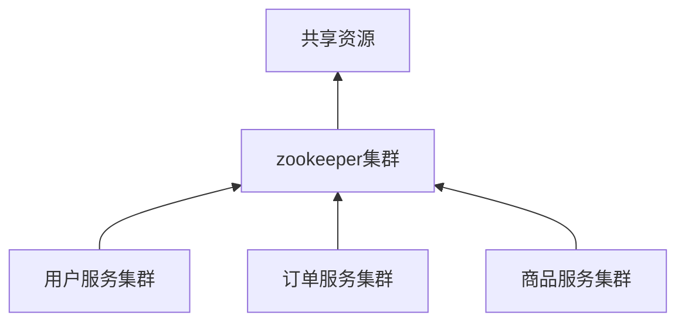
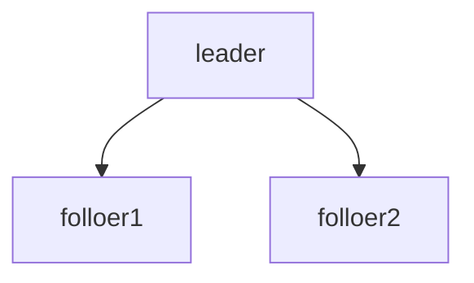

# 是什么？

Zookeeper是一款分布式协调服务。什么是分布式协调服务呢？在分布式环境下，协调各个节点对共享资源的访问的服务，即分布式协调服务。zookeeper存在的目的就是这个。



当然，zookeeper除了以上核心功能，还在其他的应用场景也提供了很好的帮助。

## Zookeeper的应用场景

1. 分布式锁（redis提供了一样的功能，可被替换）
2. 负载均衡机制（spring cloud ribbon提供了微服务之间的负载均衡）
   1. kafka基于zookeeper进行master选举
3. 配置中心（consul，阿里云ACM都可以做到）
4. 服务注册发现（spring cloud euraka、consul都可以做到）
5. 服务上下线动态感知（spring cloud euraka可以替换）

ZooKeeper主要被应用在HBase\Solr\Kafka等系统上

## Zookeeper的数据结构

zookeeper的数据结构是结构化存储方式。和文件系统的目录结构一样，只不过并不是真正的文件目录，而是在一个文件下应用了文件系统中的这些原理。zookeeper中的每一个节点被称为zNode。


节点类型

- 持久节点：永久保存（默认）create /znode data
- 顺序节点：zookeeper会对存储的节点添加顺序号。create -s  /znode data
- 临时节点：一次会话后消失。create -s  /znode data


# 有什么特性？


## Watch事件机制

客户端可以监听某一指定节点。当该节点下的数据发生变化时，zookeeper会产生一个watch事件，并且发送到客户端。但是客户端只会收到一次事件通知，如果后续这个节点再次发生变化，那么之前设置watch的客户端不会再收到消息。

- watch是一次性的操作。
- 可以通过循环监听达到永久监听效果。

如何触发和监听事件在后续整合Java中讲解。


## ACL权限控制

类似于linux的文件系统访问权限。在zookeeper中，提供了ACL的命令进行节点的权限控制。

定义了节点的5种权限。

命令：create/read/write/delete/admin


# 运用的一些设计思想

1. 乐观锁
2. 发布订阅


# 整合Java

引入依赖

```xml
<dependency>
  <groupId>org.apache.zookeeper</groupId>
  <artifactId>zookeeper</artifactId>
  <version>3.4.13</version>
</dependency>
```


## 数据的增删改查操作

建立连接

```java
public ZooKeeper getZooKeeper() throws IOException, InterruptedException {
  final CountDownLatch countDownLatch = new CountDownLatch(1);
  // ZooKeeper集合通过监视器对象返回连接状态。
  ZooKeeper zooKeeper = new ZooKeeper(connection, 4000, event -> {
    if (event.getState().equals(Event.KeeperState.SyncConnected)) {
      // 如果收到服务器的响应事件，则表示连接成功
      countDownLatch.countDown();
    }
  });
  System.out.println(zooKeeper.getState());
  countDownLatch.await();
  System.out.println(zooKeeper.getState());
  return zooKeeper;
}
```

新建节点

```java
public String createNode(String path, byte[] data) throws IOException, KeeperException, InterruptedException {
  ZooKeeper zooKeeper = getZooKeeper();
  // acl 要创建的节点的访问控制列表。ZooKeeper API提供了一个静态接口 ZooDefs.Ids 来获取一些基本的acl列表。例如，ZooDefs.Ids.OPEN_ACL_UNSAFE返回打开znode的acl列表。
  String createPath = zooKeeper.create(path, data, ZooDefs.Ids.OPEN_ACL_UNSAFE, CreateMode.PERSISTENT);
  System.out.println("createPath = " + createPath);
  return createPath;
}
```

获取当前节点的值

```java
public byte[] getNodeData(String path, Stat stat) throws IOException, InterruptedException, KeeperException {
    ZooKeeper zooKeeper = getZooKeeper();
    byte[] bytes = zooKeeper.getData(path, null, stat);
    return bytes;
}
```

修改节点

```java
public Stat updateNodeData(String path, byte[] data, Stat stat) throws IOException, InterruptedException, KeeperException {
    ZooKeeper zooKeeper = getZooKeeper();
    Stat statResult = zooKeeper.setData(path, data, stat.getVersion());
    return statResult;
}
```

删除节点

```java
public void removeNode(String path, Stat stat) throws IOException, KeeperException, InterruptedException {
  ZooKeeper zooKeeper = getZooKeeper();
  zooKeeper.delete(path, stat.getVersion());
}
```


## Watch事件监听

客户端可以监听某一指定节点。当该节点下的数据发生变化时，zookeeper会产生一个watch事件，并且发送到客户端。但是客户端只会收到一次事件通知，如果后续这个节点再次发生变化，那么之前设置watch的客户端不会再收到消息。

- watch是一次性的操作。
- 可以通过循环监听达到永久监听效果。


### 如何触发事件？

事务类型的操作都会触发监听事件

- create
- delete
- setData


### 如何监听事件？

在客户端中通过以下三个操作监听事件，后续结合Java整合讲解watch事件监听。

- getData
- getChildren
- exists


### watch事件机制

1. None(-1)：客户端连接状态发生变化，客户端会接收到该事件
2. NodeCreated(1)：节点创建事件
3. NodeDeleted(2)：节点删除事件
4. NodeDataChanged(3)：节点数据变更事件
5. NodeChildrenChanged(4)：子节点创建删除事件


### 什么操作触发什么事件

| 操作\事件            | Event for "/user"                     | Event for "/user/vip"                |
| -------------------- | ------------------------------------- | ------------------------------------ |
| create("/user")      | NodeCreatedEvent(exists/getData)      | 无                                   |
| delete("/user")      | NodeDeletedEvent(exists/getData)      | 无                                   |
| setData("/user")     | NodeDataChangedEvent(exists/getData)  | 无                                   |
| create("/user/vip")  | NodeChildrenChangedEvent(getChildren) | NodeCreatedEvent(exists/getData)     |
| delete("/user/vip")  | NodeChildrenChangedEvent(getChildren) | NodeDeletedEvent(exists/getData)     |
| setData("/user/vip") | 无                                    | NodeDataChangedEvent(exists/getData) |


```java
/**
* 监听节点创建事件
*/
@Test
public void nodeCreatedEventTest() throws KeeperException, InterruptedException {
  String path = "/user";
  String value = "张三";
  ZooKeeper zooKeeper = getZooKeeper();
  zooKeeper.exists(path, event -> {
    System.out.println(event.getPath() + "\t" + event.getType() + "\t" + event.getState());
  });
  zooKeeper.create(path, value.getBytes(), Ids.OPEN_ACL_UNSAFE, CreateMode.PERSISTENT);
  System.out.println("create success");
}
/**
* 监听节点删除事件
*/
@Test
public void nodeDeletedEventTest() throws KeeperException, InterruptedException {
  String path = "/user/vip";
  ZooKeeper zooKeeper = getZooKeeper();
  zooKeeper.exists(path, event -> {
    System.out.println(event.getPath() + "\t" + event.getType() + "\t" + event.getState());
  });
  System.out.println("start delete");
  zooKeeper.delete(path, new Stat().getVersion());
  System.out.println("delete success");
}
/**
* 监听节点变更事件
*/
@Test
public void nodeDataChangedEventTest() throws KeeperException, InterruptedException {
  String path = "/user";
  String value = "李四";
  ZooKeeper zooKeeper = getZooKeeper();
  zooKeeper.exists(path, event -> {
    System.out.println(event.getPath() + "\t" + event.getType() + "\t" + event.getState());
  });
  System.out.println("start set");
  zooKeeper.setData(path, value.getBytes(), new Stat().getVersion());
  System.out.println("set success");
}
/**
* 监听子节点变更事件
*/
@Test
public void nodeChildrenChangedEventTest() throws KeeperException, InterruptedException {
  String path = "/user/vip";
  String value = "张三";
  ZooKeeper zooKeeper = getZooKeeper();
  zooKeeper.getChildren("/user", event -> {
    System.out.println(event.getPath() + "\t" + event.getType() + "\t" + event.getState());
  });
  System.out.println("start create children");
  zooKeeper.create(path, value.getBytes(), Ids.OPEN_ACL_UNSAFE, CreateMode.PERSISTENT);
  System.out.println("create children success");
}
```


### Watch事件监听实现原理

底层运用了nio


# 集群

leader-follow方式




## Leader选举


# 安装

```shell
wget http://mirror.bit.edu.cn/apache/zookeeper/zookeeper-3.4.14/zookeeper-3.4.14.tar.gz
tar -zxvf zookeeper-3.4.14.tar.gz
cd zookeeper-3.4.14/conf/
cp zoo_sample.cfg zoo.cfg
cd ../bin
sh zkServer.sh start
```


# 命令

```shell
# 展示根节点
[zk: localhost:2181(CONNECTED) 14] ls /
# 创建节点以及对应的值
[zk: localhost:2181(CONNECTED) 14] create /path /data
# 创建有序节点，zookeeper会自动添加顺序号
[zk: localhost:2181(CONNECTED) 14] create -s /seq 有序节点
[zk: localhost:2181(CONNECTED) 14] ls /
[seq0000000005, zookeeper, seq0000000003, seq0000000004, order]
# 创建临时节点，会话结束后，等待心跳检测，之后就会自动删除
[zk: localhost:2181(CONNECTED) 14] create -e /tmp 临时节点
# 修改节点值
[zk: localhost:2181(CONNECTED) 14] set /path la
# 获取节点值
[zk: localhost:2181(CONNECTED) 10] get /path
## 节点的值
la
cZxid = 0x38
ctime = Tue May 07 15:25:34 CST 2019
mZxid = 0x43
mtime = Tue May 07 15:45:29 CST 2019
pZxid = 0x38
cversion = 0 ## 当前节点的字节点版本号
dataVersion = 2 ## 数据内容的版本号，每做一次修改就自动累加（乐观锁），在set 语句后面加版本号，如果不一致，修改失败。
aclVersion = 0 ## 当前节点ACL变更的版本号。
ephemeralOwner = 0x0 ## 临时节点所需要的所属会话信息
dataLength = 2 ## 节点值长度
numChildren = 0
# 删除节点
[zk: localhost:2181(CONNECTED) 14] delete /path
```

