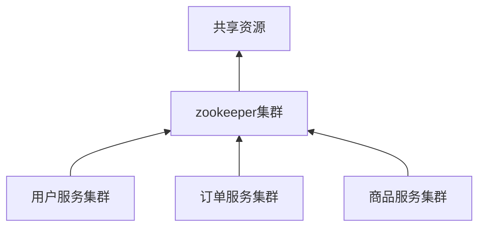
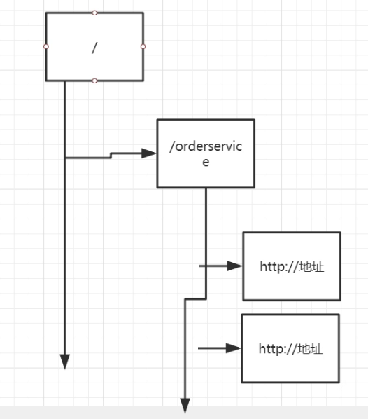
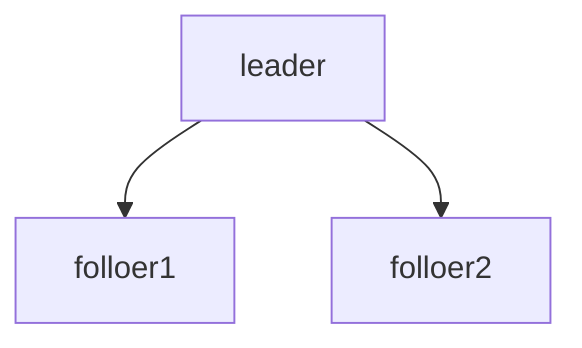

# 是什么

zookeeper是分布式协调服务。协调各个节点对共享资源的访问，控制接入顺序。

这个可以简单的理解成一个分布式锁。实际上zookeeper就是可以实现分布式锁的功能。也是zookeeper作为分布式协调服务的原因。



当然，zookeeper出了是分布式协调服务之外，还提供了很多其他的功能点。比如：

1. 负载均衡机制（spring cloud ribbon提供了一样的功能，可被替换）
2. 服务注册中心（spring cloud euraka、consul都可以做到）
3. 服务上下线动态感知

## Zookeeper的数据结构

zookeeper的数据结构是结构化存储方式。和文件系统的目录结构一样，只不过并不是真正的文件目录，而是在一个文件下应用了文件系统中的这些原理。zookeeper中的每一个节点被称为zNode。



节点类型

- 持久节点：永久保存（默认）create /znode data
- 顺序节点：zookeeper会对存储的节点添加顺序号。create -s  /znode data
- 临时节点：一次会话后消失。create -s  /znode data


## ACL权限控制

类似于linux的文件系统访问权限。在zookeeper中，提供了ACL的命令进行节点的权限控制。

定义了节点的5种权限。

命令：create/read/write/delete/admin


## Watch机制

客户端可以监听某一指定节点。节点下的数据变更会存在事件通知给客户端，类似发布订阅。这样客户端就能够被动的知道节点的变更信息。


## Zookeeper的应用场景

1. 配置中心（consul、阿里云acm可以替换）
2. 服务发现（consul、spring cloud euraka可以替换）
3. 分布式锁（redis）
4. 负载均衡（spring cloud ribbon可以替换）
   1. kafka基于zookeeper进行master选举
5. 服务上下线动态感知（spring cloud euraka可以替换）


# 安装

```shell
wget http://mirror.bit.edu.cn/apache/zookeeper/zookeeper-3.4.14/zookeeper-3.4.14.tar.gz
tar -zxvf zookeeper-3.4.14.tar.gz
cd zookeeper-3.4.14/conf/
cp zoo_sample.cfg zoo.cfg
cd ../bin
sh zkServer.sh start
```


# 命令

```shell
# 展示根节点
[zk: localhost:2181(CONNECTED) 14] ls /
# 创建节点以及对应的值
[zk: localhost:2181(CONNECTED) 14] create /path /data
# 创建有序节点，zookeeper会自动添加顺序号
[zk: localhost:2181(CONNECTED) 14] create -s /seq 有序节点
[zk: localhost:2181(CONNECTED) 14] ls /
[seq0000000005, zookeeper, seq0000000003, seq0000000004, order]
# 创建临时节点，会话结束后，等待心跳检测，之后就会自动删除
[zk: localhost:2181(CONNECTED) 14] create -e /tmp 临时节点
# 修改节点值
[zk: localhost:2181(CONNECTED) 14] set /path la
# 获取节点值
[zk: localhost:2181(CONNECTED) 10] get /path
## 节点的值
la
cZxid = 0x38
ctime = Tue May 07 15:25:34 CST 2019
mZxid = 0x43
mtime = Tue May 07 15:45:29 CST 2019
pZxid = 0x38
cversion = 0 ## 当前节点的字节点版本号
dataVersion = 2 ## 数据内容的版本号，每做一次修改就自动累加（乐观锁），在set 语句后面加版本号，如果不一致，修改失败。
aclVersion = 0 ## 当前节点ACL变更的版本号。
ephemeralOwner = 0x0 ## 临时节点所需要的所属会话信息
dataLength = 2 ## 节点值长度
numChildren = 0
# 删除节点
[zk: localhost:2181(CONNECTED) 14] delete /path
```


# 整合Java

```xml
<dependency>
  <groupId>org.apache.zookeeper</groupId>
  <artifactId>zookeeper</artifactId>
  <version>3.4.13</version>
</dependency>
```


# Zookeeper的集群

leader-follow方式




