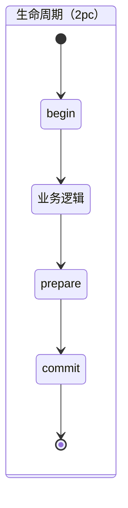
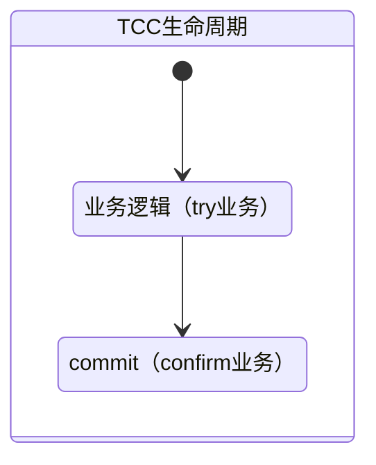

[TOC]

# 简述

分布式事务指：针对分布在不同节点上的若干子操作组成的一个大操作，能够保证其子操作全部成功或者全部失败的机制。

如果说数据库事务保证了单机数据的ACID，那么分布式事务则保证了不同数据库上数据的一致性。

# 理论与模型

1. 当数据库单表超过1000万条，就要考虑分库分表；

2. 当业务扩展迅猛，单机应用难以承载压力，就要考虑服务化；

我们看到，不论是数据库分库分表还是应用的服务化，其本质上就是操作数据库变多，这时候数据库事务的ACID是无法满足的。而为了保证数据一致性，就需要用到分布式事务。

分布式事务在工程领域里，主要探讨的是最终一致性和强一致性的解决方案，由此产生了以下几种理论和模型：

**两理论一模型，三组件两协议**

## CAP理论

CAP理论告诉我们，我们需要将一致性（Consistency）、可用性（Availability）、分区容错性（Partation Tolerance）放在一个天平上进行权衡，三要素最多只能满足其中之二，而分区容错性在分布式系统中是无法避免的。即要么CP，要么AP。

- 一致性（Consistency）：此一致性表示强一致性。即分布式环境中所有节点在同一时刻所有数据完全相同；
- 可用性（Availability）：指服务一直可用，系统能够正常响应用户的读写操作。不出现访问超时或者操作失败的情况；
- 分区容错性（Partation Tolerancy）：分区容错的意思指的是分区之间的通信可能失败，要容许它失败。分区容错性在分布式系统中客观存在，无法避免。

关于CAP的取舍，要视具体业务场景进行处理。

- 满足CA。则表明这就不是分布式系统，显然不符合应用服务化的进程
- 满足CP。舍弃可用性，则表示你的系统会存在不可用
- 满足AP。舍弃一致性，则表示你的系统在并发访问时存在数据不一致的情况

对于上述CAP的取舍，通常都是牺牲一致性（这里专指强一致性），但并不是说数据从此就永远不一致了，这里我们引申出BASE理论。

## BASE理论

BASE理论是对CAP理论中一致性和可用性进行一个权衡的结果。核心是：既然无法做到强一致性，那么每个应用可以根据自身情况，采用适当方式达到最终一致。

BASE是Basic Available（基本可用）、Soft State（软状态）、Eventually consistent（最终一致）的缩写。

- 基本可用：分布式系统出现故障时，保证核心功能可用，允许损失部分可用性。例如，电商在做促销时，为了保证购物系统的稳定性，部分消费者可能会被引导到一个降级的页面；
- 软状态：允许系统数据出现中间状态，比如处理中、同步中
- 最终一致：系统中的数据副本在经过一段时间同步之后，最终达到一致的状态

## X/Open DTP模型[^X/Open Distributed Transaction Processing Model]

X/Open DTP模型是X/OPEN这个组织定义的一套分布式事务的标准，即定义了规范和API接口，由厂商进行具体的实现。

X/Open DTP模型中存在三个组件：AP，TM，RM。组件之间存在以下接口：XA、TX

### 组件

X/Open DTP模型提供了以下三大组件：

1. AP[^Application Program]：应用程序，可以理解为使用DTP的程序；
2. TM[^Transaction Manager]：事务管理器，负责管理全局事务并协调提交或回滚它们的决策，从而确保它们的原子性；
3. RM[^Resource Manager]：资源管理器，这里可以理解为一个DBMS系统，或者消息服务器管理系统，应用程序通过资源管理器对资源进行控制。

### 协议

X/Open DTP模型提供了以下标准协议串联起各组件。

#### Native API

通常由各厂商自行定义，以提供应用访问资源的能力；

#### XA协议

XA协议由 Tuxedo 首先提出的，并交给X/Open组织，作为资源管理器与事务管理器的接口标准。

XA协议包括两套函数，以`xa_`开头的及以`ax_`开头的。Oracle、DB2这些商业数据库都实现了XA接口。

XA 的目标是允许多个资源（数据库， 应用服务器， 消息队列， 事务缓存等）可以在一个事务中处理，同时跨应用满足 ACID 属性。

只要实现了XA接口，那么就可以实现TM对多个RM的事务管理，即实现了跨应用的ACID。

XA规范定义了:

1. TransactionManager : 这个TransactionManager可以通过管理多个ResourceManager来管理多个Resouce,也就是管理多个数据源
2. XAResource : 针对数据资源封装的一个接口
3. 两阶段提交 : 多数据源事务提交的机制

##### JTA规范

JTA（Java Transaction API）是在Java上的规范，是XA在Java上的体现。

1. TransactionManager : 常用方法,可以开启,回滚,获取事务. begin(),commit(),rollback()...
2. XAResouce : 资源管理,通过Session来进行事务管理,commit(xid)...
3. XID : 每一个事务都分配一个特定的XID

相对于常见的JDBC事务而言，JTA事务是多数据源的分布式事务，JDBC事务是单数据源事务。

#### TX协议

定义了应用程序和事务管理器之间的交互规范。应用程序界定最小的工作单元，事务管理器提供给应用程序开启和完成最小工作单元的能力。事务管理器接受应用的请求，并对参与的资源管理器和其他的事务管理器进行协调，最终将完成状态返回给到应用程序；

### 参考资料

[X/Open XA interface with two-phase commit](https://www.ibm.com/support/knowledgecenter/SSAL2T_9.1.0/com.ibm.cics.tx.doc/concepts/c_xopen_intface_w_two_phase_commit.html)

# 解决方案

## 基于XA协议分布式事务

需要RM提供底层支持（一般是兼容XA）

### 两阶段提交[^2PC]

两阶段提交事务方案就叫做XA事务，是一个常见的保证分布式事务正确性的算法。通常适用于在短时间（几毫秒～几分钟）内就可以完成更新的场景。

2PC是强一致性解决方案，满足事务的ACID特性，看上去是十分完美的，但存在很多的缺陷。

2PC是基于数据库层面的，由RM支持它将事务提交分成了两个阶段。

#### 工作流程

参与者将操作成败通知协调者，再由协调者根据所有参与者的反馈情报决定各参与者是否要提交操作还是中止操作。这里的参与者可以理解为RM，协调者可以理解为TM。

> 阶段一：prepare。协调者询问各数据库是否准备完毕，数据库对资源加锁，并回复给协调者
>
> 阶段二：commit/rollback。所有回复都是prepared ok，则提交事务；否则，回滚事务

#### 缺陷

1. **同步阻塞问题**。2PC的所有参与节点都是同步阻塞的，参与者会对数据加锁，其他访问者对这些数据的访问会被阻塞；
2. **单点故障问题**。XA协议中的协调者只有一台，一旦发生故障，尤其是在阶段二，所有的参与者都等待协调者发来提交指令，这就会造成阻塞；
3. **数据不一致**。在阶段二若发生网络异常，部分参与者接收到提交指令，部分没有，则整个分布式系统中就存在数据不一致的情况。

### 三阶段提交[^3PC]

3PC是为了弥补2PC中存在的缺陷，引入了超时机制，解决了2PC中的同步阻塞和单点故障问题，但仍然存在数据不一致问题。

3PC是基于数据库层面的。

### 开源框架或实现案例

1. [Mysql XA事务](../数据库/mysql.md)
2. atomikos实现了JTA规范
3. JOTM实现了JTA规范
4. [seata](https://seata.io/zh-cn/)未来版本

### 使用场景

1. 低并发场景下多数据源的事务保障

## TCC[^补偿事务]

TCC是基于应用层面的。

TCC相对于XA事务而言，不依赖于RM对XA协议的支持，而通过业务系统中业务逻辑的调度来实现分布式事务。

从这里可以看出，TCC事务是和业务深度绑定的，对代码的嵌入性很高，要求每个业务需要写三种步骤的操作

### 工作流程

TCC事务主要分成三个操作，这三个操作时业务执行阶段，而XA事务的是事务执行阶段：

1. Try：尝试执行任务
2. Confirm：确认执行业务
3. Cancel：取消任务

### 缺陷

1. 业务嵌入性强。要求每个业务需要写三种步骤的操作。

###开源框架或实现案例

[bytesoft](https://www.bytesoft.org/)

[seata](https://seata.io/zh-cn/)

[tx-lcn](https://www.txlcn.org/zh-cn/)

[tcc-transaction](https://github.com/changmingxie/tcc-transaction)

## 事务消息[^MQ]

### 工作流程

### 缺陷

###开源框架或实现案例

## 本地消息表[^Ebay]

### 工作流程

### 缺陷

###开源框架或实现案例

##Sagas事务模型

### 工作流程

### 缺陷

###开源框架或实现案例

[seata](https://seata.io/zh-cn/)

[^补偿事务]: 最终一致性
[^Ebay]: 最终一致性
[^MQ]: 最终一致性
[^Application Program]: 应用程序，可以理解为使用DTP的程序
[^Transaction Manager]: 事务管理器负责协调和管理事务，提供给AP应用程序编程接口（TX协议）以及管理资源管理器
[^Resource Manager]: 资源管理器，这里可以理解为一个DBMS系统，或者消息服务器管理系统，应用程序通过资源管理器对资源进行控制。资源必须实现XA定义的接口

[^X/Open Distributed Transaction Processing Model]: 分布式事务处理模型

[^2PC]: Two Phase Commit 两阶段提交
[^3PC]: Three Phase Commit 三阶段提交