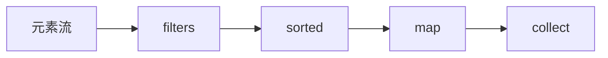

# 第一章：Lambda表达式

Lambda表达式是JDK8引入的新的表达式语法。允许把函数作为一个方法的参数传递进方法中。

表达式的格式是**左边参数，右边方法体**

Lambda表达式的简单案例

```java
@Test
public void threadDemo() {
  // 案例1：不包含参数，也不包含返回值。
  functionNoArgs(() -> System.out.println("hello world"));
  // 案例2：包含一个参数，不包含返回值
  functionOneArgs(args -> System.out.println(args));
  // 案例3：包含多个参数，不包含返回值
  functionNArgs((a, b) -> System.out.println(a + b));
  // 案例4：包含多个参数，包含返回值
  System.out.println(functionNArgsReturn((a, b) -> returnResult(a, b)));
}
private String returnResult(String a, Integer b) {
  return "lalala\t" + a + b;
}
@FunctionalInterface
interface FunctionInterfaceNArgsReturn {
  String nArgsReturn(String a, Integer b);
}
public String functionNArgsReturn(FunctionInterfaceNArgsReturn function) {
  String a = "return ";
  Integer b = 12;
  return function.nArgsReturn(a, b);
}
@FunctionalInterface
interface FunctionInterfaceNoArgs {
  void noArgs();
}
public void functionNoArgs(FunctionInterfaceNoArgs function) {
  function.noArgs();
}
@FunctionalInterface
interface FunctionInterfaceOneArgs {
  void oneArgs(String args);
}
public void functionOneArgs(FunctionInterfaceOneArgs function) {
  String args = "one args";
  function.oneArgs(args);
}
@FunctionalInterface
interface FunctionInterfaceNArgs {
  void nArgs(String a, Integer b);
}
public void functionNArgs(FunctionInterfaceNArgs function) {
  function.nArgs("hello ", 2);
}

```

# 第二章：方法引用

JDK1.8新特性：方法引用。通过双冒号（::）表示

方法引用通过方法的名字来指向一个方法。

案例：

```java
@Test
public void demo() {
  // 1. 构造器方法引用
  // Car car1 = Car.create(new Supplier<Car>() {
  //     @Override
  //     public Car get() {
  //         return new Car();
  //     }
  // });
  // Car car = Car.create(() -> new Car());
  Car car = Car.create(Car::new);
  car.setName("张三");
  Car car2 = Car.create(Car::new);
  car2.setName("李四");
  final List<Car> cars = Arrays.asList(car, car2);

  // 2. 静态方法引用
  // for (Car carSingle: cars) {
  //     Car.running(carSingle);
  // }
  // cars.forEach(carSingle -> {
  //     Car.running(carSingle);
  // });
  cars.forEach(Car::running);

  // 3. 特定类的任意对象的方法引用
  cars.forEach(Car::addOil);
  cars.forEach(System.out::println);
  // 4. 特定对象的方法引用
  cars.forEach(car::repair);
}
@FunctionalInterface
public interface Supplier<T> {
    T get();
}
@Data
@NoArgsConstructor
@AllArgsConstructor
static class Car {
  private String name;
  public static Car create(final Supplier<Car> supplier) {
    return supplier.get();
  }

  public static void running(final Car car) {
    System.out.println("Running " + car.toString());
  }

  public void repair(final Car another) {
    System.out.println("repair the " + another.toString());
  }

  public void addOil() {
    System.out.println("addOil " + this.toString());
  }
}

```


# 第三章：默认方法

接口也能够实现方法。以`default`开头的方法。

存在这个是JDK8扩展过程中为了兼容JDK8之前的代码不得不做出的调整。

```java
@Test
public void defaultFunctionTest() {
    Food food = new Beef();
    food.eat("西瓜");
}
class Beef implements Food {
    @Override
    public void eat(String name) {
        System.out.println("吃" + name);
        this.complete();
    }
}
interface Food {
    void eat(String name);
    default void complete() {
        System.out.println("真美味");
    }
}
```

# 第四章：流式编程（Stream API）

Java 8 API添加了一个新的抽象称为流Stream，可以让你以一种声明的方式处理数据。

这种风格将要处理的元素集合看作一种流， 流在管道中传输， 并且可以在管道的节点上进行处理， 比如筛选， 排序，聚合等。

元素流在管道中经过中间操作（intermediate operation）的处理，最后由最终操作(terminal operation)得到前面处理的结果。



## 什么是Stream？

Stream（流）是一个来自数据源的元素队列并支持聚合操作

- 元素是特定类型的对象，形成一个队列。 Java中的Stream并不会存储元素，而是按需计算。
- **数据源**：流的来源。 可以是集合，数组，I/O channel， 产生器generator 等。
- **聚合操作**：类似SQL语句一样的操作， 比如filter, map, reduce, find, match, sorted等。

和以前的Collection操作不同， Stream操作还有两个基础的特征：

- **Pipelining**：中间操作都会返回流对象本身。 这样多个操作可以串联成一个管道， 如同流式风格（fluent style）。 这样做可以对操作进行优化， 比如延迟执行(laziness)和短路( short-circuiting)。
- **内部迭代**：以前对集合遍历都是通过Iterator或者For-Each的方式，显式的在集合外部进行迭代，这叫做外部迭代。 Stream提供了内部迭代的方式，通过访问者模式(Visitor)实现。

## 生成流（stream）

在 Java 8 中, 集合接口有两个方法来生成流：

- **stream()** − 为集合创建串行流。
- **parallelStream()** − 为集合创建并行流。

```java
// 转换成stream后又转换成新的List，没有做任何操作，则list和resultList地址一致
List<Integer> list = Arrays.asList(1, 2, 6, 4, 3, 10, 7);
List<Integer> resultList = list.stream().collect(Collectors.toList());
System.out.println(resultList); // [1, 2, 6, 4, 3, 10, 7]
System.out.println(resultList.equals(list)); // true。如果流做了调整，则为false
```


## forEach

Stream 提供了新的方法 'forEach' 来迭代流中的每个数据。

案例。以下代码片段使用 forEach 输出了10个数据：

```java
// 原本的list是[1, 2, 6, 4, 3, 10, 7]
list.stream().forEach(element -> System.out.printf(element + '\t'));
// 结果：1	2	6	4	3	10	7	
```

## map

map 方法用于修改数据源每一个元素，并返回新的数据源。

案例：

```java
// 原本的list是[1, 2, 6, 4, 3, 10, 7]
list.stream().map(element -> element * 10).forEach(element -> System.out.printf(element + '\t'));
// 结果: 10	20	60	40	30	100	70
```


## flatMap

flatMap 方法用于将流存入集合中的每个元素，并返回新的数据源。

案例。intList的元素存在两个。则将两倍的list集合存储到新的集合中。

```java
// 原本的list是[1, 2, 6, 4, 3, 10, 7]
List<Integer> intList = new ArrayList<>();
intList.add(1);
intList.add(12313);
System.out.println(intList.stream().flatMap(element -> list.stream()).collect(Collectors.toList()));
// 结果：[1, 2, 6, 4, 3, 10, 7, 1, 2, 6, 4, 3, 10, 7]
```


## filter

filter 方法用于通过设置的条件过滤出元素

案例。过滤2的倍数

```java
// 原本的list是[1, 2, 6, 4, 3, 10, 7]
List<Integer> filterList = list.stream().filter(element -> element % 2 == 0).collect(Collectors.toList());
System.out.println(filterList);
// 结果：[2, 6, 4, 10]
```

## limit

limit 方法用于获取指定数量的流

```java
list.stream().limit(2).collect(Collectors.toList());
// 结果：[1, 2, 6, 4]
```

## sorted

sorted 方法用于对流进行排序

案例。对数据进行倒序排列：

```java
// 原本的list是[1, 2, 6, 4, 3, 10, 7]
List<Integer> sortedList = list.stream().sorted((element1, element2) -> element2.compareTo(element1)).collect(Collectors.toList());
System.out.println(sortedList); 
// 结果：[10, 7, 6, 4, 3, 2, 1]
```

## count

count 方法用于统计元素个数

```java
// 原本的list是[1, 2, 6, 4, 3, 10, 7]
System.out.println(list.stream().count()); // 7
```


## Collectors

Collectors 类实现了很多归约操作，例如将流转换成集合和聚合元素。

```java
List<Integer> list = Arrays.asList(1, 2, 6, 4, 3, 10, 7);
List<Integer> resultList = list.stream().collect(Collectors.toList());
```


## 统计

聚合运算。累加Sum等。它们主要用于int、double、long等基本类型上

```java
// 聚合统计。list=(1, 2, 6, 4, 3, 10, 7);
IntSummaryStatistics statistics = list.stream().mapToInt(element -> element).summaryStatistics();
System.out.println("最大：" + statistics.getMax());
System.out.println("最小：" + statistics.getMin());
System.out.println("平均数：" + statistics.getAverage());
System.out.println("总和：" + statistics.getSum());
System.out.println("个数：" + statistics.getCount());
// 最大：10
// 最小：1
// 平均数：4.714285714285714
// 总和：33
// 个数：7
```


# 第五章：函数式编程

函数式接口(Functional Interface)就是一个有且仅有一个抽象方法，但是可以有多个非抽象方法的接口。

函数式接口可以被隐式转换为 lambda 表达式。

JDK1.8之后添加的函数式接口：`java.util.function`包下的所有接口。函数式接口通过`@FunctionalInterceptor`标识。

## Consumer

消费者。代表了接受一个输入参数并且无返回的操作

```java
// 代表了接受一个输入参数并且无返回的操作
applier(books, book -> System.out.println("consumer\t" + book));
private void applier(List<String> books, Consumer<String> consumer) {
  books.stream().forEach(book -> consumer.accept(book));
}
```


## Supplier

供应商。不传参，返回一个结果

```java
System.out.println(supplier(books, () -> "服务"));
private List<String> supplier(List<String> books, Supplier<String> supplier) {
  return books.stream().filter(book -> book.contains(supplier.get())).collect(Collectors.toList());
}
```


## Function

方法。接收一个参数，返回一个结果。

```java
// 接受一个输入参数，返回一个结果。
System.out.println(function(books, book -> "function: " + book));
private List<String> function(List<String> books, Function<String, String> function) {
  return books.stream().map(book -> function.apply(book)).collect(Collectors.toList());
}
```


## Predicate

谓语。接收一个参数，返回一个布尔结果。

判断输入的对象是否符合某个条件

```java
List<String> books = Arrays.asList("Java", "服务器", "微服务", "大数据", "分布式", "客户端");
// book是test方法的参数，book.contains("服务")是test的方法体。
// 通过这个lambda表达式传递了一个函数实现了函数式编程。
// 使用了谓语函数式接口（Predicate）
// Predicate接收一个参数，返回一个布尔值
System.out.println(predicate(books, book -> book.contains("服务")));
private int predicate(List<String> books, Predicate<String> predicate) {
	AtomicInteger total = new AtomicInteger();
	books.stream().forEach(book -> {
  	if(predicate.test(book)) {
    	total.getAndIncrement();
    }
	});
	return total.get();
}
```


# 第六章：Optional 类

Optional 类是一个可以为null的**容器对象**。如果值存在则isPresent()方法会返回true，调用get()方法会返回该对象。

Optional 是个容器：它可以保存类型T的值，或者仅仅保存null。Optional提供很多有用的方法，这样我们就不用显式进行空值检测。

Optional 类的引入很好的解决空指针异常。

```java
// 类声明
public final class Optional<T> extends Object
```


# 第七章：新的Date Time API


