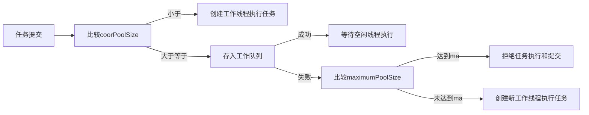

# 前言：并发编程存在的问题

## 1. 上下文切换的问题

​	即使是单核CPU也支持多线程执行。是通过给每个线程分配CPU时间片的方式来实现这个机制，给人的感官就像是多个线程同时执行。每个时间片都是一般默认是几十毫秒。

​	CPU通过时间片分配算法循环执行任务，当前任务执行完一个时间片后会切换到另一个任务。在切换之前，CPU会保存当前任务的执行状态，以便于切换回来时加载到当前状态。这一个过程就是一次上下文切换。

​	而上下文切换会引起效率变慢。就比如看一本梵语书籍，你发现一个单词不认识，就要记住这个单词以及所在页码和行数，然后切换到另一本梵语字典进行查询，查询完成后，继续阅读。这个切换过程就回影响到阅读的速度，同样的上下文的切换也会影响到多线程的执行速度。


### 多线程一定更快吗？

```java
public class ContextSwitchProblem {
    private static final long count = 100000L;
    public static void main(String[] args) throws InterruptedException {
        concurrent();
        serialize();
    }
    /**
     * 并发执行
     *
     */
    private static void concurrent() throws InterruptedException {
        long start = System.currentTimeMillis();
        Thread thread = new Thread(() -> functionOne());
        thread.start();
        long b = functionOne();
        long time = System.currentTimeMillis() - start;
        thread.join();
        System.out.println("[concurrent] time = " + time + " ms; b = " + b);
    }
    /**
     * 串行执行
     */
    private static void serialize() {
        long start = System.currentTimeMillis();
        functionOne();
        long b = functionOne();
        long time = System.currentTimeMillis() - start;
        System.out.println("[serialize] time = " + time + " ms; b = " + b);
    }
    private static long functionOne() {
        long a = 0;
        for (long i = 0; i < count; i++) {
            a++;
        }
        return a;
    }
}
```

由以上程序展示，随着count数据的变化，并发执行和串行执行在性能上会发生变化。即多线程不一定会使得性能提升。

| 循环次数 | 并发执行时间 | 串行执行时间 | 并发比串行快多少 |
| -------- | ------------ | ------------ | ---------------- |
| 10万     | 201ms        | 1ms          | 约慢200倍        |
| 1千万    | 237ms        | 22ms         | 约慢10倍         |
| 1亿      | 255ms        | 83ms         | 约慢3倍          |
| 10亿     | 796ms        | 1003ms       | 快一点           |
| 1百亿    | 4857ms       | 6792ms       | 快一点        |
| 1千亿    | 38675ms      | 66053ms      | 约快1倍          |

当循环次数小于10亿时，并发执行慢因为县城创建和上下文切换导致的。


## 2. 死锁的问题


## 3. 受限于硬件软件的资源限制问题


# 一、Java内存模型

## 1 多处理器架构
### 1.1 多处理器架构
多处理器体系结构。黄色区域为进程，t1、t2、t3为线程。
一个CPU可以执行一个线程。


### 1.2 缓存一致性协议
针对多处理器架构。cpu的计算速度远远的高于内存的读写速度。为了解决这个问题，不得不引入了高速缓存（cache）来作为cpu和内存的缓冲，高速缓存是在cpu上的。如果是多核计算机，那么就会导致存在一个主内存，多个高速缓存的情况。这就引入了一个新的问题，缓存一致性问题。一旦在不同的高速缓存中操作同一个数据，不久存在数据不一致的情况了嘛。所以定义了一种协议来解决这个问题。比如MSI、MESI、MOSI及Dragon Protocol等。


### 1.3 重排序
cpu为了提高运算单元的使用率，会将程序指令按照一定规则重新排序，并最终对结果进行重组。这样就提高了性能，充分利用了cpu的运算单元。同时不会使结果错误。


```
// 执行顺序：one -> other
// x = 0; y = 1;

// 执行顺序：other -> one
// x = 1; y = 0;

// 乱序执行：other(b=1) -> one(x=b) -> one(a=1) -> other(y=a)
// x = 1; y = 1;

// 1. 乱序执行导致：one(x=b) -> other(y=a) -> one(a=1) -> other(b=1)
// 2. 缓存一致性问题导致：one(a=1) -> one(x=b=0) -> 此时线程one所在工作内存（cpu本地缓存）已经改了，但是线程other的工作内存中并没有同步到数据，a仍然是0。此时other(b=1) -> other(y=a=0)。在这个时候同步到主内存中。
// x = 0; y = 0;


```

## 2 JMM（Java 内存模型） 
### 2.1 Java内存模型
#### 是什么
1. 主内存
    - 所有的全局变量（包含了实例、静态变量和构成数组对象的元素）都保存在主内存中。不包含局部变量和方法参数，因为后者是线程私有的。
2. 工作内存
    - 线程私有。存有线程所需要的主内存中的数据的备份
3. 线程
    - 线程对数据的读写操作都是在工作内存中进行，而不能在主内存中直接读写变量。

#### 为什么需要Java内存模型
由于不同的物理机硬件架构使用不同的缓存一致性协议（如MSI、MESI、MOSI及Dragon Protocol等）。为了屏蔽这些差异，JVM提供了一套Java内存模型来解决这个问题。

#### 目的
java内存模型的目的是定义程序中各个变量的内存访问规则。


### 2.2 Java内存模型和JVM运行时数据区的异同
Java内存模型和JVM运行时数据区完全是不同的东西。

JVM运行时数据区描述的是java虚拟机在物理内存当中的管理模型，其对应的是物理机。有存储数据的堆、栈（栈帧中的局部变量表、返回地址、动态链接）、方法区、程序计数器（存储当前线程正在执行的指令地址），有用于计算的栈（栈帧中的操作数栈）、本地方法栈。

因为不同架构下的物理机拥有不一样的内存模型，Java虚拟机就拥有一套自己的内存模型，即Java内存模型（JMM）。JMM的出现屏蔽了各种硬件、操作系统的内存访问差异，实现平台一致性，使得能够做到“一次编写，到处运行”的目的
而Java内存模型则是为了定义数据读写的规则。

## 3 线程的安全性问题
安全性问题主要是三大问题：原子性、可见性、有序性问题。
### 3.1 原子性问题
多个线程对同一个数据的操作导致的错误

### 3.2 可见性问题
从多cpu处理器架构的角度思考：保存在CPU本地的高速缓存中的数据对于其他CPU上运行的线程是不可见的。

从Java内存模型的角度思考：工作内存的数据是主内存的备份，多个线程对同一个数据的备份，并进行运算，则会导致不同线程中的数据不一致，这就是可见性问题。

可见性问题的解决方案：内存屏障（内存栅栏）。CPU或者编译器提供的一套特殊的指令，用于同步共享线程中的工作内存数据。

### 3.3 有序性问题
有序性问题由以下几个原因导致：
1. 编译器中编译后得到的指令顺序和源代码的顺序是可以不同的。
2. cpu的指令执行重排序优化。

JMM有一个happens-before规则用来解决了有序性问题。happens-before规则规定了程序中A操作在B操作之前，那么编译后的指令操作，也必须是先执行A再执行B，而不能进行重排序。

### 3.4 java是如何解决这些线程安全性问题的呢？
Java提供了volatile、synchrolized、final、java.util.concurrent包下的类来专门解决这些安全性问题。
1. 原子性问题
    - synchrolized。JVM通过synchrolized解决原子性问题。JVM底层是提供了`monitorenter`和`monitorexit`两个指令进行原子操作。
2. 可见性问题：通过volatile解决可见性问题
    - volatile
3. 有序性问题
    - 指令重排导致的有序性问题由JMM规定的happens-before规则去控制
    - 多线程并发执行的有序性问题由synchrolized同步解决

#### volatile
volatile是一个轻量级的锁。用于解决可见性问题，防止指令重排（即解决了有序性问题）。

volatile变量仍然有工作内存的拷贝，但是由于它特殊的操作顺序性规定，所以看起来如同直接在主内存中读写访问一般。

volatile规定多个线程并发操作volatile数据的时候，保证写操作必须在读操作之前进行。

### 3.5 优化屏障和内存屏障


# 二、并发编程基础
## 1 线程的6大状态
1. NEW（初始）
2. RUNNABLE（运行）
3. BLOCKED（阻塞）
4. WAITING（等待）
5. TIMED_WAITING（定时等待）
6. TERMINATED（终止）


通过命令`jps`和`jstack`可以查看内存中线程的运行状态。jps显示所有java线程。jstack进行堆栈信息跟踪。

```shell
[root@localhost ~]# jps
18484 jar
14295 Bootstrap
32168 Bootstrap
30812 Jps
15918 Bootstrap
[root@localhost ~]# jstack 18484
2019-02-27 14:35:25
Full thread dump Java HotSpot(TM) 64-Bit Server VM (25.191-b12 mixed mode):
"Attach Listener" #289 daemon prio=9 os_prio=0 tid=0x00007fb064003000 nid=0x7883 waiting on condition [0x0000000000000000]
   java.lang.Thread.State: RUNNABLE
"lettuce-eventExecutorLoop-1-4" #250 daemon prio=5 os_prio=0 tid=0x00007fb0549ac800 nid=0x167c waiting on condition [0x00007fb005092000]
   java.lang.Thread.State: WAITING (parking)
        at sun.misc.Unsafe.park(Native Method)
        - parking to wait for  <0x0000000086a05998> (a java.util.concurrent.locks.AbstractQueuedSynchronizer$ConditionObject)
        at java.util.concurrent.locks.LockSupport.park(LockSupport.java:175)
        at java.util.concurrent.locks.AbstractQueuedSynchronizer$ConditionObject.await(AbstractQueuedSynchronizer.java:2039)
        at java.util.concurrent.LinkedBlockingQueue.take(LinkedBlockingQueue.java:442)
        at io.netty.util.concurrent.SingleThreadEventExecutor.takeTask(SingleThreadEventExecutor.java:238)
        at io.netty.util.concurrent.DefaultEventExecutor.run(DefaultEventExecutor.java:64)
        at io.netty.util.concurrent.SingleThreadEventExecutor$5.run(SingleThreadEventExecutor.java:884)
        at io.netty.util.concurrent.FastThreadLocalRunnable.run(FastThreadLocalRunnable.java:30)
        at java.lang.Thread.run(Thread.java:748)
"lettuce-epollEventLoop-4-4" #249 daemon prio=5 os_prio=0 tid=0x00007fb070008000 nid=0x167b runnable [0x00007fb006194000]
   java.lang.Thread.State: RUNNABLE
        at io.netty.channel.epoll.Native.epollWait0(Native Method)
        at io.netty.channel.epoll.Native.epollWait(Native.java:114)
        at io.netty.channel.epoll.EpollEventLoop.epollWait(EpollEventLoop.java:241)
        at io.netty.channel.epoll.EpollEventLoop.run(EpollEventLoop.java:258)
        at io.netty.util.concurrent.SingleThreadEventExecutor$5.run(SingleThreadEventExecutor.java:884)
        at io.netty.util.concurrent.FastThreadLocalRunnable.run(FastThreadLocalRunnable.java:30)
        at java.lang.Thread.run(Thread.java:748)
```

## 2 开启和中断线程
### 2.1 开启线程
start();
### 2.2 中断线程
1. 通过try catch InterruptedException 中断方式来终止线程
2. 通过Thread的interrupt中断标识来终止线程
3. 自定义一个中断标识来终止线程

# 三、Java并发库
## 1. Executor
### 是什么
Executor基于生产者-消费者模式。提交任务的操作是生产者。执行任务的线程就是消费者。  

### 线程池
一句话概括实现原理：当用户提交任务的时候，线程池首先会判断线程数是否达到核心线程数（corePoolSize），没有超过，就会新建线程执行任务，而一旦超过就会将任务存入工作队列中（阻塞队列），等待空闲线程执行。当工作队列中的个数满了之后，线程池就会新建线程来执行任务，一旦线程池中的线程数达到maxmiumPoolSize，线程池就会拒绝处理新的任务。

源码中使用了32位的int值来保存线程的状态和线程的个数。前三位表示状态，后29位表示个数。



## 几个重要的参数
1. 工作队列（workQueue）：是个阻塞队列。保存了需要执行的任务，提供线程处理
2. 工作线程（worker）：
3. 任务
4. 核心线程数（corePoolSize）：定义线程池中线程的核心大小。在工作队列没满之前，只允许小于等于核心线程数的线程进行工作。
5. 最大线程数（maximumPoolSize）：定义线程池中线程最大的线程数目，一旦超过这个数据，线程池就会拒绝新的任务。
6. 存活时间（keepAliveTime）：空闲线程的存活时间。


“在线程池中执行任务”比“为每个任务分配一个线程”优势更多。好处：    
1. 通过重用现有的线程而不是创建新的线程，可以在处理多个请求时分摊在线程创建和销毁过程中产生的巨大开销
2. 当请求到达时，工作线程通常已经存在，因此不会犹豫等待创建线程而延迟任务的执行，提高了响应性。
3. 通过适当调整线程池的大小，可以创建足够多的线程以便使处理器保持忙碌状态，同时还可以防止过多线程相互竞争资源而使应用程序耗尽内存或失败。

类库提供了一些有用的默认配置。可以通过调用Executors中的静态工厂方法之一创建线程池：
```java
public class Executors {
    // 创建固定线程池，没提交一个任务就创建一个线程，直到达到线程池的最大数量。
    public static ExecutorService newFixedThreadPool();
    // 单线程Executor，创建单个工作者线程执行任务。任务在队列中是串行执行。
    public static ExecutorService newSingleThreadExecutor();
    // 创建一个可缓存的线程池，如果线程池的当前规模超过了处理需求，就会回收空闲线程，当需求增加时，就添加新的线程，线程池的规模不存在任何限制
    public static ExecutorService newCachedThreadPool();
    // 创建固定线程池，以延迟或者定时的方式执行任务。
    public static ScheduledExecutorService newScheduledThreadPool(int nThreads);
    // ... 其他方法
}
```

#### Executor生命周期
为了解决执行服务的生命周期的问题，Executor扩展了ExecutorService接口，添加了一些用于生命周期管理的方法（同时还有一些用于任务提交的便利方法）。
```java
public interface ExecutorService extends Executor {
    // 用于执行平缓的关闭过程：不再接受新的任务，同时等待已经提交的任务执行完成——包括还未开始执行的任务
    void shutdown();
    // 执行粗暴的关闭过程：它将尝试取消所有正在运行中的任务，并且不再启动队列中尚未开始执行的任务。
    List<Runnable> shutdownNow();
    boolean isShutdown();
    boolean isTerminated();
    boolean awaitTermination(long timeout, TimeUnit unit) throws InterruptedException;
    // ... 其他用于任务提交的便利方法
}
```

#### Callable和Future接口
> Runnable、Callable、Future的区别      
> Runnable无返回结果。Callable和Runnable描述的都是抽象的计算任务。任务有四个生命周期阶段：创建、提交、开始、完成。      
> Future表示一个任务的生命周期。get方法的可以获得任务的执行结果（会出现阻塞的情况，如果之前的Callable任务还在执行中）。
> Callable和Future有助于任务之间的协作。


## 2. Java中的锁


## 3. Java中的原子操作类


## 4. Java中的并发容器和框架


# 参考资料

[Java并发编程的艺术](https://book.douban.com/subject/26591326/)