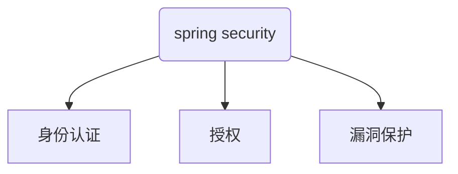

# 简介

Spring Security是一款开源的安全框架，提供了身份认证（Authentication）、授权和访问控制（Authorization）以及防止常见的网络攻击（会话固定、CSRF）的功能。

## 体系结构

Spring提供了`DelegatingFilterProxy`用于桥接Servlet容器和Spring。即如果过滤器想要使用Spring托管的Bean，就必须通过`DelegatingFilterProxy`。Spring Security作为Spring大家庭中的一员，提供了`FilterChainProxy`这一个特殊的`Filter`，它通过`SecurityFilterChain`委派给众多的Security过滤器来执行具体的操作。

为什么在`DelegatingFilterProxy`下在加个`FilterChainProxy`？它为所有的Security过滤器提供了一个起点。和其他过滤器解耦。

# 一、身份认证[^Authentication]

Spring Security提供了全面的身份认证支持。

Spring Security的身份认证模块有以下重要组件：

1. `SecurityContextHolder`：**是Spring Security存储已经通过身份认证的用户详细信息的地方；Spring Security的核心**。其内部的数据只用于当前登录用户。Spring Security将会使用认证通过的用户信息进行授权和访问控制`authorization`
   1. 
2. `SecurityContext`：从`SecurityContextHolder`中获取，包含当前已经通过身份认证的用户的信息
3. `Authentication`：用户信息。作为`AuthenticationManager`的入参用于认证。通过`SecurityContextHolder`获取已认证的`Authentication`实例。
   1. `principal`：用于验证用户。当使用账号密码认证时，通常是`UserDetails`实例；
   2. `credentials`：通常是个密码。在大多数情况下，在身份认证之后，将被清理；
   3. `authorities`：用户被授予的权限。一般而言是角色或者作用域；
4. `GrantedAuthority`：被授予的验证主体的高级别的权限。即角色、作用域
5. `AuthenticationManager`：**进行身份认证的接口。spring security filter的所有身份认证操作都在这个接口的实现类上。**
   1. `Authentication authenticate(Authentication authentication) throws AuthenticationException;`
6. `ProviderManager`：`AuthenticationManager`的常用实现。`ProviderManager`委派给`AuthenticationProvider`去做具体类型的身份认证
7. `AuthenticationProvider`：**由`ProviderManager`用于执行特定类型的身份认证。比如：**
   1. `DaoAuthenticationProvider `支持用户名/密码认证
   2. `JWTAuthenticationProvider`支持JWT Token认证
8. `AuthenticationEntryPoint`：获取客户端请求，响应客户端一个http response。实现可以执行重定向到登录页、使用WWW Authenticate头响应等。
9. `AbstractAuthenticationProcessingFilter`：用于身份认证的基础过滤器
10. `UserDetailsService`：用于获取用户信息的接口，可以自己实现。
11. `UserDetails`：`UserDetailsService`返回的用户信息。存储了用户名、密码以及权限信息

Spring Security的身份认证机制有：

1. 用户名/密码认证
2. 记住我（会话超时仍然登录）（Remind Me）
3. OAuth 2.0认证
4. OpenId认证
5. CAS（中央认证服务）
6. JAAS认证
7. X509认证
8. SAML认证
9. 外部机制认证

## 身份认证机制

### 1. 用户名/密码认证[^Username/Password Authentication]

通过用户名和密码进行身份认证。用户或者系统输入用户在系统中的账户名和密码向服务器后台发起请求，进行身份认证。

Spring Security提供三种方式来从`HttpServletRequest`中获取用户名密码：

- Form Login
- HTTP Basic Authentication
- HTTP Digest Authentication

基于上述三种，我们可以根据现有的业务系统，自行扩展

#### Form Login

表单登录。Spring Security提供了一套自定义的登录页面，支持表单登录。对于前后端分离项目而言不需要看。

#### Basic HTTP Authentication

基本HTTP身份认证方案，使用Base64编码传输用户/密码作为身份凭据。用户名密码是明文传输，被认为是不安全的。

置于header中的Authorization属性。

#### Digest HTTP Authentication

摘要HTTP身份认证方案。避免了基础HTTP身份认证方案中明文传输凭据的缺陷。摘要式身份认证的核心是`nonce`，是一个由服务器生成的随机值。客户端将用户名、密码和这个`nonce`进行拼接，并MD5哈希传输到服务器，服务器在处理每个请求之前，读取这个凭据进行认证。

由于每次请求都要传输这个凭据，因此客户端必须存储用户名密码，同时服务器需要每次都对用户名密码以及随机值进行拼接验证，因此也不能采用不可逆的加密来存储用户名密码。

置于header中的Authorization属性。

### 2. 记住我身份认证[^Reminber-Me Authentication]

启用记住我之后，服务会生成一个身份令牌，从而记住用户身份，不用每次都传递用户名密码信息。

存在两种实现形式：

1. 基于cookie的hash算法生成的令牌token
   1. 不太适用于app。app端需要自行处理cookie，麻烦
2. 基于服务端，使用数据库或其他存储方式存储的令牌token
   1. 随着用户量的增长，服务器压力急剧上升

### 3. 基于OpenId身份认证[^OpenId Support]

# 二、授权[^Authorization]

# 三、漏洞保护[^Protection Against Exploits]

## 跨站点请求伪造[^ CSRF]

Cross Site Request Forgery

## 安全HTTP响应头

## HTTP

# 四、密码学

# 源码分析

# 总结

# 其他

## Spring Security所有Filter

- ChannelProcessingFilter
- ConcurrentSessionFilter
- WebAsyncManagerIntegrationFilter
- SecurityContextPersistenceFilter
- HeaderWriterFilter
- CorsFilter
- CsrfFilter
- LogoutFilter
- OAuth2AuthorizationRequestRedirectFilter
- Saml2WebSsoAuthenticationRequestFilter
- X509AuthenticationFilter
- AbstractPreAuthenticatedProcessingFilter
- CasAuthenticationFilter
- OAuth2LoginAuthenticationFilter
- Saml2WebSsoAuthenticationFilter
- [`UsernamePasswordAuthenticationFilter`](https://docs.spring.io/spring-security/site/docs/5.3.1.BUILD-SNAPSHOT/reference/html5/#servlet-authentication-usernamepasswordauthenticationfilter)
- ConcurrentSessionFilter
- OpenIDAuthenticationFilter
- DefaultLoginPageGeneratingFilter
- DefaultLogoutPageGeneratingFilter
- [`DigestAuthenticationFilter`](https://docs.spring.io/spring-security/site/docs/5.3.1.BUILD-SNAPSHOT/reference/html5/#servlet-authentication-digest)
- BearerTokenAuthenticationFilter
- [`BasicAuthenticationFilter`](https://docs.spring.io/spring-security/site/docs/5.3.1.BUILD-SNAPSHOT/reference/html5/#servlet-authentication-basic)
- RequestCacheAwareFilter
- SecurityContextHolderAwareRequestFilter
- JaasApiIntegrationFilter
- RememberMeAuthenticationFilter
- AnonymousAuthenticationFilter
- OAuth2AuthorizationCodeGrantFilter
- SessionManagementFilter
- [`ExceptionTranslationFilter`](https://docs.spring.io/spring-security/site/docs/5.3.1.BUILD-SNAPSHOT/reference/html5/#servlet-exceptiontranslationfilter)
- [`FilterSecurityInterceptor`](https://docs.spring.io/spring-security/site/docs/5.3.1.BUILD-SNAPSHOT/reference/html5/#servlet-authorization-filtersecurityinterceptor)
- SwitchUserFilter

## 参考资料

[传统 Web 应用中的身份验证技术](https://www.jianshu.com/p/6ca51a8d66bd)

[^Authentication]: 身份认证
[^Protection Against Exploits]: 漏洞保护
[^ CSRF]: 跨站点请求伪造
[^Authorization]: 授权
[^Username/Password Authentication]: 用户名密码认证
[^Reminber-Me Authentication]: 记住我-基于Token认证