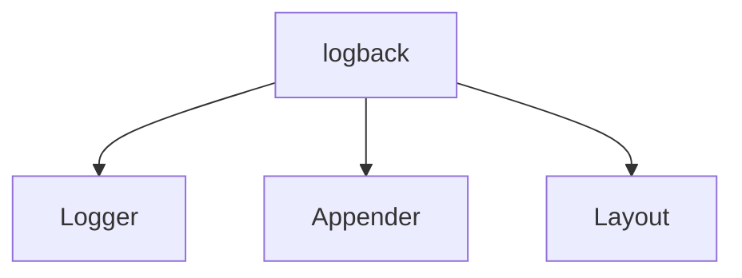

# 一、简介

logback是日志系统，它继承自log4j，比其他的日志系统更快更小。


# 二、逻辑组件

`logback`主要构建在三个组件上：`Logger`、`Appender`、`Layout`。

- `Logger`负责设定日志的输出级别：trace、debug、info、warn、error；默认debug级别
- `Appender`负责确定日志输出的目的地，比如控制台、文件、消息队列、数据库等。一个`Logger`可以输出到多个`Appender`中；
- `Layout`负责确定输出日志的格式，对日志进行格式化。





除了主要的这三大组件，还有诸如`Encoders`、`Filters`、`MDC`、`Receivers`等组件。

- `Encoders`：更好的控制日志输出。将日志事件`LoggingEvent`转换成字节数组，希望能够更好的控制日志输出（类似于Layout，存在的目的是拓展Layout）；
- `Filters`：用于按需求过滤日志。过滤器基于三元运算逻辑，多个过滤器组装或者链接成一个复杂的过滤逻辑；
- `Receiver`：用于接收远程`Appender`的日志事件，如果是`Appender`是日志事件的生产者，那么`Receiver`就是日志事件的消费者。结合使用基于套接字的 appender 与 receiver，可以构建复杂的拓扑图，通过网络分发应用程序的日志事件。


## Logger

`Logger`负责设定日志的输出级别：trace、debug、info、warn、error；默认debug级别


## Appender

`Appender`负责确定日志输出的目的地，比如控制台、文件、消息队列、数据库等。一个`Logger`可以输出到多个`Appender`中；


## Layout

`Layout`负责确定输出日志的格式，对日志进行格式化。


## Filters

在`logback-classic`中，有两种类型的过滤器，`regular`过滤器以及`turbo`过滤器。

- `regular`过滤器需要实现`Filter抽象类`，直接绑定到对应的`Appender`实例上；
- `turbo`过滤器需要实现`TurboFilter`抽象类，是绑定在`Logger`上下文中。即每次打印都会调用

过滤器通过一个有序列表进行管理。过滤器可以被直接添加到 `Appender` 实例上。通过将一个或者多个过滤器添加到`Appender`上，你可以通过任意标准来过滤日志事件。例如，日志消息的内容，`MDC`的内容，时间，或者日志事件的其它部分。

在logback中，每个过滤器的 `decide(ILoggingEvent event)` 被依次调用。我们只要实现 `Filter`接口的`decide`方法，就能够按照自己的方式过滤日志。`decide`方法会返回一个枚举`FilterReply`。枚举有三个类型：`DENY`、`NEUTRAL`、`ACCEPT`。

- `DENY`：跳过剩下的过滤器，直接丢弃日志
- `NEUTRAL`：往后继续执行其他过滤器
- `ACCEPT`：跳过剩下的过滤器，直接执行日志输出

常见的`Filter`有`LevelFilter`


## MDC

`MDC`即日志上下文。

实现方式：在每个线程的基础上管理上下文信息，而后通过特定的 logback 组件去获取

`MDC` 类中只包含静态方法。它让开发人员可以在 *诊断上下文* 中放置信息，而后通过特定的 logback 组件去获取。


实用案例之全局打印用户信息：

1. 先在代码中加上一行 `MDC.put("user", request.getHeader("userId"));`

2. 然后在 logback 的 pattern 中加上 `%X{user}` 即可


目前`MDCInsertingServletFilter`提供以下上下文信息，可直接在日志中打印

| MDC key             | MDC value                                                    |
| ------------------- | ------------------------------------------------------------ |
| `req.remoteHost`    | 由 [getRemoteHost()](http://java.sun.com/j2ee/sdk_1.3/techdocs/api/javax/servlet/ServletRequest.html#getRemoteHost()) 返回 |
| `req.xForwardedFor` | 请求头 ["X-Forwarded-For"](http://en.wikipedia.org/wiki/X-Forwarded-For) 的值 |
| `req.method`        | 由 [getMethod()](http://java.sun.com/j2ee/sdk_1.3/techdocs/api/javax/servlet/http/HttpServletRequest.html#getMethod()) 返回 |
| `req.requestURI`    | 由 [getRequestURI()](http://java.sun.com/j2ee/sdk_1.3/techdocs/api/javax/servlet/http/HttpServletRequest.html#getRequestURI()) 返回 |
| `req.requestURL`    | 由 [getRequestURL()](http://java.sun.com/j2ee/sdk_1.3/techdocs/api/javax/servlet/http/HttpServletRequest.html#getRequestURL()) 返回 |
| `req.queryString`   | 由 [getQueryString()](http://java.sun.com/j2ee/sdk_1.3/techdocs/api/javax/servlet/http/HttpServletRequest.html#getQueryString()) 返回 |
| `req.userAgent`     | 请求头 "User-Agent" 的值                                     |


```java
package org.slf4j;

public class MDC {
  // 将上下文的值作为 MDC 的 key 放到线程上下的 map 中
  public static void put(String key, String val);

  // 通过 key 获取上下文标识
  public static String get(String key);

  // 通过 key 移除上下文标识
  public static void remove(String key);

  // 清除 MDC 中所有的 entry
  public static void clear();
}
```


## Receiver

用于接收远程 appender 的日志事件，根据本地策略打印接收到的日志事件。结合使用基于套接字的 appender 与 receiver，可以构建复杂的拓扑图，通过网络分发应用程序的日志事件

一个 logback 的配置可以包含任何数量的 receiver 组件，充当任意组合的服务器或者客户端的角色。唯一的限制是每个充当服务器角色的 receiver 必须监听在不同的端口，每个充当客户端角色的 receiver 将会准备的连接到一个远程的 appender 上。


# 三、源码时序图

[logback源码分析](https://www.processon.com/view/5e770117e4b027d999c1aedc)


# 四、收获

1. 策略模式无处不在。不论是Appender、Layout这些重要组件，还是Encoder；
2. 过滤器采用三值逻辑循环处理，没有使用责任链模式；
   1. 所谓三值逻辑是相对于古典的二值逻辑引申出来的，除了true、false、还多了未知
3. sl4j中的MDC调用的MDCAdapter重点不在于适配，而在于委派。将实际的工作委派给具体的日志系统，如logback；
4. MDC加上servlet过滤器可以实现链路追踪；


# 五、Demo

将日志通过`SocketAppender`投递到远程服务器上，并通过`DBAppender`持久化到mysql中。


## 日志服务器

### 1. 配置logback-spring.xml

```xml
<?xml version="1.0" encoding="UTF-8"?>
<configuration>
  <include resource="org/springframework/boot/logging/logback/defaults.xml"/>
  <springProperty scope="context" name="driverClassName" source="spring.datasource.driver-class-name"/>
  <springProperty scope="context" name="username" source="spring.datasource.username"/>
  <springProperty scope="context" name="password" source="spring.datasource.password"/>
  <springProperty scope="context" name="url" source="spring.datasource.url"/>

  <appender name="CONSOLE" class="ch.qos.logback.core.ConsoleAppender">
    <encoder>
      <pattern>[用户ID][%X{user}] %d{HH:mm:ss.SSS} [%thread] %-5level %logger - %msg%n</pattern>
    </encoder>
  </appender>

  <appender name="DB" class="ch.qos.logback.classic.db.DBAppender">
    <connectionSource class="ch.qos.logback.core.db.DataSourceConnectionSource">
      <dataSource class="com.alibaba.druid.pool.DruidDataSource">
        <driverClassName>${driverClassName}</driverClassName>
        <url>${url}</url>
        <username>${username}</username>
        <password>${password}</password>
      </dataSource>
    </connectionSource>
  </appender>

  <root level="INFO">
    <appender-ref ref="CONSOLE"/>
    <appender-ref ref="DB"/>
  </root>

  <receiver class="ch.qos.logback.classic.net.server.ServerSocketReceiver">
    <port>4560</port>
  </receiver>

</configuration>

```


### 2. 数据库

```mysql
CREATE TABLE `logging_event` (
  `timestmp` bigint(20) NOT NULL,
  `formatted_message` text NOT NULL,
  `logger_name` varchar(254) NOT NULL,
  `level_string` varchar(254) NOT NULL,
  `thread_name` varchar(254) DEFAULT NULL,
  `reference_flag` smallint(6) DEFAULT NULL,
  `arg0` varchar(254) DEFAULT NULL,
  `arg1` varchar(254) DEFAULT NULL,
  `arg2` varchar(254) DEFAULT NULL,
  `arg3` varchar(254) DEFAULT NULL,
  `caller_filename` varchar(254) NOT NULL,
  `caller_class` varchar(254) NOT NULL,
  `caller_method` varchar(254) NOT NULL,
  `caller_line` char(4) NOT NULL,
  `event_id` bigint(20) NOT NULL AUTO_INCREMENT,
  PRIMARY KEY (`event_id`)
) ENGINE=InnoDB AUTO_INCREMENT=266 DEFAULT CHARSET=utf8;

CREATE TABLE `logging_event_exception` (
  `event_id` bigint(20) NOT NULL,
  `i` smallint(6) NOT NULL,
  `trace_line` varchar(254) NOT NULL,
  PRIMARY KEY (`event_id`,`i`),
  CONSTRAINT `logging_event_exception_ibfk_1` FOREIGN KEY (`event_id`) REFERENCES `logging_event` (`event_id`)
) ENGINE=InnoDB DEFAULT CHARSET=utf8;

CREATE TABLE `logging_event_property` (
  `event_id` bigint(20) NOT NULL,
  `mapped_key` varchar(254) NOT NULL,
  `mapped_value` text,
  PRIMARY KEY (`event_id`,`mapped_key`),
  CONSTRAINT `logging_event_property_ibfk_1` FOREIGN KEY (`event_id`) REFERENCES `logging_event` (`event_id`)
) ENGINE=InnoDB DEFAULT CHARSET=utf8;

```


## 日志客户端

### 1. 配置logback-spring.xml

```xml
<?xml version="1.0" encoding="UTF-8"?>
<configuration>
  <include resource="org/springframework/boot/logging/logback/defaults.xml"/>

  <springProperty scope="context" name="springAppName" source="spring.application.name"/>
  <springProperty scope="context" name="springProfile" source="spring.profiles.active"/>
  <springProperty scope="context" name="appVersion" source="info.version"/>

  <property name="STDOUT_PATTERN"
    value="[用户ID][%X{user}] %d{HH:mm:ss.SSS} [%thread] %-5level %logger - %msg%n"/>

  <appender name="STDOUT" class="ch.qos.logback.core.ConsoleAppender">
    <encoder>
      <pattern>${STDOUT_PATTERN}</pattern>
      <!-- 控制台也要使用UTF-8，不要使用GBK，否则会中文乱码 -->
      <charset>UTF-8</charset>
    </encoder>
  </appender>
  
  <!-- SocketAppender，连接远程Socket服务器 -->
  <appender name="SOCKET" class="ch.qos.logback.classic.net.SocketAppender">
    <!-- logback服务器的IP地址 -->
    <remoteHost>127.0.0.1</remoteHost>
    <!-- logback服务器的端口 -->
    <port>4560</port>
  </appender>

  <logger name="org.springframework" level="WARN"/>

  <root level="INFO">
    <appender-ref ref="STDOUT" />
    <appender-ref ref="SOCKET" />
  </root>
</configuration>

```


### 2. 设置全局日志过滤器

```java
package cn.airaccoon.universe.app.intercepter;

import java.io.IOException;
import javax.servlet.Filter;
import javax.servlet.FilterChain;
import javax.servlet.ServletException;
import javax.servlet.ServletRequest;
import javax.servlet.ServletResponse;
import javax.servlet.annotation.WebFilter;
import javax.servlet.http.HttpServletRequest;
import org.slf4j.MDC;
import org.springframework.stereotype.Component;

/**
 * @author: raccoon
 * @date: 2020-03-25 11:34
 * @description: 日志上下文过滤器
 */
@Component
@WebFilter(urlPatterns = "/**", filterName = "logContextFilter")
public class LogContextFilter implements Filter {

  @Override
  public void doFilter(ServletRequest servletRequest, ServletResponse servletResponse,
      FilterChain filterChain) throws IOException, ServletException {
    try {
      HttpServletRequest request = (HttpServletRequest) servletRequest;
      MDC.put("user", request.getHeader("userId"));
      filterChain.doFilter(servletRequest, servletResponse);
    } finally {
      MDC.remove("user");
    }
  }
}
```


```java
package cn.airaccoon.universe.app.controller;

import cn.airaccoon.universe.common.model.User;
import cn.airaccoon.universe.common.utils.LogUtil;
import java.util.List;
import java.util.Map;
import lombok.extern.slf4j.Slf4j;
import org.springframework.web.bind.annotation.PostMapping;
import org.springframework.web.bind.annotation.RequestBody;
import org.springframework.web.bind.annotation.RequestParam;
import org.springframework.web.bind.annotation.RestController;

/**
 * @author: raccoon
 * @date: 2020-03-13 10:28
 * @description:
 */
@Slf4j
@RestController
public class LogController {
  @PostMapping("/private/log/info")
  public User publish(@RequestBody User user) {
    log.info("[request]: {}", user);
    return user;
  }
}
```


