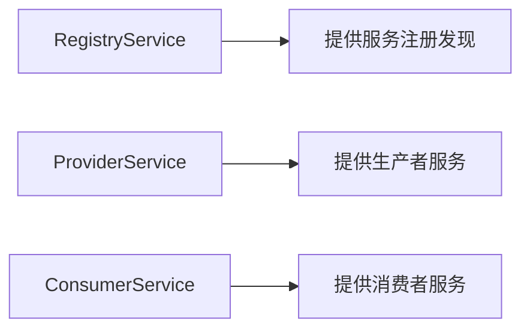

# 一、说在SpringCloud之前

## Reactive编程

### 什么是reactive编程？

reactive编程就是响应式编程。

特点是：

1. 观察者模式。发布订阅。事件驱动。
2. 流畅的（Fluent）
3. 流式编程（Stream）
4. 函数式编程

## Spring WebFlux

Spring WebFlux就是spring推出的一款reactive编程框架，剔除了对ServletAPI的依赖，采取流式函数式编程，以发布订阅驱动（观察者模式），实现同步/异步非阻塞。

WebFlux在常用组件，如`@RequestMapping`，`@Controller`等和WebMVC无任何区别。

区别在于WebFlux摒弃了Servlet。因此没有`HttpServletRequest`和`HttpServletResponse`

只有`ServerHttpRequest`和`ServerHttpResponse`

|            | spring web flux                                    | spring web mvc        |
| ---------- | -------------------------------------------------- | --------------------- |
| 请求参数   | `ServerHttpRequest`                                | `HttpServletRequest`  |
| 响应参数   | `ServerHttpResponse`                               | `HttpServletResponse` |
|            | `ServerWebExchange`：交换机，获取request和response |                       |
| 单元素集合 | Mono<T> 单元素流式编程                             |                       |
| 多元素集合 | Flux<T> 集合元素流式编程                           |                       |


## Spring Boot

Spring Boot三大特性：

1. 自动配置
   1. 提供了`@EnableConfigurationProperties`、`@ConfigurationProperties`等注解自动装配配置信息，简化了开发。
2. 起步依赖
   1. `spring-boot-starter-web`这种方式屏蔽了依赖版本冲突的问题
3. 状态监控（健康检查）
   1. 通过`actuator`组件对服务的状态进行监控

### 1. 自动配置

- `@EnableConfigurationProperties`
  - 使用：`@EnableConfigurationProperties({MyConfig.class})`
  - 描述：

- `@ConfigurationProperties`
  - 使用：`@ConfigurationProperties(prefix = "my.config")`
  - 描述：此处的`prefix`表示相同的前缀，在当前bean下的属性名称必须和配置文件中的名称一致


#### 1.1 多个环境下的配置

实际开发过程中，一般会存在开发环境dev、测试环境test、生产环境prod。每个环境存在自己的配置信息。spring boot支持程序启动时在配置文件`application.yml(properties)`中指定对应环境的配置文件。配置文件格式是`application-{profile}.yml(properties)`，`profile`对应环境标志。比如：

- `application-dev.yml`，表示开发环境
- `application-test.yml`，表示测试环境
- `application-prod.yml`，表示生产环境

在`application.yml(properties)`中配置`spring.profiles.active`即可选择对应的环境

```yaml
## 设置读取开发环境
spring:
  profiles:
    active: test
```

### 2. 状态监控

spring boot提供了对服务运行状态进行监控的组件`actuator`，监控数据可以通过REST（最常见简单）、远程shell、JMX方式获取。

引入`actuator`的起步依赖：

```xml
<dependency>
  <groupId>org.springframework.boot</groupId>
  <artifactId>spring-boot-starter-actuator</artifactId>
</dependency>
```

在配置文件中配置管理端口，用于`actuaor`暴露外部端口监控运行状态。

```yaml
management:
  server:
    port: 9090
  endpoints:
    web:
      exposure:
        ## 将所有的对外暴露的端点全部放开
        include: "*"
  endpoint:
    restart:
      ## 配置服务可以重启（默认是关闭）：/actuator/restart
      enabled: true
    pause:
      enabled: true
```

```properties
## 暴露出去的健康检查API
/actuator/health
/actuator/info
/actuator
```


## Spring Cloud大纲

1. 分布式配置
   1. consul
   2. spring cloud config
2. 服务注册发现
   1. consul
   2. eureka
   3. zookeeper
3. 服务调用
   1. feign
   2. RestTemplate
4. 负载均衡
   1. ribbon
5. 服务熔断（限流）
   1. hytrix
6. 服务网关
   1. zuul
   2. spring cloud gateway
7. 链路追踪
   1. sleuth + zipkin
8. Stream消息整合
   1. spring cloud stream + kafka
   2. spring cloud stream + rabbitmq
9. 服务总线（spring cloud bus）


# 二、服务注册和发现

## Eureka

### Eureka的基础架构

| 名称             |              | 描述                                 |
| ---------------- | ------------ | ------------------------------------ |
| Register service | 服务注册中心 | 是Eureka服务器，提供注册和发现的功能 |
| Provider service | 生产者       | 是Eureka客户端，提供服务             |
| Consumer service | 消费者       | 是Eureka客户端，消费服务             |

生产者将服务名和服务IP通过REST API的方式注册到注册中心，同样，服务消费者 EurekaClient也向服务注册中心Eureka Server 注册。同时服务消费者获取一份服务注册列表的信息 ， 该列表包含了所有向脱务注册中心 Eureka Server 注册的服务信息。获取服务注册列表信息之后 ，服务消费者就知道服务提供者的 IP地址，可以通过 Http远程调度来消费服务提供者的服务。





### Eureka中的概念

- 服务注册-register
  - Eureka Client向Eureka Server注册时，发送自身的元数据（自身ip、端口、健康检查url、主页地址等信息）
- 服务续约（心跳）-register renew
  - Eureka Client会每隔30秒发送一次心跳信息给Eureka Server，告知其自身是否可用。如果Eureka Server90秒都没雨收到心跳注册中心会删除该客户端信息。
  - 注意：官方不建议更改服务续约的间隔时间
  - 此处的服务续约就是心跳检测
- 获取服务注册列表信息-fetch registries
  - Eureka Client会从Eureka Server拉取服务列表，并缓存到本地。Eureka Client通过拉取到的服务列表查找到自己想要的服务地址信息，进行远程调用。
  - 注册信息每30秒更新一次，如果本地缓存和Eureka Server不同，Eureka Client会自行处理。
- 服务下线-cancel
  - Eureka Client在服务关闭时可以向Eureka Server发送下线请求。发送请求后，Eureka Server就会从服务注册列表中删除该服务
  - 该下线请求不会自动完成。需要在程序关闭时添加以下代码`DiscoveryManager.getinstance().shutdownComponent();`
- 服务剔除-eviction
  - 默认情况下，Eureka Server在90秒内没有接收到Eureka Client的心跳，则将该服务从注册服务列表中剔除。
- Eureka的高可用


### 构建简单的Eureka Server和Eureka Client

首先，引入maven依赖

```xml
    <properties>
        <project.build.sourceEncoding>UTF-8</project.build.sourceEncoding>
        <project.reporting.outputEncoding>UTF-8</project.reporting.outputEncoding>
        <java.version>1.8</java.version>
        <spring-cloud.version>Finchley.SR1</spring-cloud.version>
    </properties>

    <!-- 引入eureka的服务 -->
    <dependency>
      <groupId>org.springframework.cloud</groupId>
      <artifactId>spring-cloud-starter-eureka-server</artifactId>
      <version>1.4.6.RELEASE</version>
    </dependency>

    <dependencyManagement>
        <dependencies>
            <dependency>
                <groupId>org.springframework.cloud</groupId>
                <artifactId>spring-cloud-dependencies</artifactId>
                <version>${spring-cloud.version}</version>
                <type>pom</type>
                <scope>import</scope>
            </dependency>
        </dependencies>
    </dependencyManagement>
```

配置Eureka Server

```java
@EnableEurekaServer
@SpringBootApplication
public class EurekaApplication {
    public static void main(String[] args) {
        SpringApplication.run(EurekaApplication.class);
    }
}
```

```yaml
server:
  ## eureka注册中心默认端口就是8761
  port: 8761
eureka:
  instance:
    hostname: 127.0.0.1
  client:
    register-with-eureka: false
    fetch-registry: false
    service-url:
      defaultZone: http://${eureka.instance.hostname}:${server.port}
spring:
  application:
    name: eureka
```

Eureka Server注册中心地址：`http://127.0.0.1:8761/`


配置Eureka Client

```java
@EnableEurekaClient
@SpringBootApplication
public class EurekaProviderApplication {
    public static void main(String[] args) {
        SpringApplication.run(EurekaProviderApplication.class);
    }
}

// Controller代码
@RestController
public class HelloController {
    @Value("${server.port}")
    private String port;
    @GetMapping("/hello.json")
    public Map<String, Object> hello() {
        Map<String, Object> result = new HashMap<>(1);
        result.put("port", port);
        return result;
    }
}
```

```yaml
eureka:
  client:
    service-url:
      defaultZone: http://localhost:8761/eureka/

server:
  port: 8762
spring:
  application:
    name: provider
```


### 构建高可用的EurekaServer集群

因为目前的服务注册发现主流是通过Docker来进行实现，不再研究Eureka集群。


### Eureka存在的问题

引入eureka之后，服务响应数据全部变成xml。需要指定produces才能修改成json。工作量太大。


# 三、负载均衡

## Ribbon简介

负载均衡存在两种方式：

1. 作为独立的进程单元。通过负载均衡策略，将请求转发到不同的执行单元上。比如：Nginx
2. 将负载均衡逻辑封装在客户端代码上。服务消费者维护服务提供者的信息列表，服务消费者通过负载均衡策略将请求分发到不同的服务提供者。比如：Ribbon

Ribbon是netflix公司提供的一套负载均衡组件，采用第二种方式。

Ribbon作为负载均衡器，在spring cloud微服务系统中，结合了两种方式进行集成。

1. 和RestTemplate结合
2. 和Feign结合。Feign默认集成了Ribbon


## 什么是RestTemplate

RestTemplate是spring framework中访问三方restful api接口的模板类。

RestTemplate是用来消费REST服务的。

支持HTTP协议的请求方法，例如`GET POST DELETE PUT`等

案例：

```java
    @GetMapping("/rest")
    public Map<String, Object> rest() {
        Map<String, Object> result = new HashMap<>(1);
        RestTemplate restTemplate = new RestTemplate();
        String url = "http://127.0.0.1:8762/hello.json";
        Map jsonResult = restTemplate.getForObject(url, HashMap.class);
        result.put("result", jsonResult);
        return result;
    }
		//输出： {result={port=8762}}
```


## Ribbon结合RestTemplate消费服务

架构：一个Eureka Server、两个Eureka Client、一个Ribbon Consumer

两个Eureka Client相同，都提供了`/hello.json`接口。端口分别是`8763`和`8763`。Ribbon Consumer作为消费者端口是`8764`

Ribbon代码

```xml
 <!-- pom.xml -->
 <!-- 引入ribbon的服务 -->
 <dependency>
   <groupId>org.springframework.cloud</groupId>
   <artifactId>spring-cloud-starter-netflix-ribbon</artifactId>
   <version>1.4.6.RELEASE</version>
 </dependency>

```

```yaml
## bootstrap.yml
eureka:
  client:
    service-url:
      defaultZone: http://localhost:8761/eureka/

server:
  port: 8764
spring:
  application:
    name: ribbon
```

```java
@EnableEurekaClient
@SpringBootApplication
public class RibbonApplication {
    public static void main(String[] args) {
        SpringApplication.run(RibbonApplication.class);
    }
}
@Configuration
public class RibbonConfig {
    @Bean
    @LoadBalanced	// 此处使用了Ribbon的负载均衡。默认算法平均访问服务提供者。
    public RestTemplate restTemplate() {
        return new RestTemplate();
    }
}
@RestController
public class RibbonController {
    @Autowired
    private RestTemplate restTemplate;
    @GetMapping("/ribbon")
    public String ribbon() {
        // 此处的provider替换了原本需要的远程服务的IP和端口。
        // 这个provider就是服务提供者的名称${application.application.name}
        String url = "http://provider/hello.json";
        Map jsonResult = restTemplate.getForObject(url, HashMap.class);
        return jsonResult.toString();
    }
}
```

此时访问`/ribbon`，就会平均获得结果`{port=8763}`和`{port=8762}`。即负载均衡成功。


# 四、声明式调用

## Feign简介

Feign是Netflix开发的一款声明式、模板化的HTTP客户端， Feign可以帮助我们更快捷、优雅地调用HTTP API。

Spring Cloud对Feign进行了增强，使Feign支持了Spring MVC注解，并整合了Ribbon和Eureka，从而让Feign的使用更加方便。

Spring Cloud Feign是基于Netflix feign实现，整合了Spring Cloud Ribbon和Spring Cloud Hystrix，除了提供这两者的强大功能外，还提供了一种声明式的Web服务客户端定义的方式。


## Feign案例

以下案例沿用ribbon案例：

```xml
<!-- 引入feign的服务 -->
<dependency>
  <groupId>org.springframework.cloud</groupId>
  <artifactId>spring-cloud-starter-openfeign</artifactId>
  <version>2.1.1.RELEASE</version>
</dependency>
```

```yaml
eureka:
  client:
    service-url:
      defaultZone: http://localhost:8761/eureka/

server:
  port: 8765
spring:
  application:
    name: feign
```

```java
// 远程调用接口定义
// 定义当前接口是通过Feign远程调用的。
// 调用者服务是provider（spring.application.name=provider）
// 多个provider则默认通过ribbon进行负载均衡。
// 如果存在自己的配置，则添加configuration，比如失败重试间隔时间等
@FeignClient(value = "provider", configuration = FeignConfig.class)
public interface EurekaClientFeignApi {
    // 此处的值是服务提供者的远程URL地址
    @GetMapping(value = "/hello.json")
    Map<String, Object> sayHelloFromEurekaClient();
}

// 如果需要自定义一些Feign配置则添加这个
@Configuration
public class FeignConfig {
    @Bean
    public Retryer retryer() {
        return new Retryer.Default(100, 1, 5);
    }
}

// 允许FeignClients
@EnableFeignClients
@EnableEurekaClient
@SpringBootApplication
public class FeignApplication {
    public static void main(String[] args) {
        SpringApplication.run(FeignApplication.class);
    }
}

// 通过该接口进行远程调用。
@RestController
public class EurekaClientFeignController {
    @Autowired
    private EurekaClientFeignApi eurekaClientFeignApi;
    @GetMapping(value = "/hello")
    public Map<String, Object> sayHelloFromEurekaClient(@RequestParam(value = "name") String name) {
        Map<String, Object> result = eurekaClientFeignApi.sayHelloFromEurekaClient();
        result.put("name", name);
        return result;
    }
}

// 由于存在两个名字叫"provider"的服务，因此根据ribbon进行负载均衡，会交替返回以下数据
{"port": 8763,"name": "zhangsan"}
{"port": 8762,"name": "zhangsan"}

```


# 五、服务熔断

## 什么是服务熔断

在分布式系统中，服务之间的依赖错综复杂，一旦某个服务出现故障，则会导致依赖于他的服务出现远程调度的线程阻塞。

Hystrix是Netflix提供的一个熔断器组件。能够阻止分布式系统中服务的联动故障。Hystrix通过隔离服务的访问点组织联动故障，并提供了故障的解决方案，从而提升整个分布式系统的弹性。


## Hytrix解决了什么问题

服务A依赖了服务B、C、D、E。D服务故障，则服务A就会等待服务D，且其他的服务请求也会被阻塞。高并发情况下，会导致服务器线程资源消耗殆尽直至不可用，导致整个系统不可用，这就叫做雪崩效应。

为了防止雪崩效应，产生了熔断器模型。

Hystrix 是在业界表现非常好的一个熔断器模型实现的开源组件。

## Hystrix设计原则

- 防止单个服务的故障耗尽整个服务的Servlet容器的线程资源。
- 快速失败机制：如果某个服务故障，则调用该服务的请求快速失败，而不是线程等待。
- 回退（fallback）方案：在请求发生故障时，提供设定好的故障回退方案。
- 熔断机制：防止故障扩散到其他服务
- 监控组件：提供熔断器的监控组件 Hystrix Dashboard，可以实时监控熔断器的状态 。

## Hystrix的工作机制

当服务的某个API接口请求失败次数在一定时间内小于阈值时，熔断器处于关闭状态，该API接口正常提供服务。当失败次数达到阈值后，Hystrix就会判定该接口出现故障，开启熔断器，此时请求该 API 接口会执行快速失败的逻辑（回退fallback方案），不执行具体的业务逻辑，请求的线程不会处于阻塞状态。处于开启状态的熔断器会在一段时间之后处于半开启状态，并将一定数量的请求执行正常逻辑。剩余的请求会执行快速失败，若执行正常逻辑的 请求失败了，则熔断器继续打开；若成功了 ，则将熔断器关闭。这样熔断器就具有了自我修复的能力。


## Hystrix结合Feign案例

基于之前的案例进行改造。

开启注册中心、和一个Eureka生产者，然后开启Hystrix消费者。

```xml
<!-- feign的起步配置就自动添加了hystrix -->
<!-- 引入hystrix的服务 -->
<dependency>
  <groupId>org.springframework.cloud</groupId>
  <artifactId>spring-cloud-starter-netflix-hystrix</artifactId>
  <version>2.1.1.RELEASE</version>
</dependency>
```

```yaml
## bootstrap.yml
eureka:
  client:
    service-url:
      defaultZone: http://localhost:8761/eureka/

server:
  port: 8766
spring:
  application:
    name: hystrix

## application.yml
### 配置开启熔断器
feign:
  hystrix:
    enabled: true
```

```java
@EnableHystrix  // 开启Hystrix熔断器
@EnableFeignClients
@EnableEurekaClient
@SpringBootApplication
public class HystrixApplication {
    public static void main(String[] args) {
        SpringApplication.run(HystrixApplication.class);
    }
}

// 通过fallback添加熔断器的回退方案
@FeignClient(value = "provider", configuration = FeignConfig.class, fallback = EurekaClientFeignApiFallback.class)
public interface EurekaClientFeignApi {
    @GetMapping(value = "/hello.json")
    Map<String, Object> hello();
}

// 实现上面的接口，即所谓的回退方案
@Component
public class EurekaClientFeignApiFallback implements EurekaClientFeignApi {
    @Override
    public Map<String, Object> hello() {
        Map<String, Object> map = new HashMap<>();
        map.put("code", "999");
        map.put("message", "rpc error!!!");
        return map;
    }
}

@RestController
public class EurekaClientFeignController {
    @Autowired
    private EurekaClientFeignApi eurekaClientFeignApi;
    @GetMapping(value = "/hello")
    public Map<String, Object> sayHelloFromEurekaClient(@RequestParam(value = "name") String name) {
        Map<String, Object> result = eurekaClientFeignApi.hello();
        result.put("name", name);
        return result;
    }
}

// 1. 开启生产者服务，返回正常
{"port": 8762, "name": "zhangsan"}
// 2. 关闭生产者服务，通过回退方案返回对应数据
{"code": 999, "name": "zhangsan", "message": "rpc error!!!"}
// 生产者服务重启之后，可能需要等待一段时间关闭熔断器，才能够真是调用到接口

```

## 使用Dashboard监控熔断器Hystrix的状态

Hystrix Dashboard提供了友好的图形化界面用于熔断器的状态数据监控。

```java
// 通过@EnableHystrix开启熔断器功能
// 通过@EnableHystrixDashboard开启熔断器监控器
@EnableHystrix
@EnableHystrixDashboard
@EnableFeignClients
@EnableEurekaClient
@SpringBootApplication
public class HystrixApplication {
    public static void main(String[] args) {
        SpringApplication.run(HystrixApplication.class);
    }
  	// 添加监控地址
    @Bean
    public ServletRegistrationBean getServlet(){
        HystrixMetricsStreamServlet streamServlet = new HystrixMetricsStreamServlet();
        ServletRegistrationBean registrationBean = new ServletRegistrationBean(streamServlet);
        registrationBean.setLoadOnStartup(1);
        registrationBean.addUrlMappings("/actuator/hystrix.stream");
        registrationBean.setName("HystrixMetricsStreamServlet");
        return registrationBean;
    }
}
```

```xml
<!-- 引入hystrix监控器的服务 -->
<dependency>
  <groupId>org.springframework.cloud</groupId>
  <artifactId>spring-cloud-netflix-hystrix-dashboard</artifactId>
  <version>2.1.1.RELEASE</version>
</dependency>

```

启动之后访问一下路径：

[http://127.0.0.1:8766/hystrix](http://127.0.0.1:8766/hystrix)


输入`http://127.0.0.1:8766/actuator/hystrix.stream`、2000、自定义名称

点击Monitor Steam按钮。

之后访问接口`http://127.0.0.1:8766/hello?name=zhangsan`。然后查看刚才那个网站，就会出现一下监控信息。


# 六、服务网关

## Spring Cloud Gateway

Spring Cloud Gateway目的是提供统一的路由方式，采用了非阻塞的编程方式。

产生的原因是为了替代netflix的zuul。

spring cloud gateway基于Filter链的方式提供了网关基本的功能，用于提供统一的路由、安全、监控/埋点、限流等。

## 工作原理

用户发起请求，经由网关，网关通过DispatcherHandler接收请求，然后遍历HandlerMapping获取WebHandler，匹配路由信息，并通过谓语进行判断路由是否可用（路由谓语工厂）。如果可用，则通过WebHandler进行处理请求，然后经由过滤器链，路由到业务服务处理业务。


## 三大过滤器类型

1. 路由谓语工厂（Route Rredicate Factory）
2. 自定义网关过滤工厂（Gateway Filter Factory）
3. 自定义全局过滤器（GlobalFilter）


### 路由谓语工厂

路由谓语工厂：Route Prediacate Factory

Spring Cloud Gateway将路由作为SpringWebFlux中HandlerMapping基础设施的一部分进行匹配。SpringCloudGateway包含许多内置的路由谓词工厂。所有这些谓词都符合HTTP请求的不同属性。可以组合多个路由谓词工厂，并通过逻辑和组合。

作用域是特定路由。

比如可以针对特定路由，指定header头或者事件或者host的请求才能通过。

常见的spring cloud gateway提供的路由谓语工厂：

`AfterRoutePrediacateFactory`、`BeforeRoutePredicateFactory`、`BetweenRoutePredicateFactory`、`CookieRoutePredicateFactory`、`HeaderRoutePredicateFactory`、`HostRoutePredicateFactory`、`MethodRoutePredicateFactory`、`PathRoutePredicateFactory`、`QueryRoutePredicateFactory`、`RemoteAddrRoutePredicateFactory`


### 自定义网关过滤工厂

自定义网关过滤工厂：Gateway Filter Factory

通过网关过滤工厂，允许以某种特定的方式修改传入的Http请求或者传出的Http响应。

该过滤工厂的作用域是用户指定的特定路由。

自定义GatewayFilter又有两种实现方式，一种是直接 **实现GatewayFilter接口**，另一种是 **继承AbstractGatewayFilterFactory类** ,任意选一种即可。


### 自定义全局过滤器

自定义全局过滤器：GlobalFilter

全局过滤器的作用域是所有路由。

自定义全局过滤器，需要继承GlobalFilter


[spring cloud gateway的filter使用案例](https://segmentfault.com/a/1190000016227780)


# 七、服务链路追踪

分布式微服务系统中，服务之间调用关系错综复杂，追踪问题变得异常麻烦，这就需要追踪一个请求的调用路径。这就需要服务链路追踪。

常见的链路追踪组件有 Google 的 Dapper、 Twitter 的 Zipkin， 以及阿里的 Eagleeye (鹰眼)等。

本章节主要讲述Spring Cloud Sleuth结合Zipkin实现服务链路追踪。

## 基础术语

- Span
  - 基本工作单元。发送一个远程调度任务就会产生一个 Span。span是用一个64位ID唯一标识的
  - Span 还包含了其他的信息，例如：摘要、时间戳事件 、 Span 的ID以及进程 ID。
- Trace
  - 由一系列 Span组成的，呈树状结构。
  - 请求一个微服务API，该API又调用其他的微服务API，每调用一个API就产生一个Span，有这些Span组成的树状调用链就是Trace
- Annotation
  - 用于记录一个事件，一些核心注解用于定义一个请求的开始和结束，这些注解如下：
    - cs-Client Sent: 客户端发送一个请求，这个注解描述了 Span 的开始 。
    - sr-Server Received:服务端获得请求并准备开始处理它 ，如 果将其 sr 减去 cs 时间戳，
      便可得到网络传输的时间。
    - ss-Server Sent:服务端发送 响应 ， 该注解表明请求处理的完成(当请求返回客户端) ，
      用 SS 的时间戳减去 sr时间戳，便可以得到服务器请求的时间。
    - er-Client Received: 客户端接收响应， 此时 Span 结束，如果 er 的时间 戳减去 cs 时间
      戳，便可以得到整个请求所消耗 的时间 。


## Sleuth + Zipkin案例

Spring Cloud Sleuth有两种方式整合Zipkin。

- Http直连方式
- MQ方式


主要分成四个模块，一个Eureka Server，一个Zipkin Server，一个服务生产者，一个Gateway。

通过gateway调用链接，路由到服务生产者。

Eureka Server沿用之前模块。

### Spring Cloud Sleuth通过Http直连方式整合zipkin

#### 1. 配置Zipkin Server

```xml
<!-- 务必注意版本问题 -->
<!-- 引入zipkin-server -->
<dependency>
  <groupId>io.zipkin.java</groupId>
  <artifactId>zipkin-server</artifactId>
  <version>2.8.2</version>
</dependency>

<!-- 引入zipkin-server 图形化界面 -->
<dependency>
  <groupId>io.zipkin.java</groupId>
  <artifactId>zipkin-autoconfigure-ui</artifactId>
  <version>2.8.2</version>
</dependency>
```

```yaml
eureka:
  client:
    service-url:
      defaultZone: http://localhost:8761/eureka/
server:
  port: 9411
spring:
  application:
    name: zipkin-server
# zipkin启动报错无法访问的解决方法
management:
  metrics:
    web:
      server:
        auto-time-requests: false
```

```java
@EnableZipkinServer
@EnableEurekaClient
@SpringBootApplication
public class ZipkinApplication {
    public static void main(String[] args) {
        SpringApplication.run(ZipkinApplication.class);
    }
}
```

#### 2. 配置服务生产者

```xml
<!-- 引入zipkin起步依赖 -->
<dependency>
  <groupId>org.springframework.cloud</groupId>
  <artifactId>spring-cloud-starter-zipkin</artifactId>
</dependency>
```

```yaml
eureka:
  client:
    service-url:
      defaultZone: http://localhost:8761/eureka/
server:
  port: 8768
spring:
  application:
    name: zipkin-provider
  sleuth:
    sampler:
      probability: 1.0
  zipkin:
    base-url: http://127.0.0.1:9411
```

```java
@EnableEurekaClient
@SpringBootApplication
public class ZipkinProviderApplication {
    public static void main(String[] args) {
        SpringApplication.run(ZipkinProviderApplication.class);
    }
}
@RestController
public class HiController {
    @GetMapping(value = "hi")
    public Map<String, Object> hi() {
        Map<String, Object> result = new HashMap<>(1);
        result.put("hi", "hi");
        return result;
    }
}
```

#### 3. 配置gateway

```xml
<!-- 引入zuul的服务 -->
<dependency>
  <groupId>org.springframework.cloud</groupId>
  <artifactId>spring-cloud-starter-netflix-zuul</artifactId>
  <version>2.0.0.RELEASE</version>
</dependency>
<!-- 引入zipkin起步依赖 -->
<dependency>
  <groupId>org.springframework.cloud</groupId>
  <artifactId>spring-cloud-starter-zipkin</artifactId>
</dependency>
```

```yaml
eureka:
  client:
    service-url:
      defaultZone: http://localhost:8761/eureka/
server:
  port: 8769
spring:
  application:
    name: zipkin-gateway
  sleuth:
    sampler:
      probability: 1.0
  zipkin:
    base-url: http://127.0.0.1:9411
zuul:
  routes:
    api-a:
      ## 配置访问/user-api/**的路由转发到服务zipkin-provider上去
      path: /user-api/**
      serviceId: zipkin-provider
```

```java
@EnableZuulProxy
@EnableEurekaClient
@SpringBootApplication
public class ZipkinGatewayApplication {
    public static void main(String[] args) {
        SpringApplication.run(ZipkinGatewayApplication.class);
    }
}
```

#### 4. 运行系统

搭建系统之后，依次启动eureka-server、zipkin server、zipkin provider、zipkin gateway。在浏览器上访问`http://10.0.7.151:8769/user-api/hi`，然后访问`http://127.0.0.1:9411/zipkin/`就可以查看到服务调用链了。


### Spring Cloud Sleuth通过RabbitMQ方式整合zipkin

#### 1. 配置Zipkin Server

```xml
<!-- 引入zipkin-server -->
<dependency>
  <groupId>io.zipkin.java</groupId>
  <artifactId>zipkin-server</artifactId>
  <version>2.8.2</version>
</dependency>

<!-- 引入zipkin-server 图形化界面 -->
<dependency>
  <groupId>io.zipkin.java</groupId>
  <artifactId>zipkin-autoconfigure-ui</artifactId>
  <version>2.8.2</version>
</dependency>

<!-- 使用消息的方式收集数据（使用rabbitmq） -->
<dependency>
  <groupId>io.zipkin.java</groupId>
  <artifactId>zipkin-autoconfigure-collector-rabbitmq</artifactId>
  <version>2.3.1</version>
</dependency>
```

```yaml
server:
  port: 9411
eureka:
  client:
    service-url:
      defaultZone: http://localhost:8761/eureka/
spring:
  application:
    name: zipkin-rabbitmq-server
## 为zipkin配置rabbitmq
zipkin:
  collector:
    rabbitmq:
      addresses: 47.92.96.167:5672
      username: raccoon
      password: 116511
      queue: zipkin
    sample-rate: 1
# zipkin启动报错无法访问的解决方法
management:
  metrics:
    web:
      server:
        auto-time-requests: false
```

```java
@EnableZipkinServer
@EnableEurekaClient
@SpringBootApplication
public class ZipkinRabbitMqServerApplication {
    public static void main(String[] args) {
        SpringApplication.run(ZipkinRabbitMqServerApplication.class);
    }
}

```

#### 2. 配置服务生产者

```xml
<dependency>
  <groupId>org.springframework.cloud</groupId>
  <artifactId>spring-cloud-starter-zipkin</artifactId>
</dependency>
<!-- 配置MQ -->
<dependency>
  <groupId>org.springframework.amqp</groupId>
  <artifactId>spring-rabbit</artifactId>
</dependency>
```

```yaml
server:
  port: 8770
eureka:
  client:
    service-url:
      defaultZone: http://localhost:8761/eureka/
spring:
  application:
    name: zipkin-rabbitmq-provider
  rabbitmq:
    port: 5672
    host: 47.92.96.167
    username: raccoon
    password: 116511
  zipkin:
    rabbitmq:
      queue: zipkin
  sleuth:
    sampler:
      probability: 1.0
```

```java
@EnableEurekaClient
@SpringBootApplication
public class ZipkinRabbitProviderApplication {
    public static void main(String[] args) {
        SpringApplication.run(ZipkinRabbitProviderApplication.class);
    }
}
@RestController
public class HelloController {
    @GetMapping(value = "hello")
    public Map<String, Object> hi() {
        Map<String, Object> result = new HashMap<>(1);
        result.put("hello", "hello");
        return result;
    }
}
```

#### 3. 配置gateway

```xml
<!-- 引入zuul的服务 -->
<dependency>
  <groupId>org.springframework.cloud</groupId>
  <artifactId>spring-cloud-starter-netflix-zuul</artifactId>
  <version>2.0.0.RELEASE</version>
</dependency>
<dependency>
  <groupId>org.springframework.cloud</groupId>
  <artifactId>spring-cloud-starter-zipkin</artifactId>
</dependency>
<!-- 配置MQ -->
<dependency>
  <groupId>org.springframework.amqp</groupId>
  <artifactId>spring-rabbit</artifactId>
</dependency>
```

```yaml
server:
  port: 8771

eureka:
  client:
    service-url:
      defaultZone: http://localhost:8761/eureka/

spring:
  application:
    name: zipkin-rabbitmq-gateway
  rabbitmq:
    port: 5672
    host: 47.92.96.167
    username: raccoon
    password: 116511
  zipkin:
    rabbitmq:
      queue: zipkin
  sleuth:
    sampler:
      probability: 1.0
zuul:
  routes:
    api-a:
      ## 配置访问/user-api/**的路由转发到服务zipkin-rabbitmq-provider上去
      path: /user-api/**
      serviceId: zipkin-rabbitmq-provider
```

```java
@EnableZuulProxy
@EnableEurekaClient
@SpringBootApplication
public class ZipkinRabbitGatewayApplication {
    public static void main(String[] args) {
        SpringApplication.run(ZipkinRabbitGatewayApplication.class);
    }
}
```

#### 4. 运行系统


# 八、Stream消息整合

## Spring Cloud Stream

默认提供了三大接口：Sink、Source、Processor

```java
// 通过Source绑定一个输出渠道
// Bindable interface with one output channel.
public interface Source {
   String OUTPUT = "output";
   @Output(Source.OUTPUT)
   MessageChannel output();
}
```

```java
// 通过Sink绑定一个输入渠道
// Bindable interface with one input channel.
public interface Sink {
   String INPUT = "input";
   @Input(Sink.INPUT)
   SubscribableChannel input();
}
```

```java
// 通过Processor既能绑定一个输出渠道也能绑定一个一个输入渠道
// Bindable interface with one input and one output channel.
public interface Processor extends Source, Sink {
}
```

