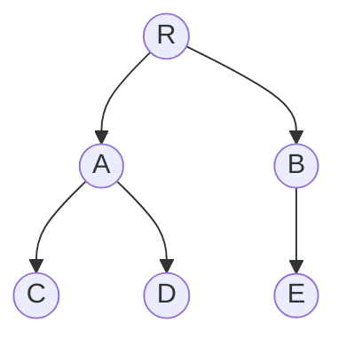

# 数据结构

数据结构是描述数据的存储、数据之间的关系以及对数据进行各种操作的一个概念。

数据结构可以记为：

```mathematica
Data-Structure = (D, R)
```

`D`表示数据元素的集合，R表示数据之间的关系。

一般情况下，关系指的是数据之间的逻辑关系，这就数据的逻辑结构；数据在计算机中的存储表示数据的存储结构或者物理结构。

由于存储方式的不同，同一种逻辑结构会存在两种不同的存储结构：

1. 顺序存储结构
2. 非顺序存储结构

顺序存储结构一般在存储结构中体现数据的关系（比如一维数组）；

非顺序存储结构则通常采用指针实现数据之间的关系（比如链式存储结构、散列存储结构、索引存储结构）。

任何一种算法的设计取决于选定的逻辑结构；

算法的实现则依赖于所采用的存储结构。


## 顺序存储结构

顺序存储结构一般在存储结构中体现数据的关系（比如一维数组）；

顺序存储结构是利用元素在存储介质中的位置表示数据元素之间的逻辑关系，或逻辑上相邻的节点存在在物理位置相邻的存储单元里。

**数据元素的逻辑关系由存储单元的物理相邻关系体现。**


## 非顺序存储结构

非顺序存储结构则通常采用指针实现数据之间的关系（比如链式存储结构、散列存储结构、索引存储结构）。

非顺序存储结构是利用元素存储地址的指针表示元素之间的逻辑关系，逻辑上相邻的元素在物理位置上可相邻可不相邻。

**数据元素的逻辑关系由存储单元的指针表示。**

1. 链表：利用指针直接表示数据元素之间的逻辑关系；
2. 散列表：根据数据元素的关键字，利用散列函数直接计算出该元素的存储地址；
3. 索引：在存储节点元素信息的同时，建立附加的索引表。索引表的每一项称为索引项，索引项的一般形式是：（关键字，地址）。关键字是能够唯一标识一个节点元素的那些数据项集合。索引存储结构分为稠密索引和稀疏索引，稠密索引是指每个节点在索引表中都有一个索引项的索引表；而稀疏索引是指一组节点在索引表中对应一个索引项的索引表。


## 数据类型

针对存储结构，数据元素存储在计算机中，对每个数据元素确定其取值范围以及在值上定义一组操作，这就是所谓的数据类型。

数据类型用于刻画数据对象的特征。

数据类型按照是否可以分解分为两种类型：

1. 原子类型
2. 结构类型


# 算法

所谓算法就是解决问题的一种方法或者过程。

有两种维度可以判别算法的优劣：

- 时间复杂度：得到最终结果，单条语句执行总次数；
- 空间复杂度：当前算法所耗费的存储空间


## 时间复杂度

时间复杂度是指当前算法所耗费的时间，具体可以指得到结果，单条语句所执行次数。

假设我们顺序查找一个一维数组的一条元素，元素个数为n，那么最长需要执行n次才能找到我们需要的数据。时间复杂度就是$$O(n)$$


而如果采用二分查找一个一维数组的一条元素，元素个数为n，那么最长需要执行$$ log_2^n $$次。


可以看到顺序查找的时间复杂度远高于二分查找。但是我们发现二分查找必须保证元素是顺序存储的，这就需要在插入的时候进行维护，增加了插入的成本。

这个成本就引入了新的复杂度：空间复杂度。


### 算法时间复杂度参考表

| 算法     | 时间复杂度     |
| -------- | -------------- |
| 顺序查找 | $$O(n)$$       |
| 二分法   | $$O(log_2^n)$$ |


## 空间复杂度

空间复杂度类似于时间复杂度，是指当前算法所耗费的存储空间。

假设存有n个整数的一维数组，存储一个元素需要c个字节，那么该数组需要存储cn个字节，那么可以说该数组的空间复杂度是$$ O(n) $$

| 数据结构 | 空间复杂度 |
| -------- | ---------- |
| 一维数组 | $$O(n)$$   |


# 线性表（List）

线性表按照顺序存储和非顺序存储分成两种：

- 顺序表
  - 顺序表（ArrayList）。底层使用一维数组存储
- 链式表
  - 单向链表
  - 双向链表（LinkedList）
  - 循环链表


## 顺序表（ArrayList）

$$ A = (a_1,a_2,a_3,...,a_n) $$


线性表中的节点的物理存放顺序和逻辑结构顺序完全一致。


## 链式表（LinkedList）

### 单向链表

$$ A=(<data_1, next_1>, <data_2, next_2>, ..., <data_n, null>) $$


### 循环链表

$$ A = (<data_1, next_1>, <data_2, next_2>, ..., <data_n, nextdata_1>) $$


### 双向链表

$$ A = (<null, data_1, next_1>, <prev_2, data_2, next_2>, ..., <prev_n, data_n, null>) $$


## 时间复杂度

| 时间复杂度 | 顺序存储表                              | 链式存储表 |
| ---------- | --------------------------------------- | ---------- |
| 查询       | $$ O(1) $$                              | $$ O(n) $$ |
| 插入       | $$ O(n) $$ 若只在尾部插入，则$$ O(1) $$ | $$ O(1) $$ |
| 删除       | $$ O(n) $$ 若只在尾部删除，则$$ O(1) $$ | $$ O(1) $$ |

顺序表便于查询，链式表便于插入删除。


## 空间复杂度

顺序表的空间是静态分配的，预先知道的情况下，存储空间复杂度是$$ O(1) $$。若长度`n`变化较大时，采用链表存储结构较好，若存储规模变化小，则采用顺序表。


# 栈和队列

栈和队列是两种特殊的线性表。

- 栈：先进后出；
- 队列：先进先出。


## 栈（Stack）

栈是限制只能在栈顶进行插入、删除操作的线性表。先进后出（LIFO-last in first out）。


1. push：进栈。插入数据到栈顶。新插入的都是最新的元素。最早插入的数据在栈底（栈底元素）。
2. pop：退栈。弹出数据，会被删除。每次删除的数据都是最新的元素（栈顶元素）
3. peek：观看一下最新元素，不做删除。每次看的都是最新的元素（栈顶元素）


### 顺序栈

顺序栈是顺序表的简化版本，只能对栈顶操作。唯一重要的是确定栈顶是数组的哪头。

假设n个元素，以游标0作为栈顶，那么每压入或者弹出一个元素，就要移动每一个元素，时间复杂度是$$ O(n) $$；

假设还是n个元素，以游标n-1作为栈顶，那么每压入或者弹出一个元素，就不需要移动任何元素，只是单纯操作需要处理的元素，时间复杂度就是$$ O(1) $$。

这里我们就需要避免**上溢**。

在Java中的`Stack`类实现了顺序栈，并且是默认容量为10的数组，当检测到入栈数量大于10时，就会复制一个新的数组，容量是上一次容量的两倍，否则继续压栈就会发生上溢问题。


### 链式栈

是链表的简化版本。只针对表头操作。

相对于顺序栈，两者的时间复杂度都是常数时间$$ O(1) $$。链式栈不需要考虑上溢的问题，但需要增加指针的空间开销。


### 应用场景

#### 递归

递归和栈都是先进后出。一般的递归方式在时间和空间上是不节省的。我们能够通过栈来实现递归程序的非递归实现。


### 时间复杂度

| 时间复杂度 | 顺序栈     | 链式栈     |
| ---------- | ---------- | ---------- |
| 插入       | $$ O(1) $$ | $$ O(1) $$ |
| 删除       | $$ O(1) $$ | $$ O(1) $$ |


## 队列（Queue）

先入先出。队列的操作在两端进行，队首删除，队尾插入。FIFO（First In First Out）


按照存储结构不同，队列分为顺序队列和链式队列。


### 顺序队列

顺序队列其实就是操作受限的顺序表。

顺序队列和栈一样也存在上溢现象。同时，队列还会存在**假溢出**现象。所谓假溢出就是在入队和出队操作中，头尾指针不断增加但不减少，或则只减少不增加，导致被删除元素的空间无法重新利用，造成队列有大量空余空间不能插入新的元素或者删除元素。最终当尾指针到达数组上界之后，据不能进行入队或者出对操作了。

在Java中的`ArrayBlockingQueue`中使用循环的方式解决了假溢出的问题，即**循环队列**。`ArrayBlockingQueue`中存在三个变量，`count`，`takeIndex`，`putIndex`。假设元素数量是n，count记录了当前元素总个数n，putIndex记录了当前存储的数组索引位置，默认是0，每添加一个元素，putIndex加1，当队列满了时，putIndex置为0；takeIndex则存储了出队的索引位置，默认是0，每次出队一个元素，就加1，当takeIndex达到总个数时，重置为0，循环出队。

入队：给定数组，默认从0开始，累加存储；

出队：默认从0开始，累加出队。


### 链式队列

链式队列比链表在运算实现上更加方便，只在队列的两端操作，是特殊的链表。在队首插入元素，在队尾删除元素。

时间复杂度是$$ O(1) $$ 


# 数组和广义表

## 数组

数组是数据结构中的基本机构形式，是顺序式的结构。

数组是存储同一类型数据的数据结构，使用时必须定义数组大小和存储的数据类型。

数组分为一维数组和多维数组。一个数组下标的称为一维数组，两个及以上下标的为多维数组。

### 一维数组

一维数组又称为**向量**，是最基本的数据类型。

一维数组的存储是顺序存储的，逻辑地址和物理地址都是连续的，已知第一个元素的地址$$loc(a_1)$$，就能够知道个元素的地址$$loc(a_n)$$。如果一个元素占用空间是$$c$$。那么n个元素的地址就是：
$$
loc(a_n) = loc(a_1) + n * c
$$


### 多维数组

多维数组指下表的个数在两个或两个以上，常用的是二维数组。后续均以二维数组为例。

二维数组又称为矩阵。

矩阵中一般存在3种特殊矩阵：对称矩阵、稀疏矩阵、三角矩阵。

针对这三种矩阵，在物理存储时可以进行数据压缩。


#### 对称矩阵的压缩

假设n阶矩阵$$A=(n,n)$$的元素满足以下条件：
$$
a_i,_j = a_j,_i(i>=1, j>=1)
$$
则A被称为n阶对称矩阵。

对于n阶矩阵，如果不压缩存储，则需要存储元素又$$n^2$$个，而对角的元素个数分别为$$n(n-1)/2$$个，加上对角线个数为n。我们需要存储的数据就是$$n(n+1)/2$$个。

这时候，我们就通过压缩算法将二维数组的数据存到了一维数组中。比如以下Java实现的四阶矩阵案例：

```java
public class SymmetricMatrix {

  public static void main(String[] args) {
    // 阶数
    int n = 4;

    System.out.println(">> 原始数据");
    int[][] symmetricMatrix = getSymmetricMatrix(n);
    for (int[] matrix : symmetricMatrix) {
      for (int element : matrix) {
        System.out.print(element + " ");
      }
      System.out.println();
    }
    System.out.println(">> 压缩后的数据");
    int[] compressSymmetricMatrix = compressSymmetricMatrix(symmetricMatrix, n);
    for (int compress : compressSymmetricMatrix) {
      System.out.print(compress + " ");
    }
    System.out.println();
    System.out.println(">> 还原后的数据");
    int[][] reductionSymmetricMatrix = reductionSymmetricMatrix(n, compressSymmetricMatrix);
    for (int[] matrix : reductionSymmetricMatrix) {
      for (int element : matrix) {
        System.out.print(element + " ");
      }
      System.out.println();
    }
  }

  /**
   * 还原对称矩阵
   *
   * @param n 阶数
   * @param compressSymmetricMatrix 压缩后的矩阵
   * @return 对称矩阵
   */
  public static int[][] reductionSymmetricMatrix(int n, int[] compressSymmetricMatrix) {
    int[][] symmetricMatrix = new int[n][n];
    int compressIndex = 0;
    for (int i = 0; i < n; i++) {
      for (int j = 0; j <= i; j++) {
        symmetricMatrix[i][j] = symmetricMatrix[j][i] = compressSymmetricMatrix[compressIndex];
        compressIndex++;
      }
    }
    return symmetricMatrix;
  }

  /**
   * 压缩对称矩阵
   *
   * @param symmetricMatrix 对称矩阵
   * @param n 阶数
   * @return 压缩后的对称矩阵
   */
  public static int[] compressSymmetricMatrix(int[][] symmetricMatrix, int n) {
    int[] compressSymmetricMatrix = new int[n * (n + 1) / 2];
    int count = 0;
    for (int i = 0; i < n; i++) {
      for (int j = 0; j <= i; j++) {
        compressSymmetricMatrix[count] = symmetricMatrix[i][j];
        count++;
      }
    }
    return compressSymmetricMatrix;
  }

  /**
   * 获取一个对称矩阵
   *
   * @param n 阶数
   * @return 对称矩阵
   */
  public static int[][] getSymmetricMatrix(int n) {
    int[][] symmetricMatrix = new int[n][n];
    for (int i = 0; i < n; i++) {
      for (int j = 0; j < n; j++) {
        if (i > j) {
          symmetricMatrix[i][j] = i;
        } else {
          symmetricMatrix[i][j] = j;
        }
      }
    }
    return symmetricMatrix;
  }

}
```


数据存储的空间存储从$$n^2$$变成了$$n(n+1)/2$$了，空间将近减少一半。


#### 三对角矩阵的压缩


所谓的三对角矩阵就是除了主对角线及其上下两条对角线上的数据之外，所有的数据全是0。

这时我们将对角线上的数据压缩到一维数组中。


#### 稀疏矩阵的压缩

稀疏矩阵很难下定义，一般都是凭人的直觉判定。在一个矩阵中，0的元素占总的元素个数较大比例时，这个矩阵就是稀疏矩阵。

比如有以下4*5阶稀疏矩阵：
$$
\left\{
\begin{matrix}
0&0&0&3&0\\
0&2&0&0&0\\
0&0&0&0&0\\
1&0&0&0&0\\
\end{matrix}
\right\}
$$


我们对其进行压缩得到以下数据：
$$
\left\{
\begin{matrix}
4&5&3\\
1&4&3\\
2&2&2\\
4&1&1\\
\end{matrix}
\right\}
$$
压缩后变成了$$4*3=12$$条数据，而原本需要$$4*5=20$$条数据，减少了8个元素。压缩后的数据表示原矩阵4行5列3个非零数据。1行4列是3，2行2列是2，4行1列是1。

一般的对于稀疏矩阵的压缩，如果存在t个非零数据，则需要用t+1行的三元数组表示。当　

$$ (t+1)*3 <= m*n $$时，使用压缩才能够节省空间。否则更加浪费空间。


## 广义表

广义表是线性表的扩展。我们知道一个线性表是由n个元素组成的有限集合。其中的元素有两种形式：

- 不可分割的原子元素
- 可以分割的元素

不可分割的原子元素组成的表为线性表；

可以分割的元素组成的表就是广义表。


# 树

树型结构是非线性结构，是由根节点和若干子树组成的。表示为：
$$
TREE = (D, R);
$$
一棵树是由若干子树构成，而若干子树又由若干更小的子树构成。树中节点没有次序之分，每个结点都可以任意颠倒。示例如下：




## 基本概念

- 树：由根节点和若干子树组成的非线性结构；
- 根结点（root）：没有前驱结点的结点；
- 子树：除根结点外，其余互不相交的集合，每个集合就是其根结点下的子树；
- 度（degree）：一个结点的子树个数被称为该结点的度。一棵树的度数是其结点度的最大值。示例中树的度数是2；
- 叶子结点（leaf）：深度为0的结点被称为叶子结点；
- 父结点（parents）：树中结点的前趋结点被称为其父结点；
- 子结点（child）：树中结点的后继结点被称为其子结点；
- 兄弟结点（sibling）：同一个父结点下的子结点之间被称为兄弟结点；
- 路径（path）：树中存在一个结点序列$$k_1k_2k_3...k_i$$，使得该序列中相邻结点的左边是右边的父结点。那么我们称该结点序列是从$k_1$到$k_i$的一条路径；
- 边：连接两个结点的线段；
- 边的数目：即路径的长度，结点数减一。$i-1$；
- 祖先（ancestor）和子孙（descendant）：如果从结点$k_m$到结点$k_n$存在一条路径，那么我们称$k_m$是$k_n$的祖先，$k_n$是$k_m$的子孙；
- 结点的层数（level）：结点的层数是从根节点开始算的。根节点层数为1，后续结点层数依次加1；
- 树的高度/深度（height/depth）：树中结点的最大层数称为树的高度或者深度。示例中的高度/深度是3；
- 有序树（ordered tree）：如果把一棵树每个结点的个子树看作从左到右有序排列的，不可互换，那么该树为有序树；
- 无序树（unordered tree）：否则为无序树；
- 森林（forest）：由m（m>=0）棵互不相交的树组成的集合；


树中任意结点都可以拥有0或多个子结点，但最多只有一个父结点，没有父结点的结点是根节点，祖孙结点是父子结点的延续，这种父子关系不是线性关系，因此树型结构是非线性的。如果是有序树，那么兄弟结点之间从左到右就是其长幼顺序


## 二叉树


# 图


# 排序


# 查找


# 动态存储管理


# 文件管理


# 总结

数据结构所研究的内容归纳为3点：

- 研究数据元素之间的客观联系（逻辑结构）；
- 研究数据元素之间在计算机内部的存储方式（存储结构）；
- 研究如何在数据的各种结构（逻辑的和物理的）上实施有效的操作或处理（算法）。


```mathematica
程序 = 数据结构 + 算法
```


