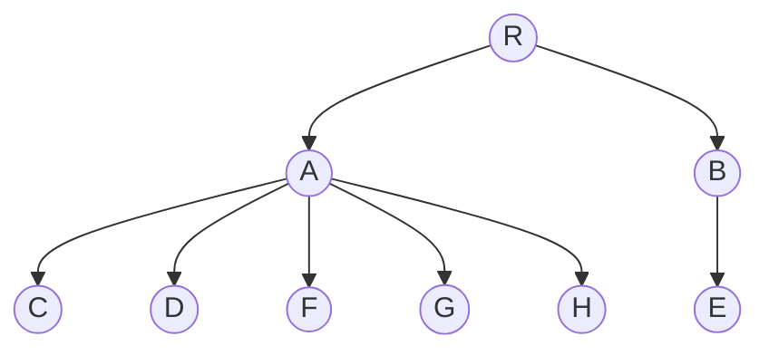
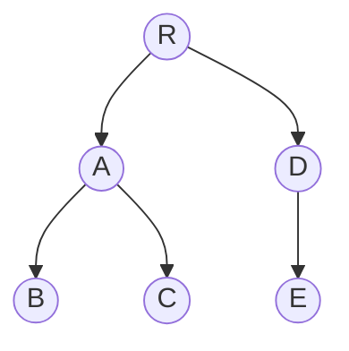
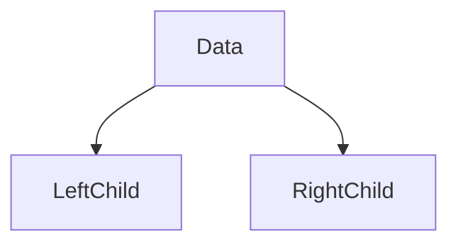
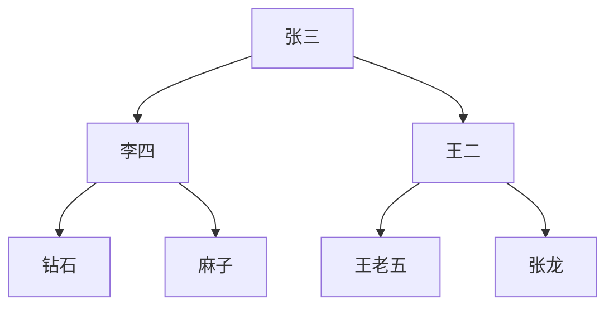

# 树

树的定义：树是N（N>0）个元素的有限集合。有且仅有一个根节点，它没有前趋结点；除了根节点外，其余结点组成M（M<N）个互不相交的集合，每一个集合组成一棵子树。每个结点没有顺序之分。

之前几个章节中的线性表（顺序表和链表）、栈和队列、数组和广义表都描述的是元素之间的线性关系；

接下来的树描述的元素之间的层次关系和分支关系。

树型结构是非线性结构，是由根节点和若干子树组成的。表示为：
$$
TREE = (D, R);
$$
一棵树是由若干子树构成，而若干子树又由若干更小的子树构成。树中节点没有次序之分，每个结点都可以任意颠倒。示例如下：

## 有序树

如果把一棵树每个结点的个子树看作从左到右有序排列的，不可互换，那么该树为有序树。

## 无序树

默认的树就是无序树

## 基本概念

- 树：由根节点和若干子树组成的非线性结构；
- 根结点（root）：没有前驱结点的结点；
- 子树：除根结点外，其余互不相交的集合，每个集合就是其根结点下的子树；
- 度（degree）：一个结点的子树个数被称为该结点的度。一棵树的度数是其结点度的最大值。示例中树的度数是5；
- 叶子结点（leaf）：深度为0的结点被称为叶子结点；
- 父结点（parents）：树中结点的前趋结点被称为其父结点；
- 子结点（child）：树中结点的后继结点被称为其子结点；
- 兄弟结点（sibling）：同一个父结点下的子结点之间被称为兄弟结点；
- 路径（path）：树中存在一个结点序列$$k_1k_2k_3...k_i$$，使得该序列中相邻结点的左边是右边的父结点。那么我们称该结点序列是从$k_1$到$k_i$的一条路径；
- 边：连接两个结点的线段；
- 边的数目：即路径的长度，结点数减一。$i-1$；
- 祖先（ancestor）和子孙（descendant）：如果从结点$k_m$到结点$k_n$存在一条路径，那么我们称$k_m$是$k_n$的祖先，$k_n$是$k_m$的子孙；
- 结点的层数（level）：结点的层数是从根节点开始算的。根节点层数为1，后续结点层数依次加1；
- 树的高度/深度（height/depth）：树中结点的最大层数称为树的高度或者深度。示例中的高度/深度是3；
- 有序树（ordered tree）：如果把一棵树每个结点的个子树看作从左到右有序排列的，不可互换，那么该树为有序树；
- 无序树（unordered tree）：否则为无序树；
- 森林（forest）：由m（m>=0）棵互不相交的树组成的集合；

树中任意结点都可以拥有0或多个子结点，但最多只有一个父结点，没有父结点的结点是根节点，祖孙结点是父子结点的延续，这种父子关系不是线性关系，因此树型结构是非线性的。如果是有序树，那么兄弟结点之间从左到右就是其长幼顺序

# 二叉树

二叉树定义：二叉树是N（N>0）个元素的有限集合。如果不为空，那么仅有一个结点没有前趋结点，它就是根节点；每个结点上最多只可以存在左右两棵互不相交的子树。

二叉树可以简单理解为树的限制版。但实际两者并不相同，他们存在以下差异：

1. 二叉树可以为空

2. 二叉树每一个结点最多只能存在左右两棵子树。因此二叉树的度最大是2。

    

## 二叉树的性质

1. 二叉树第 $$i$$ 层上的结点个数最多是$$ 2^(~^i~^-~^1~^) $$个
2. 高度为 $$ k $$ 的二叉树，最多存在 $2^k-1$ 个结点
3. 度数为0的结点个数是度数为2的结点个数加1。（$n_0 = n_2 + 1$）
4. 有n个结点的完全二叉树的高度是$log_2^n+1$或者$log_2~^(~^n~^+~^1~^)$ 
5. 非空满二叉树的叶子结点数等于其分支结点数加1
6. 一棵非空二叉树空子树的数目等于其结点数目加1

## 完全二叉树

如果一棵二叉树只有最后两层的度是小于2，且最下一层的结点都集中在最左侧的若干位置，那么这个二叉树就是完全二叉树。

## 满二叉树

高度为 $k$ 且结点数是 $ 2^k - 1$的二叉树称为满二叉树。即结点树达到二叉树的结点最大值就是满二叉树。

满二叉树是特殊的完全二叉树。

## 二叉树的存储结构

### 顺序存储二叉树

顺序存储二叉树的原则是，不论二叉树是否是完全二叉树，都看作完全二叉树的方式存储。从上到下，从左到右依次存储，如下所示：

针对完全二叉树，这样的顺序存储结构是没有问题的，有多少元素依次存储多少元素；

但是，比如一个极端例子，高度为k的右单结点二叉树，结点数也是k，但需要存储的空间确是$2^k-1$个，这显然是及其不合理的，造成严重的空间浪费。

### 链式存储二叉树

由于使用顺序存储二叉树会造成大量空间的浪费，因此，一般的二叉树都是使用链式存储方式，叫做二叉链表。在链式存储中，每一个结点由数据域和指针域组成，每个结点的指针域有两个，一个左指针一个右指针，如下图二叉树链式存储数据结构：

## 二叉树的遍历

所谓的二叉树的遍历就是按照固定的顺序，获取到二叉树中的每一个结点数据。按照遍历的顺序划分，有四种方式：

- 前序遍历
- 中序遍历
- 后序遍历
- 层次遍历

### 二叉树的前序遍历

前序遍历就是先遍历根结点，再遍历其左结点，最后遍历右结点。这是一个递归遍历的过程：

1. 访问当前根结点数据（相对子树的根结点而不是整个树的根结点）
2. 前序遍历左子树
3. 前序遍历右子树

按照前序遍历的方式，遍历顺序是：张三、李四、钻石、麻子、王二、王老五、张龙

### 二叉树的中序遍历

中序遍历就是先遍历左子树直到没有左结点，则遍历访问当前根结点数据，最后遍历右结点，依次递归遍历。

1. 遍历左子树
2. 访问根结点
3. 遍历右子树

按照中序遍历的方式，遍历顺序是：钻石、李四、麻子、张三、王老五、王二、张龙

### 二叉树的后序遍历

后序遍历就是先遍历左子树，再遍历右子树，最后访问根结点

1. 遍历左子树
2. 遍历右子树
3. 访问根结点

按照后序遍历的方式，遍历顺序是：钻石、麻子、李四、王老五、张龙、王二、张三

### 二叉树的层次遍历

层次遍历就是从根结点的第一层开始，从上至下遍历，并从左往右逐个访问。

1. 首先构建一个队列
2. 往队列中添加整个二叉树的根结点
3. 递归遍历4到6
4. 从队列中获取结点
5. 访问获取到的结点数据
6. 将访问到的结点的左右结点存入队列中

按照层次遍历的方式，遍历顺序是：张三、李四、王二、钻石、麻子、王老五、张龙

## 线索二叉树

由于二叉树是非线性的，不存在前趋和后继结点的概念，但是当我们通过固定顺序遍历一棵二叉树，我们就能够得到一个线性序列的，这样二叉树的结点就有了前趋和后继结点。

通常二叉树是采用链式结构存储的，是二叉链表，每一个结点上会存储左右儿子结点信息，但不存储前趋后继结点。而如果我们存在需求想要获取一个结点的前趋和后继结点，那么我们每一次都必须要去遍历二叉树，这是非常消耗性能的。

为了方便访问前趋和后继结点，我们可以在结点上标记其前趋和后继结点位置。简单的方式就是每一个结点上添加两个指针域：前趋结点指针域和后继结点指针域，但这样会浪费更大的存储空间，如果n个结点的二叉树，本来左右儿子是$2*n$个指针域，现在变成了$4 * n$个了。

然后我们知道对于n个结点的二叉树，其叶子结点的左右指针域都是空，总的空指针域为$n+1$个，因此我们可以利用这$n+1$个指针域，专门存储前趋和后继结点地址信息。这种附加的指针信息就是**线索**。

若左指针为空，则存储前趋结点地址；若右指针为空，则存储后继结点地址。

同时通过bit为1的标识位区别是左右儿子还是前后结点地址。比如ltag为1表示前趋结点线索，为0表示左儿子。

**一棵二叉树通过固定顺序遍历，存储线索的过程就叫做二叉树的线索化，二叉链表就变成了线索链表，二叉树就变成了线索二叉树**。

