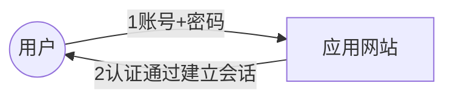
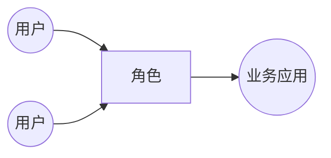

[TOC]


# 简介

产品安全架构是构建产品自身安全特性的主要组件以及其关系。从产品自身做好安全防御基础设施，不涉及产品之外的防御措施，如防DDoS攻击等。

产品安全架构的目标是保证可以玩（CIA）：保密性、可用性、完整性。

实现这一目标的是5A方法论：


涉及的产品范围：web应用、网络服务、服务器软件、客户端软件等。


# 一、身份认证Authentication

身份认证包括对人、设备的身份认证。

我们如何进行身份认证呢？常用的认证场景有如下三种：

1. 应用本身进行身份认证
2. 通过统一的SSO（单点登录系统）进行身份认证
3. OAuth2.0三方认证


不论是哪种认证场景，都包含于一下通用的认证机制：

1. 会话机制：用户输入账号口令，认证通过后，与用户建立会话，在会话有效期间，不再需要认证（账号口令）；
2. 全程ticket机制：用户认证通过后，服务端生成ticket分配给用户，用户全程带着ticket，可以访问自己权限范围内的数据；
3. 持续的消息认证机制：每次请求都执行身份认证


## 1.1 会话机制

客户端存储服务器端产生的会话id（sessionid），并在每次请求中带上它。

服务器生成一个sessionid，并对其进行管理，比如记录当前登录用户的IP、User-Agent等信息，将其存于内存、数据库或者文件。


**会话机制的特点是，认证一次之后建立会话，之后不再检验用户凭证（Ticket）或者账户密码，除非Cookie过期失效。当然会话相关信息还是会验证的，比如IP、User-Agent等**


以上会话机制是推荐使用的，但很多应用仍然采用的是直接通过网站和用户认证建立会话，如下图：




### 如何保证安全性？

1. **灵活的会话管理**：比如在首次登录认证之后，限定登录IP、User-Agent，后续使用该sessionid发起请求的必须和首次认证时的IP、User-Agent保持一致，否则要求重新认证。目的是防止黑客窃取到sessionid，尝试假冒用户请求时，因为ip或User-Agent的不同而认证失败，适具体应用场景而定。比如用户出差频繁，ip多变等。（保密性）
2. **cookie设置**：启用HttpOnly防止被js读取，document.cookie无法获取cookie信息，防止JS注入攻击；启用Secure属性，请求只能通过HTTPS传递；（保密性）
3. **超时管理**：根据应用或者业务的不同敏感程度，设置对应的会话超时时间；比如支付设置的失效时间等。（完整性）


**根据上述会话机制，只要黑客没有得到用户账号和口令，就可以防止恶意登录。**但用户的口令总是会以为总总原因而被盗取。下面讲讲口令的保护。


## 1.2 口令的保护

我们常见的口令被泄漏的原因如下：

1. 口令明文存储
2. 口令弱hash算法（MD5）且不加盐存储
3. 用户在不同应用网站使用同一个口令所引起的撞库。
4. 登录模块缺少对撞库行为的控制


### 如何进行口令保护？

1. 服务器端密文存储口令（hash算法加盐）
2. 登录操作必须通过HTTPS传输
3. 用户侧口令必须加密后传输，即使使用HTTPS 


### 各种口令存储方式

| 存储方式         | 问题和风险                                                   |
| ---------------- | ------------------------------------------------------------ |
| 明文存储         | 数据库文件泄漏后，密码即被泄漏。不能使用                     |
| 单向hash存储     | 数据库文件泄漏后，通过彩虹表可破解。不推荐使用               |
| 加盐单向hash存储 | 盐值随数据库文件一同泄漏后，一般只能被黑客暴力破解部分弱口令 |
| 慢速加盐hash存储 | 增加加盐或者加密的时间，提高暴力破解时间成本，会导致服务器性能下降，可在前端使用 |

通过上述四种口令存储方式，我们知道加盐单向hash存储在安全和效率上做了较好的均衡，但仍然存在部分弱口令被破解的风险，因此我们可以结合慢速加盐hash存储，将这种hash方式置于前端处理。


### 弱口令

为了尽可能的减少弱口令的破解，如12345、P@ssw0rd等，一般让前端限制用户使用较强的口令。比如必须包含大小写字母、数字、特殊符号中的三种。

**对于后台而言，如果能使用动态口令，不使用静态口令，是最好的。**

动态口令即验证码等口令。


### 生物口令

除了动态和静态口令，还有生物口令，如指纹、声纹、虹膜、面部识别等数据。

生物特征属于用户个人隐私，处理不当就会与法律法规冲突，这些信息更需要得到保护。一般而言，无论是否加密，都不能够直接将生物识别的图像信息上传到服务器，可行的方式就是只上传经过处理的生物特征数值，而不是原始图片。如果是手机智能终端的身份认证，建议仅仅在硬件层级上完成，指纹数据不出手机。


## 1.3 Hash算法

Hash算法，又称为单向散列算法。原本的用途是将任意长度的消息M转换成固定长度的消息摘要D。记为：
$$
D = HASH(M) 
$$

- HASH算法单向不可逆。即摘要D无法得到消息M
- 现实中没有另一个消息M2，使得$HASH(M2)=D$。即无法同时存在两个消息有相同的摘要。


#### MD5

2004年，王小云教授成功碰撞出两个不同的消息存在相同的摘要。

因此MD5不安全了


#### SHA-1

2017年，CWI研究所和Google公司发布了SHA-1碰撞实例，两个不同的PDF文件，拥有相同的SHA-1消息摘要。

因此SHA-1不安全了


#### SHA-2

SHA-2是一个合集。包括SHA-256、SHA-384、SHA-512等，推荐使用其中的SHA-256和SHA-512。

SHA-2和SHA-1采用了相同的处理引擎

目前是安全的，未被破解。可以说位数越长越安全，因此可以说这里面SHA-512是最安全的hash算法。


#### SHA-3

由于MD5和SHA-1相继被破解，而SHA-2和SHA-1采用了相同的处理引擎，NIST（美国国家标准与技术研究院）担心SHA-2未来可能面临风险，而准备的一个与之前算法不同的备用算法。

目前还未被大量使用。


#### 慢速加盐散列

**所谓的慢速是恰到好处的慢**

随着计算机硬件的不断更新，能力越来越强，暴力破解更加的简单。为了防止这一情况，使暴力破解在时间成本上花费更多，不论硬件发展到多快，都可以通过一个叫做安全因子或者迭代计数的参数来控制散列函数的速度，达到既可以有效防止暴力破解，又对用户而言无感知的状态。比如设置安全因子使得加解密速度为五六百毫秒。

防黑客频繁调用应用接口进行暴力破解。

常用的慢速加盐散列算法有如下三种：

- Bcrypt
- Scrypt
- PBKDF2


## 1.4 双因子认证

通过两种不同的方式进行身份认证。在原有的口令认证基础上额外添加的安全机制。比如：

- 手机短信验证码
- U2F（通用双因子认证）：在口令认证基础上，使用USB设备或者NFC设备进行进一步认证
- TOTP


## 1.5 扫码认证

是一种信任传递机制，较好的满足了安全和效率的问题。比账户口令登录要方便。


# 二、授权Authorization

## 2.1 授权策略

从安全角度上讲，默认的权限越小越好，满足基本需求即可。

### 2.1.1 基于属性的授权

基于属性的授权（Attribute-Based Authorization）

该授权可以不用建立授权表，只需要通过固定规则，将其纳入访问控制模块即可。比如分配给我的相册只能由我和我指定的人查看，其他人都看不到

```java
if(currentUser in photo.friends) { 可以查看 }
```


### 2.1.2 基于角色的授权

基于角色的授权（Role-Based Authorization）



在应用系统中先建立相应的角色，再将用户ID或者账户体系下的群组关联到这个角色上。

这样做的好处是将用户或者群组和具体的业务应用进行解耦。当人员离职、转岗时，就无须频繁的维护新的权限关系。使用角色后，只需哟啊维护该角色内的人员清单就可以了，工作量大大减少。


### 2.1.3 基于任务的授权

基于任务的授权（Task-Based Authorization）

是为了保障流程任务顺利完成而使用的临时授权机制，该授权需要一项正在进行的任务作为前提条件。

典型场景如下：

- 用户下了一个购买saas产品的订单
- 销售将订单提交到财务进行审核
- 财务才能够有权获取该订单对应的用户的信息


基于任务的授权就是审批流上的授权。


### 2.1.4 基于ACL的授权

ACL（Access Controll List）基于访问控制列表的授权。

访问控制模块会根据ACL设定的权限表来决定是否允许访问。


### 2.1.5 动态授权

动态授权是基于专家知识或人工智能，来判断并决策访问者是否有权利访问。比如分析某个请求，如果是正常用户就允许访问，如果高度怀疑是入侵或未授权的爬虫行为，则拒绝访问，或需要额外操作（比如输入验证码等）。


## 2.2 典型的授权风险

典型的授权风险包括：

1. 未授权访问（无授权机制）
2. 平行和垂直越权
3. 诱导越权：用户隐私保护不力，导致用户很容易被误导轻易授权给第三方应用，导致个人隐私被泄漏
4. 职责未分离：将不同的管理权限授予同一人


### 2.2.1 平行越权

指的是一个用户可以访问另一个用户才能访问的资源


### 2.2.2 垂直越权

指的是低权限用户获得了高权限用户的所具备的权限


### 2.2.3 诱导越权

权限管理过于宽松，容易被诱导授权给第三方应用，严格控制默认权限，比如在用户侧添加两个关键动作：1. 选择狂，默认不勾选，由用户主动勾选；2. 用户需要点击同意授权。


### 2.2.4 职责未分离

职责的分离主要靠管理手段。

比如开发人员和运维人员由一人担任，就可以出现随意变更生产环境，或将生产数据随意导出到测试或本地环境


## 2.3 授权漏洞的发现和改进

### 2.3.1 交叉测试法

即不同角色或者不同权限等级的用户，彼此互换访问接口和参数，看结果是否满足权限控制规则。


### 2.3.2 漏洞改进

建立授权模块


# 三、访问控制Access Control

## 3.1 访问控制策略

### 3.1.1 基于属性的访问控制

通过比较待访问资源的属性来决定是否允许访问。比如以下属性：

- 所有者、责任人
- 所属部门


### 3.1.2 基于角色的访问控制

用户通过角色权限访问资源。


### 3.1.3 基于任务的访问控制

保障流程任务完成的访问控制


### 3.1.4 基于ACL的访问控制

典型场景：

1. 用户白名单、黑名单
2. IP白名单、黑名单
3. 文件路径白名单、黑名单


### 3.1.5 基于专家知识的访问控制

典型场景：

1. 参数控制（防止SQL注入、XSS攻击）
2. 访问频率或总量控制（例如只允许一分钟访问5次、60分钟内请求次数不超过300次等，防止数据被批量查询到出）；
3. 行为控制
4. 业务规则，如免费用户只能使用30天等


## 3.2 访问控制的不信任原则

我们常见的漏洞有：

- 缓冲区溢出
- SQL注入
- XSS跨站脚本注入
- Path Traversal（路径遍历）
- SSRF（服务侧请求伪造）
- 上传脚本文件漏洞（WebShell）


# 四、可审计Auditable

可审计就是记录所有的敏感操作，并可用于时间追溯。记录下的内容即通常所说的操作日志。

## 4.1 操作日志内容

记叙文四要素：时间、地点、人物、事件

- 时间
- 地点
  - IP
- 人物
  - 用户ID
- 事件
  - 操作和对象（数据、资源）

操作日志应当排除敏感信息，记录敏感信息可能导致信息泄漏。


## 4.2 日志的保存与清理

日志存储时限一般至少保留6个月


# 五、资产保护Asset Protection

## 5.1 数据的安全存储


## 5.2 数据的安全传输


## 5.3 数据展示和脱敏


# 关键词

- 平行越权漏洞
- 嗅探工具（sniffer）

