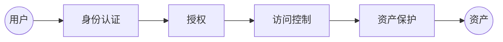
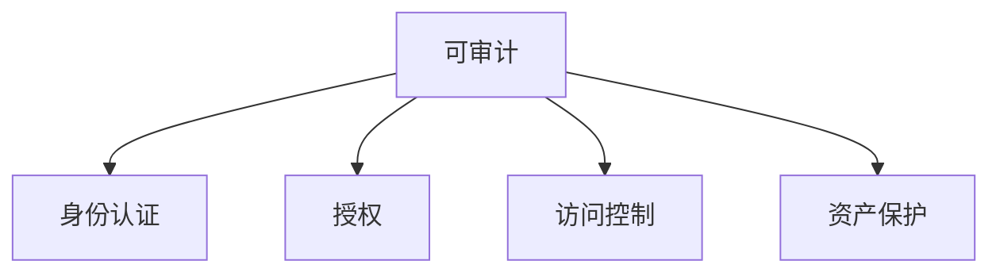
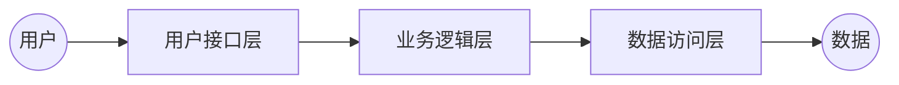

[TOC]

# 安全架构基础

安全架构是架构在安全性这一方向上的细分领域。

主要探讨基本概念以及安全架构的5A方法论。

## 什么是安全

安全是产品质量属性，目标是保障产品中的数据资产不被未授权用户访问、不被未授权用户破坏、授权用户能够正常使用。

### 安全性三目标：保证可以玩（CIA）

**保证可以玩三目标**：

- 保密性：未授权用户不能访问
- 可用性：授权用户可以正常使用
- 完整性：未授权用户不能篡改数据

#### 保密性

保密性遭到破坏的场景：

1. 平行越权漏洞
2. 黑客攻击导致数据泄露（SQL注入、拖库）
3. 通过嗅探工具嗅探网络流量
4. 射频辐射
5. 光缆窃听

#### 可用性

保密性遭到破坏的场景：

1. DDoS或者CC攻击，导致网络拥堵，主机资源耗尽
2. 缓存区溢出导致服务中止

#### 完整性

完整性遭到破坏的场景：

1. 主机感染病毒或者木马
2. 网站被入侵后，内容被篡改
3. 网络劫持篡改（很多HTTP网页中加塞的广告就是这么来的）
4. 操作系统内核文件遭替换
5. 应用层越权操作
6. 文件下载被替换

## 什么是安全架构

安全架构是架构在安全性这一方向上的细分领域。其他的架构细分领域比如：运维架构、数据库架构等。

在IT产品的安全性上，一般有三类安全架构，组成三道防线：

1. 产品安全架构：产品安全架构的目标是如何在不依赖于外部防御系统的情况下，从源头打造自身安全的产品，构建第一道防线；
2. 安全技术体系架构：安全技术体系架构的目标是构建通用的安全技术基础设施，包括安全基础设施、安全工具和技术、安全组件与支持系统等，系统性的增强各产品的安全防御能力，构建第二道防线；
3. 审计架构：独立的审计部门或其所能提供的风险发现能力，但审计的范围是包括全风险在内的所有风险，构建第三道防线；

## 5A方法论

无论是进行产品的安全架构设计或评估，还是规划安全技术体系架构的时候，都有5个需要重点关注的逻辑模块，他们就是安全架构的5打核心要素，被称为**5A方法论**。

- **身份认证**（Authentication）：**用户主体**是谁？
- **授权**（Authorization）：**授予**用户主体允许货拒绝访问客体的权限；
- **访问控制**（Access Control）：控制措施以及是否放行的**执行者**；
- **可审计**（Auditable）：形成可供追溯的操作日志；
- **资产保护**（Asset Protection）：资产的安全性保障，即保证可以玩三目标（保密、可用、完整）$资产=数据+资源$

5A方法论是为了达成保证可以玩（CIA）这一安全性目标的技术手段。

在这五大元素中，用户访问资产的主线就是：

访问控制的依据是授权，查询授权表或者基于设定的权限规则，拥有访问权限才允许继续访问。

- 用户首先需要通过身份认证，让系统知道用户是谁；
- 用户需要具备访问资产的权限；
- 访问控制模块会根据授权规则，判断是否放行；
- 在访问资产之前，必须经过必要的资产保护措施，如数据加解密传输、脱敏展示、防攻击以及防批量拉取措施、隐私保护等。
- 可审计一般指可供追溯的操作记录，并没有体现在主线中，但会覆盖整个主线。

# 产品安全架构

产品安全架构是构建产品自身安全特性的主要组件以及其关系。从产品自身做好安全防御基础设施，不涉及产品之外的防御措施，如防DDoS攻击等。

涉及的产品范围：web应用、网络服务、服务器软件、客户端软件等

## 简介

### 典型的产品架构

#### 三层架构

经典的三层架构在安全角度是比较推荐的一种逻辑架构。

三层架构不是指物理上需要三台服务器，在一台服务器上也能实现三层架构，但建议还是分布在不同服务器上为好。

#### 微服务架构

微服务代表了一种新的应用哦体系结构，是SOA的轻量化发展。将大型单一应用程序分解成了多个消息ing独立的功能或服务组件，使用轻量级的Restful API进行通信。

在微服务架构模式下，引入API网关（Gateway）来执行服务管理、统一接入。有了API网关，所有非业务领域的功能都可以交给API网关完成，比如服务的身份认证、路由、负载均衡、缓存等。

在微服务架构中，每一个服务就是一个独立的产品。

### 数据访问层的实现

数据访问层的实现可以有多种，但无论采用哪一种，都应刚满足一个条件：数据库口令只在一个地方（通常是配置文件）出现，且加密存储。

1. 自定义DAL编码
2. ORM框架：ORM框架一般是明文配置数据库口令，后续讲解如何密文替换。
3. DB Proxy（比如mycat）
4. 数据服务，提供RPC接口给业务服务

## 身份认证

身份认证包括对人、设备的身份认证。

### 如何对用户进行身份认证？

使用独立的SSO系统（单点登录系统）进行身份认证处理，而不是每一个业务都自行实现身份认证。

最典型的身份认证场景就是用户输入自己的用户名和口令，SSO系统认证后返回一个认证通过的票据（ticket），在后面的访问中，有如下常见的票据使用方式：

- 会话机制：用户使用ticket访问应用系统，应用系统验证ticket无误后，跟用户建立绘画，在会话有效期内，用户和应用系统不再访问SSO（适用于To B业务，访问的数据不一定是访问者自己的数据）；
- 全程ticket机制：用户全程带着ticket，可以访问自己权限范围内的数据（适用于To C业务，访问的数据都是用户自己的数据）；
- 持续的消息认证机制：每次请求都执行身份认证

## 授权

## 访问控制

## 可审计

## 资产保护

# 关键词

- 平行越权漏洞
- 嗅探工具（sniffer）