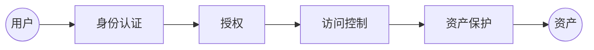
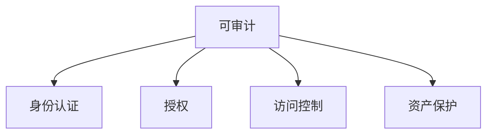

# 架构

## 概念

架构就是一款大号版本的数据结构，由**元素+关系**组成。

不同于数据结构中元素的概念（不可分割的原子单位），架构中元素的概念指的是一个基本的功能单元或者组件。比如nginx，提供了负载均衡的功能。

关系及各元素之间的关联关系。

## 类型

架构按照不同的阶段有三种类型：概念架构、逻辑架构、物理架构。

**概念架构**：在产品早期，以尽可能简化、抽象化的方式，以表达产品的基本概念，只涉及基本的元素以及元素间的关系，不涉及接口细节等内容；

**逻辑架构**：在产品需求逐渐清晰之后，提现业务逻辑模块之间的关系；

**物理架构**：产品发布和部署时，需要各个组件的物理架构，提现了具体的组件以及部署位置。

## 目的

架构存在的目的就是为了解决产品的功能和产品的质量问题。

产品功能，此处不细说了，后续再聊。

产品质量分成四个点：

- 性能：在预期的用户量和并发量下能够保证用户的正常使用
- 安全性：在符合法律法规的前提下，能够防止黑客入侵、保障系统的可用、数据不被破坏，不被泄露。
- 扩展性：当用户量急剧扩增时，能够通过扩容的方式解决问题
- 维护性：日常维护中实现自动化，减少运维人员的成本，比如产品的发布更新、日志的清理、证书的到期提醒等。

# 架构之安全架构

安全架构是架构在安全性这一方向上的细分领域。

主要探讨基本概念以及安全架构的5A方法论。

## 什么是安全

安全是产品质量属性，目标是保障产品中的数据资产不被未授权用户访问、不被未授权用户破坏、授权用户能够正常使用。

### 安全性三目标

**保证可以玩三目标（CIA）**：

- 保密性：未授权用户不能访问
- 可用性：授权用户可以正常使用
- 完整性：未授权用户不能篡改数据

#### 保密性

保密性遭到破坏的场景：

1. 平行越权漏洞
2. 黑客攻击导致数据泄露（SQL注入、拖库）
3. 通过嗅探工具嗅探网络流量
4. 射频辐射
5. 光缆窃听

#### 可用性

保密性遭到破坏的场景：

1. DDoS或者CC攻击，导致网络拥堵，主机资源耗尽
2. 缓存区溢出导致服务中止

#### 完整性

完整性遭到破坏的场景：

1. 主机感染病毒或者木马
2. 网站被入侵后，内容被篡改
3. 网络劫持篡改（很多HTTP网页中加塞的广告就是这么来的）
4. 操作系统内核文件遭替换
5. 应用层越权操作
6. 文件下载被替换

## 什么是安全架构

安全架构是架构在安全性这一方向上的细分领域。其他的架构细分领域比如：运维架构、数据库架构等。

在IT产品的安全性上，一般有三类安全架构，组成三道防线：

1. 产品安全架构：产品安全架构的目标是如何在不依赖于外部防御系统的情况下，从源头打造自身安全的产品，构建第一道防线；
2. 安全技术体系架构：安全技术体系架构的目标是构建通用的安全技术基础设施，包括安全基础设施、安全工具和技术、安全组件与支持系统等，系统性的增强各产品的安全防御能力，构建第二道防线；
3. 审计架构：独立的审计部门或其所能提供的风险发现能力，但审计的范围是包括全风险在内的所有风险，构建第三道防线；

## 5A方法论

无论是进行产品的安全架构设计或评估，还是规划安全技术体系架构的时候，都有5个需要重点关注的逻辑模块，他们就是安全架构的5打核心要素，被称为**5A方法论**。

- **身份认证**（Authentication）：**用户主体**是谁？
- **授权**（Authorization）：**授予**用户主体允许货拒绝访问客体的权限；
- **访问控制**（Access Control）：控制措施以及是否放行的**执行者**；
- **可审计**（Auditable）：形成可供追溯的操作日志；
- **资产保护**（Asset Protection）：资产的安全性保障，即保证可以玩三目标（保密、可用、完整）$资产=数据+资源$

5A方法论是为了达成保证可以玩（CIA）这一安全性目标的技术手段。

在这五大元素中，用户访问资产的主线就是：

访问控制的依据是授权，查询授权表或者基于设定的权限规则，拥有访问权限才允许继续访问。

- 用户首先需要通过身份认证，让系统知道用户是谁；
- 用户需要具备访问资产的权限；
- 访问控制模块会根据授权规则，判断是否放行；
- 在访问资产之前，必须经过必要的资产保护措施，如数据加解密传输、脱敏展示、防攻击以及防批量拉取措施、隐私保护等。
- 可审计一般指可供追溯的操作记录，并没有体现在主线中，但会覆盖整个主线。

