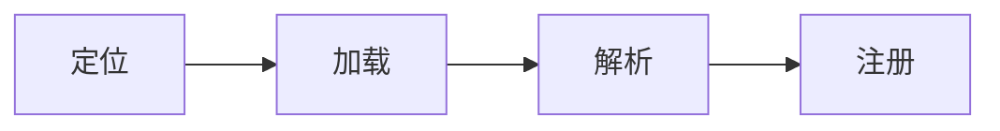
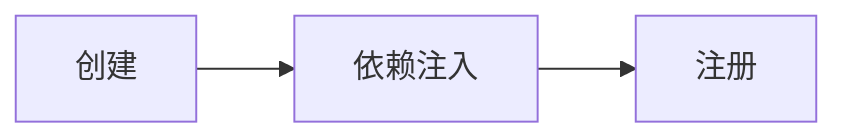
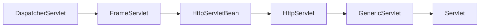
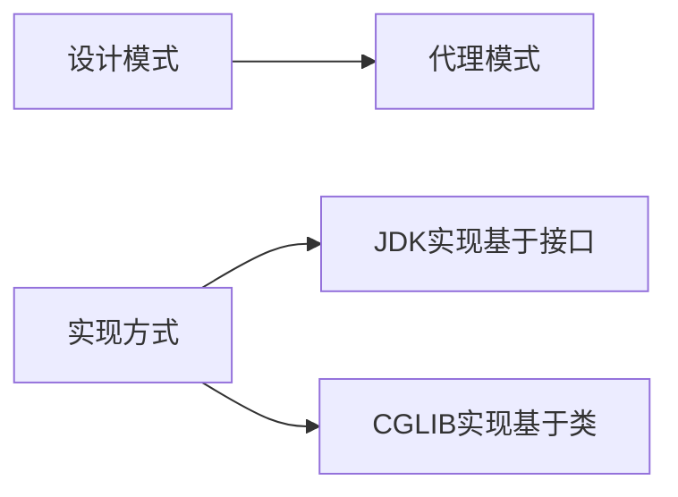
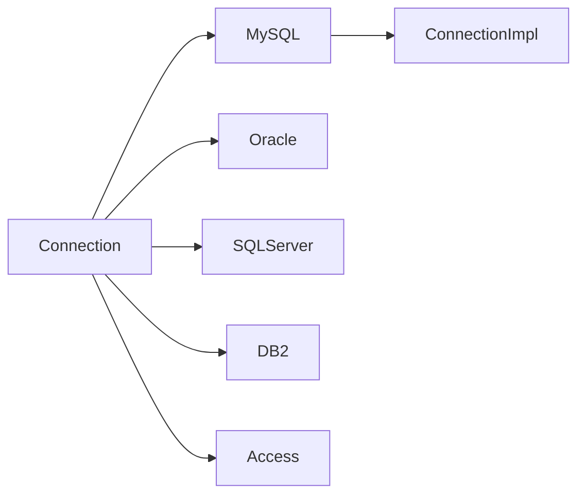

# 第一部分：Spring核心源码分析

## 第一节：Spring IOC容器初始化原理

### 1 一段话描述IOC容器初始化流程
ioc容器初始化分四个步骤：定位、加载、解析和注册。
1. 定位是指定位Resource资源信息。
2. 加载是指读取定位到资源信息成Document对象。
3. 解析是指将读取到的资源对象解析转换成spring定义的BeanDefinition对象信息。
4. 注册是指将解析后的BeanDefinition信息注册到ioc容器中。


以`ClassPathXmlApplication`作为入口，这4个步骤分别对应三个不同的关键类。定位加载的关键类是`XmlBeanDefinitionReader`，通过`XmlBeanDefinitionReader`类的`doLoadDocument`方法将资源文件信息通过调用JDK标准的JAXP规范的接口读取并封装成`Document`对象。解析的关键类是`BeanDefinnitionParserDelegate`，这是一个委派类，通过这个委派类进行bean的解析动作，将bean信息封装到`BeanDefinition`对象中。最后注册的关键类是`DefaultListableBeanFactory`，通过这个bean工厂，将beanDefinition对象注册到ioc容器中，所谓的ioc容器就是一个`ConcurrentMap`对象`beanDefinitionMap`，注册动作就是put动作。

在spring的ioc容器初始化过程中，用到了很多的设计模式，其中有注册登记式的单例模式、模板方法模式、双亲委派模式。当然也灵活的运用了java的OOP思想、面向继承的思想。父类只定义标准，通过不同的子类实现，面向扩展。

#### 1.1 IOC容器初始化时序图
[IOC容器初始化时序图](https://www.processon.com/view/5c3443c6e4b056ae29e5f7ff)

### 2 IOC几个重要的类
#### 2.1. BeanFactory
BeanFactory是最基本的IOC容器接口，是最顶层的接口，他定义了IOC容器的基本功能规范。在Spring中还有很多的IOC容器的实现供用户选择和使用。

以下是BeanFactory的关联关系：


#### 2.2 DefaultListableBeanFactory
`DefaultListableBeanFactory`是BeanFactory的子类，ioc容器的注册就是通过这个类实现的。

#### 2.3 ApplicationContext
说到BeanFactory，我们不得不提ApplicationContext。相对于BeanFactory而言，ApplicationContext定义了IOC容器的基本功能之外，还提供一些附加服务。
1. 支持信息源，可以实现国际化。(实现 MessageSource 接口)
2. 访问资源。(实现 ResourcePatternResolver 接口，后面章节会讲到)
3. 支持应用事件。(实现 ApplicationEventPublisher 接口)


#### 2.4 BeanDefinition
用BeanDefinition描述Bean对象，BeanDefinition对象就是内存中的配置文件，保存了所有跟类相关的属性信息以及依赖信息。

Spring的IOC容器管理了我们定义的Bean对象及其相互的关系。Bean对象在Spring实现中是以`BeanDefinition`描述的。继承体系如下：


#### 2.5 XmlBeanDefinitionReader
spring用BeanDefinitionReader来解析Spring配置文件。

spring是通过`XmlBeanDefinitionReader`的进行定位读取xml资源文件的。


#### 2.6 BeanDefinitionParserDelegate
spring通过`BeanDefinitionParserDelegate`这个委派类进行bean的解析，封装成`BeanDefinition`对象，以提供spring使用。


### 3 IOC容器初始化的过程
ioc容器初始化分三个步骤：定位、加载、解析和注册。
1. 定位
    - 将具体的文件路径封装成Resource对象
2. 加载是指读取定位到的资源信息。
    - 将Resource转换成IO流，并通过JDK的JAXP（java标准XML解析API）将其解析成Document对象
3. 解析是指将读取到的资源信息解析成spring定义的BeanDefinition对象信息。
    - 解析Xml对应的Document对象成BeanDefinition对象
4. 注册是指将解析后的BeanDefinition信息注册到ioc容器中。

## 第二节：依赖注入的实现原理

### 1. 一段话描述依赖注入的过程
依赖注入的整个过程分为三个步骤：创建、依赖注入和注册
1. 创建
    - 通过反射或者cglib策略读取ioc容器中的BeanDefinition的bean信息，实例化成对应的bean
2. 依赖注入
    - 实际的依赖注入。通过递归将不同的属性值注入到bean的属性中
3. 注册
    - 将完成初始化的bean实例注册到缓存中去，以供下回直接使用




spring的依赖注入分为3个步骤，1是创建，2是注入，3是注册。在这三个过程中，最核心的一个类是`AbstractAutowireCapableBeanFactory`，我们的bean的创建和依赖注入都在这个类中的`doCreateBean`方法中实现。`doCreateBean`方法中调用了两个最主要的方法，一个负责创建bean实例，一个负责对bean实例的属性进行赋值即依赖注入的核心实现。分别是`createBeanInstance`和`populateBean`方法。`createBeanInstance`中根据不同的策略（BeanUtils的反射创建和CGLIB的代理创建）来创建bean实例，`populateBean`针对已经创建的bean实例进行依赖关系的注入，将调用`setPropertyValues`方法进行每一个属性的赋值，过程中使用到递归调用`setPropertyValue`进行注入。当我们完成了bean的创建和所有的属性注入之后，我们就将单例bean通过`DefaultSingletonBeanRegistry`的`addSingleton`方法将创建完毕的单例bean注册到一个叫做`singletonObjects`的ConcurrentHashMap中，这个就是单例缓存。

在依赖注入过程中用到了的设计模式以及实现的相关思想：递归、策略模式、装饰器模式BeanWripper、模版方法模式ObjectFactory.getSingleton     
另备注：在依赖注入过程中有个核心的实现方式就是递归。


#### 1.1 依赖注入时序图
[依赖注入时序图](https://www.processon.com/view/5c3443c6e4b056ae29e5f7ff)


### 3 依赖注入中几个主要的类
#### 3.1 AbstractBeanFactory
getBean最初入口，所有getBean实际是调用了doGetBean。处理实现了FactoryBean接口的对象。

#### 3.2 AbstractAutowireCapableBeanFactory
doCreateBean终极完全入口。创建bean实例，提前暴露ObjectFactory，实现依赖注入三大操作的终极完全入口。

#### 3.3 DefaultSingletonBeanRegistry
各种创建中或者已经创建依赖完成的bean对象的容器。
```java
/** Cache of singleton objects: bean name --> bean instance */
// 真实的存放单例对象的缓存集合
private final Map<String, Object> singletonObjects = new ConcurrentHashMap<>(256);

/** Cache of singleton factories: bean name --> ObjectFactory */
// 在依赖注入发生之前提前暴露ObjectFactory对象。通过这个ObjectFactory对象获取已经创建的bean对象
private final Map<String, ObjectFactory<?>> singletonFactories = new HashMap<>(16);

/** Cache of early singleton objects: bean name --> bean instance */
private final Map<String, Object> earlySingletonObjects = new HashMap<>(16);

/** Set of registered singletons, containing the bean names in registration order */
private final Set<String> registeredSingletons = new LinkedHashSet<>(256);

/** Names of beans that are currently in creation */
// 当前正在创建的单例对象名称（用于解决循环依赖的问题）
private final Set<String> singletonsCurrentlyInCreation =
		Collections.newSetFromMap(new ConcurrentHashMap<>(16));
```

## IOC容器初始化和依赖注入的扩展
### lazy-init
spring的lazy-init默认是false，即模式采用的是初始化完成之后就会进行依赖注入。
```
AbstractBeanDefinition类中的laztInit属性：
private boolean lazyInit = false;
```

## 问题
1. ioc容器存放的是实例对象吗？
    - 不是。存放的是BeanDefintion，bean的描述信息
2. ioc容器初始化过程中会创建bean实例吗？
    - 不会。初始化过程只是读取解析beanDefinition信息。具体的bean实例化过程，是在之后的依赖注入的代码中实现的。
3. 依赖注入中循环引用的问题
4. BeanFactory和FactoryBean的区别

### BeanFactory和FactoryBean的区别
FactoryBean实质上是spring定义的一个bean的标准。这个标准是的形式是个接口，用户实现这个接口来创建自己想要的目标对象。     
他的目的是解决复杂bean创建过程的繁琐问题。它提供了3个方法，getObject、isSingleton、getObjectType。        
我们调用getBean方法来获取一个实现了FactoryBean接口的对象时，传入具体的name，实际上是获取FactoryBean.getObject方法返回的对象，而如果想要获得FactoryBean对象，则加上&name获取。
FactoryBean在设计上是巧妙的利用了静态代理模式。将目标类由FactoryBean进行代理。这个FactoryBean代理实现类用于处理一些复杂的逻辑最终返回目标对象。  
说到这里，我们就知道FactoryBean和BeanFactory完全不是一个东西。BeanFactory是ioc初始化和依赖注入的核心。

### 循环依赖的问题
#### 0. 什么是循环依赖？        
循环依赖指的是多个bean持有对方的引用。A引用了B、B引用了C、C引用了A，从而形成了一个闭环。这里要区别于方法的循环调用，方法a调用了方法b，方法b调用了方法c，方法c调用了方法a，循环调用是没有办法解决的，是个死循环，最终导致内存溢出。       
#### 1. 含参构造器注入的循环依赖问题
在创建bean之前，spring会在DefaultSingletonRegistry类中调用beforeSingletonCreation方法将beanName存入到singletonsCurrentlyInCreation这个Set集合中。然后在AbstractAutowireCapableBeanFactory中调用autowireConstructor方法准备创建bean的时候，发现存在引用参数，就会递归到getBean，去创建这个引用bean，然后又回重新调用beforeSingletonCreation方法，如果在singletonsCurrentlyInCreation中发现已经存在了beanName，则表示出现了循环依赖，直接抛出异常。
#### 2. setter方法注入的循环依赖问题
在创建bean之前，spring会在AbstractBeanFactory类中调用getSingleton方法，从一个叫做singletonFactories的集合中获取ObjectFactory对象，回去对应的bean实例，如果存在数据，则直接返回，如果不存在继续走下去，创建bean。然后在AbstractAutowireCapableBeanFactory中调用createInstance之后（即对象已经成功创建完成），调用populateBean方法之前（对已经创建的bean进行依赖注入），调用addSingletonFactory方法将能够获取这个bean的ObjectFactory对象存入到singletonFactories中。然后调用polulateBean方法，此处发现存在引用属性，就会递归getBean方法。此时又会调用getSingleton方法，经过了几轮调用之后，如果此时发现ObjectFactory对象获取到了已经创建的bean实例（即当前对象引用了最开始的那个依赖了自己之前的对象或者自己），直接返回，然后进行依赖注入。解决了循环依赖的问题。


几个主要的变量：    
1. singletonObjects：存放单例对象
2. singletonsCurrentlyInCreation：正在创建中的单例对象的名字。在createBean方法调用之前存储
3. singletonFactories：存放ObjectFactory对象的Map对象。在依赖注入发生之前提前暴露ObjectFactory对象。通过这个ObjectFactory对象获取已经创建的bean对象


## 第三节：Spring MVC

### Spring MVC是什么？
SpringMVC是spring框架基于servlet规范下对mvc设计模式的一套完整的实现。用于解决web层的请求处理的问题。

### 一句话描述SpringMVC
SpringMVC是spring框架下的基于servlet规范的对mvc设计模式的一套完整的实现，目的是用于解决web层的请求处理问题。    
SpringMVC的实现原理主要有两个阶段：

1. 配置和初始化阶段
2. 请求处理阶段

在配置和初始化阶段中，我们依据servlet规范，在web.xml文件中配置spring提供的DispatcherServlet和对应的拦截路径，然后servlet容器在启动过程当中就会创建一个DispatcherServlet对象，并调用其中的init方法进行初始化。初始化过程中，主要完成两件事情。一是进行IOC容器初始化和非延迟加载的bean的依赖注入，其中会根据用户的配置信息注入不同的对象（比如配置了mvc:annotation-drivern，spring就默认注入RequestMappingHandlerMapping对西那个）。然后就是对DispatcherServlet中的九大组件（策略）进行初始化。这九大组件主要有ViewResolver（处理视图），HandlerMapping对象（处理请求URL和具体的业务controller映射），MultipartResolver（文件上传相关处理）等等。

然后到了第二阶段请求处理阶段，首先会调用DispatcherServlet中的doService方法，然后到doDispatcher方法，具体操作就是根据用户访问URL获取到对应的handlerMapping的方法，然后通过HandlerAdapter执行对应contoller方法并返回ModalAndView对象，然后根据ViewResolver对ModalAndView对象进行相应的处理并通过response返回给用户。

在spring mvc中用到了很多的设计模式，最主要的就是mvc模式、然后有委派模式、代理模式、模版方法模式等等。

[SpringMVC时序图](https://www.processon.com/view/5c3443c6e4b056ae29e5f7ff)

### 0. 在SpringMVC之前
在SpringMVC之前，先来说一下Servlet。因为SpringMVC的开发是基于Servlet规范的。所谓的servlet规范，规定了项目结构必须要有web.xml，在web.xml中必须配置Servlet来处理用户的请求响应。在web.xml中还可以配置各种过滤器、监听器等等。

### 1. MVC的前世今生
什么是MVC？MVC是一种设计模式，MVC就是modal、view和controler，是基于项目开发的模式，用来解决用户和后台交互的问题。Spring MVC是spring中对mvc这一设计模式的实现。 
1. model：传输数据的一个载体。传输数据的封装。
2. view：视图。用来展示或者输出的模块（jsp、html、string、json、velocity、swing、xml...）。需要视图层解析器。 
3. controller：控制层。由他来根据用户请求分发不同的任务从而得到不同的结果。

JavaEE标准：JSP是个万能的组件，可以写html、也可以写js、可以写java逻辑、可以写SQL语句。开发起来太混乱，不好管理。    
MVC框架就应运而生：struts1、struts2、springMVC。

springmvc是mvc设计模式的应用典范，给mvc的实现提供了一套标准。

M：支持将url参数自动封装为一个Object或者Map。       
V：自己只有一个默认的Template、支持扩展，可以自定义View、自定义解析器       
C：做到把限制放宽了，任何一个类，都可能是一个controller。       

### 2. 几个重要的类
#### DispatcherServlet、FrameServlet、HttpServletBean、HttpServlet、Servlet


DispatcherServlet功能主要是初始化各种组件、请求转发处理。


#### 九大组件
##### MultipartResolver
用于处理上传的组件，getBean获取并注入到DispatcherServlet中。
##### LocaleResolver
用于本地化解析的组件
##### ViewResolver
用于结果处理的组件
##### HandlerMapping
用于请求映射到具体的执行controller方法的组件。      

在ioc初始化过程中，会读取配置的文件或者注解。如果存在`<mvc:annotation-driven />`，则会将`RequestMappingHandlerMapping`信息保存到ioc容器中

该`RequestMappingHandlerMapping`中的`mappingRegistry`全局变量中包含了url和具体的conroller方法的映射关系。


##### HandlerAdapter
用于多类型参数匹配转型，并作为方法具体执行的入口

在ioc初始化过程中，会读取配置的文件或者注解。如果存在`<mvc:annotation-driven />`，则会将`RequestMappingHandlerAdapter`信息保存到ioc容器中
##### HandlerExceptionResolver
用于异常的组件
##### ThemeResolver
主题解析
##### RequestToViewNameTranslator
直接解析请求到视图名
##### FlashMapManager
flash映射管理器


## 第四节：Spring AOP

### 一段话概述Spring AOP
spring aop是spring对aop设计思想的一个具体实现。他的具体实现是在依赖注入过程当中的。在依赖注入完成实例创建和属性注入之后，有一个initializeBean方法，通过这个方法作为入口，会查询当前bean是否存在对应的切面类，存在，则会根据不同的策略生成一个代理类，替换掉原本的那个原始bean对象返回给用户。然后用户操作这个代理类的过程就能够触发切面类相关操作了。

### 简单介绍下如何使用Spring AOP
#### 创建一个切面类需要用到的注解和配置
```
1. 配置方式
<aop:advisor> // 定义AOP通知器
<aop:after> // 定义AOP后置通知（不管该方法是否执行成功）
<aop:after-returning> // 在方法成功执行后调用通知
<aop:after-throwing> // 在方法抛出异常后调用通知
<aop:around> // 定义AOP环绕通知
<aop:aspect> // 定义切面
<aop:before> // 定义AOP前置通知
<aop:config> // 顶层的AOP配置元素，大多数的<aop:*>包含在<aop:config>元素内
<aop:declare-parent> // 为被通知的对象引入额外的接口，并透明的实现
<aop:pointcut> // 定义切点


<!--定义切面 指定拦截方法时 做什么-->
<bean id="aopLog" class="org.raccoon.aspect.AopLog"></bean>
<aop:config>
    <aop:aspect ref="xmlAopDemoUserLog"> <!--指定切面-->
        <!--定义切点-->
        <aop:pointcut id="logpoint" expression="execution(* org.raccoon.service.UserService.getUser(..))"></aop:pointcut>
        <!--定义连接点-->
        <aop:before pointcut-ref="logpoint" method="beforeLog"></aop:before>
        <aop:after pointcut-ref="logpoint" method="afterLog"></aop:after>
        <aop:after-returning pointcut-ref="logpoint" method="afterReturningLog"></aop:after-returning>
        <aop:after-throwing pointcut-ref="logpoint" method="afterThrowingLog"></aop:after-throwing>
    </aop:aspect>
</aop:config>

2. 自动装配注解方式
<aop:aspect-autoproxy> // 定义`@AspectJ`注解驱动的切面

@Aspect
@Component
public class ControllerAop {

    @Pointcut(value = "execution(public * net.aitrees.controller.MvcController.test(..))")
    public void test() {}
    
    @Pointcut(value = "execution(public * net.aitrees.controller.MvcController.test1(..))")
    public void test1() {}

    @Before(value = "test()")
    public void beforeTest(JoinPoint joinPoint) {
        System.out.println("【切面入参】：" + joinPoint.getArgs()[0]);
    }
    
    @Around(value = "test1()")
    public void aroundTest1(JoinPoint joinPoint) {
        System.out.println("【切面入参】：" + joinPoint.getArgs()[0]);
        joinPoint.proceed();
        System.out.println("【切面入参】：" + joinPoint.getArgs()[0]);
    }
}

```
1. @Aspect：定义一个切面类
2. @Pointcut：切点。定义一个切面类需要拦截的方法、注解等等
3. @Before：在方法执行之前触发切面方法
4. @Around：在方法执行前后添加行为
5. @After：在方法执行之后触发切面方法
6. JoinPoint：连接点。能够获取目标对象的参数信息
7. ProceedingJoinPoint：连接点。能够获取目标对象的信息、以及参数信息

### SpringAOP的实现原理


SpringAOP调用链：


### 主要的类
#### AbstratAutowireCapableFactory
结合依赖注入，作为AOP动态代理的一个入口。在完成createBeanInstance和populateBean（创建原始bean实例和属性注入）方法之后的initializeBean方法将会返回一个代理对象给用户（如果存在切面的话）。

#### AbstractAutoProxyCreator
通过此对象中的createProxy方法调用ProxyFactory.getProxy方法获得对应的代理类

#### JdkDynamicAopProxy
具体创建代理类的策略：JDK动态代理方式

#### CglibAopProxy
具体创建代理类的策略：CGLIB动态代理方式


## 第五节：Spring事务

### 什么是spring事务

### 简单介绍
在配置事务之前有两个bean是不论什么方式都要配置的：TransactionManager和DataSource。
1. 编程式事务：将需要事务处理的代码块放入，TransactionTemplate进行事务处理。粒度小，可以细化到方法体中。
2. 声明式事务：建立在AOP之上，在需要事务的方法之前和之后通过AOP添加事务处理，一旦发现执行失败，则回滚。存在配置方式和注解方式。粒度大，只支持方法。
    - 配置方式：通过配置<tx:advice>等信息
    - 注解方式：@Transactional
        - 在对应的方法上添加@Transactional注解，该方法就能够支持事务处理
        - 开启事务控制的注解支持：`<tx:annotation-driven transaction-manager="transactionManager"/>`

总结：编程式事务的基础是模板方法。声明式事务的基础是面向切面编程。

### 数据库连接
#### JDBC中几个重要的类
1. Connection
  JDK提供了Connection接口，是Java客户端和数据库连接的桥梁。由各大数据库厂商自己实现这个Connection接口。底层实现是通过一个长连接Socket连接数据库的。


因此，数据库厂商需要提供自己的数据库驱动包。
2. DataSource
  DataSource是对Connection的包装。因为Connection是由厂商生产的，我们不能改，我们就需要扩展一个DataSource，来做事务的统一管理。
3. Statement
  语句集，通过语句集执行SQL
4. ResultSet
  结果集，执行SQL之后返回的结果集

### Spring事务中几个重要的类
#### 1. DataSourceTransactionManager
在这个事务管理类中存在doCommit、doRollback方法，用于真实的执行事务提交和回滚的方法。
配置了事务相关的管理器

#### 2. TransactionTemplate
注入事务管理器，用户就可以使用这个事务模板进行事务操作了。提供用户一个函数式接口编写自己的数据库操作。

### Spring事务的七大传播级别
spring事务中的传播属性是用于解决多个事务同时存在的情况下，使用哪个事务作为标准的一个问题。

这些属性常量在TransactionDefinition中。

1. 请求(REQUIRED)：有事务就使用上下文事务，没有就创建事务操作。
2. 支持(SUPPORTS)：有事务就使用上下文事务，没有就不使用事务。
3. 请求新增(REQUIRES_NEW)：有事务就将上下文事务挂起，创建新的事务，新的事务独立于上下文事务，两者互不影响。
4. 嵌套(NESTED)：有事务就创建一个子事务，包含于上下文事务中。事务之间相互影响。
5. 强制(MANDATORY)：上下文必须有事务，没有则抛出异常。
6. 不支持(NOT_SUPPORTED)：无论上下文是否有事务，当前方法内不使用事务操作。
7. 禁止(NEVER)：上下文有事务，则抛出异常。

## spring事务相关问题
1. 嵌套事务回滚机制
    - 通过spring事务的传播级别控制事务的回滚
2. 事务失效的常见原因
    - 默认事务只针对运行时异常进行回滚。但是抛出的确实Exception异常。
    - 针对声明式事务：同一类中非事务方法调用了事务方法，此事务失效
      - 是AOP代理机制的问题。
        - 比如存在一个A类，然后A类被配置了事务切面。那么spring就会为这个A创建一个代理。用户访问A其实访问的是代理类。A中方法1和2，1调用2，1没有事务，2有事务。那么用户通过代理类调用1方法时候，此时不会产生事务，然后通过1方法中目标类的方法1去调用的目标类的2方法，实际上并没有走代理类，而是走了目标类，即1方法调用的事目标原始类的2方法，而不是代理类的2方法，所以事务不生效


# 第二部分：Spring各个组件

## 第一节：Spring中的过滤器

### 1. HiddenHttpMethodFilter

作用：spring mvc本身是支持 GET/POST/DELETE/PUT 等请求method的，但是某些客户端（浏览器）不支持DELETE和PUT。因此从spring 3.0开始，spring引入了`HiddenHttpMethodFilter`用于处理这个问题。

客户端在method=POST的情况下，添加参数_method=PUT，那么spring就会通过`HiddenHttpMethodFilter`来处理，将method修改成PUT。


# 第三部分：SpringWebFlux

## 第一节：是什么

Spring WebFlux就是spring推出的一款reactive编程框架，剔除了对ServletAPI的依赖，采取流式函数式编程，以发布订阅驱动（观察者模式），实现同步/异步非阻塞。

WebFlux在常用组件，如`@RequestMapping`，`@Controller`等和WebMVC无任何区别。

区别在于WebFlux摒弃了Servlet。因此没有`HttpServletRequest`和`HttpServletResponse`

只有`ServerHttpRequest`和`ServerHttpResponse`

|            | spring web flux      | 描述                                                         |
| ---------- | -------------------- | ------------------------------------------------------------ |
| 请求参数   | `ServerHttpRequest`  | 类似与web mvc中的`HttpServletRequest`                        |
| 响应参数   | `ServerHttpResponse` | 类似于web mvc中的`HttpServletResponse`                       |
|            | `ServerWebExchange`  | 交换机，获取request和response                                |
| 单元素集合 | Mono<T>              | 单元素流式编程。实现了`org.reactivestreams.Publisher`接口，代表0到1个元素的发布者（Publisher） |
| 多元素集合 | Flux<T>              | 集合元素流式编程。实现了`org.reactivestreams.Publisher`接口，代表0到N个元素的发布者（Publisher）。 |


