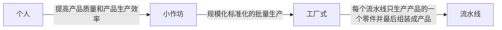
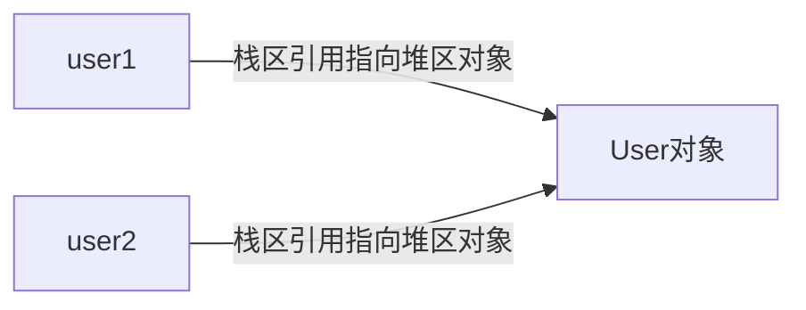
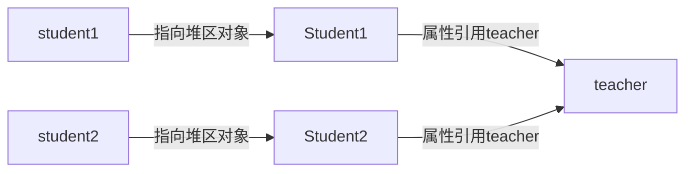
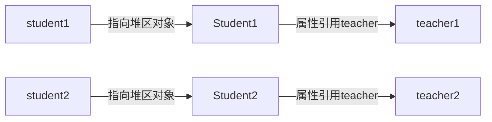
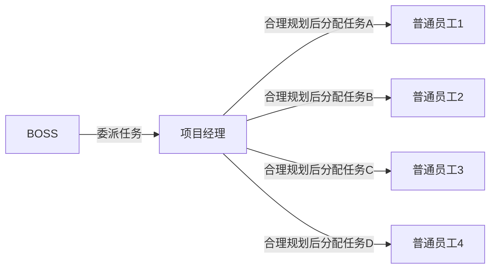
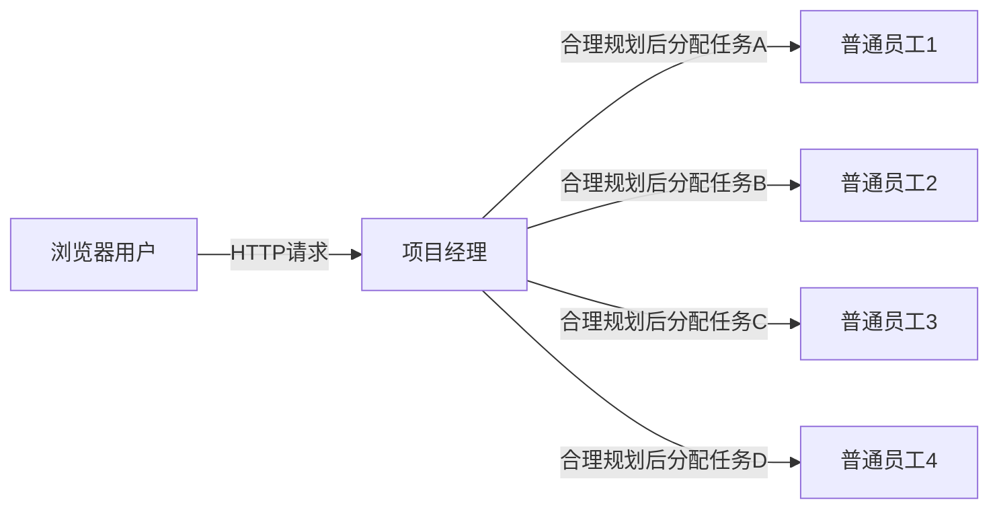

设计模式的目的是解决一些代表性的问题。不同的设计模式解决了不同的应用场景下的问题。23种设计模式分为三大类：

1. 创建型
2. 结构类
3. 行为类

但除了23种设计模式之外还有其他的设计模式。比如下面要说的简单工厂模式、委派模式等。

设计模式通常来源于生活，反过来帮助我们更好的生活。经验的总结。

设计模式：提高可读性、可扩展性、降低维护成本、解决复杂的业务问题。 

不要死记硬背，要结合生活实际案例，理解应用场景。

设计模式从来不是单一使用的，都是组合使用的。

> 小浣熊的总结：设计模式是经验的总结，灵感来源于生活，目的是解决实际的问题，便于扩展和维护。

# 工厂模式（Factory）
本章目的：理解工厂模式是什么。有什么作用。如何实现工厂模式。工厂模式的应用场景有哪些？
> 1. 工厂模式就是将对象的创建和管理交由工厂来实现。用户只需要得到结果，不需要知道过程。比较好的符合开闭原则、依赖倒装原则、合成复用原则等。
> 2. 工厂模式的作用是：1-将每一个实现类进行封装隔离，使得用户只需要关注接口和工厂，而不会把具体实现暴露给用户。2-易于扩展，而不影响到原本的功能。3-解决了用户接口选择的问题。

在学习工厂模式之前，我们要清楚我们使用接口的目的是什么。是“封装隔离”，通过封装行为的方式，将实现类的具体行为和用户隔离开来，用户只需要知道接口，不需要知道具体的实现。至于为什么使用接口不直接使用实现类的目的，那就是另外一个问题了，在此，我们默认使用接口才是最规范正确的。然后我们来看一下以下代码：
```
/**
 * 接口
 */
public interface Api {
    void api();
}
/**
 * 实现类
 */
public class Impl implements Api {
    public void api() {
        System.out.println("测试类");
    }
}
/**
 * 客户端
 */
public class Client {
    public static void main(String[] args) {
        Api api = new Impl();
        api.api();
    }
}
```
### 有什么问题呢？

这个时候我们发现了什么？我们在使用的过程中，既需要知道接口类，又需要知道实现类，我们发现怎么使用了接口变得更麻烦了。本来只需要知道一个，现在需要两个。而且实现类越多，你需要知道的也就越多，你必须知道所有的实现类，才能够完成一些功能。而且这个情况只体现了java的多态，并没有体现出“封装隔离”。

根据我们之前说的接口的目的是为了“封装隔离”，而上述情况却并没有让我们和具体的实现隔离开来，这显然是不对的。那么我们怎么才能将具体实现隔离呢？

我们面临了这么一个问题：** 我们只知道接口，但不知道具体的实现，该怎么办？**

这个时候就需要引入工厂了，上述问题的一个解决方案就是简单工厂模式。
> 简单工厂模式：将产品的生产依托给工厂，使用者并不关心生产的过程，只需要结果，产品可以是抽象类、接口、也可以是具体的类。    
> 简单工厂看似只是把new Impl()的行为放到了Factory类中，但实质上却有了质的区别。原本客户端直接创建实现类的方式，需要客户端知道所有的实现类。而使用了工厂之后，暴露给外部的只有接口和工厂，工厂内部知晓所有实现类是没问题的。完全的实现了封装隔离，降低了耦合。

```java
/**
 * 实现类A
 */
public class ImplA implements Api {
    public void api() {
        System.out.println("测试类A");
    }
}
/**
 * 实现类B
 */
public class ImplB implements Api {
    public void api() {
        System.out.println("测试类B");
    }
}
/**
 * 简单工厂
 */
public class ApiFactory {
    public static Api getApi(Integr type) {
        if(1 == type) {
            return new ImplA();
        } else if(2 == type) {
            return new ImplB();
        } else {
            return null;
        }
    }
}

/**
 * 客户端
 */
public class Client {
    public static void main(String[] args) {
        Api api = ApiFactory.getApi(1);
        api.api();
    }
}
```

举几个生活中的例子：流水线工厂（通过工厂生产产品）、银行（通过银行生产纸币）、学校（生产统一的知识）。      
这些都是大规模的批量化标准化统一化的生产。这是大的概念。然后再举个工厂的发展历史的例子：    


以上的发展历程说明的就是将产品的创建拆分成不同的组件并最后组合成一个。这就是工厂模式。      
这里解决了一个用户和产品之间的问题。    
在小作坊以前，所有人都要了解产品的全过程。每个人对生产的技巧都要全面掌握。有了小作坊之后，谁都可以开一个小作坊，张三开个作坊生产牛，李四开个作坊养猪，当张三想要吃猪肉的时候和李四换，他们可以相互交换，他们只需要掌握一种产品的生产。到了工厂之后，我们买牛奶的时候，我们不需要关心牛奶怎么生产，我们想买蒙牛就买蒙牛，想买特仑苏就买特仑苏。到了流水线，就是工厂内部的调整。  

> 小浣熊理解：工厂模式是为了解放双手，提供标准化统一化的产品生产。 

1. 什么是工厂模式
2. 工厂模式的好处
3. 工厂模式在项目中的应用

### 关于工厂模式并没有符合开闭原则的问题。

开闭原则是对扩展开放，对修改关闭。
1. 开闭原则中说的主语是谁？是针对谁而言，扩展开放，修改关闭？对工具的使用人员还是开发人员？
    - 针对使用人员而言，新增了产品，我要使用这个产品，那么我肯定是要修改的，所以针对使用人员而言，无所谓开闭原则。
    - 针对开发人员而言，新增了产品，如果我需要修改获取产品的方法，那么就不符合开闭原则，如果我不需要修改获取产品的方法，那么就符合开闭原则。
2. 工厂模式修改了代码为什么说符合开闭原则？
3. 为什么在if else 里面修改就叫修改，而在抽象类里面新增一个方法就不叫修改？
    - 在if else中修改那就是修改了，测试需要测试整个方法内部的逻辑。
    - 重新增加一个方法就叫做扩展，测试只需要测试新增的方法。
      不是修改了代码，就叫做“修改”，其实可持续性的修改就叫做扩展。


> tips：为什么需要抽象工厂模式而不是接口？比如 存在公共的实现统一国家标准      
> 用户自己生产牛奶--》用户去批发市场购买牛奶--》用户去专卖店购买牛奶--》用户去小卖部购买牛奶 

# 单例模式
本章目的：什么是单例模式？单例模式的作用是什么？如何实现单例模式？单例模式的应用场景是那些？
> 什么式单例模式：单例模式就是只实例化一个对象提供外界使用。    
> 作用是什么：单例模式的作用或者说目的是为了资源的共享复用。不再浪费资源。
> 单例模式的应用场景：配置信息、日历等常量或者不变的信息、监听器。

单例模式类型：
1. 饿汉式
    - 优点：
        - 效率高。
        - 线程安全
    - 缺点：
        - 以空间换时间。浪费内存资源。
2. 懒汉式
    - 无锁懒汉式
        - 优点
            - 效率高
            - 不会浪费内存资源
        - 缺点
            - 线程不安全
    - 同步锁懒汉式
        - 优点
            - 线程安全
            - 不会浪费内存资源
        - 缺点
            - 效率低
    - 内部类懒汉式
        - 优点
            - 线程安全
            - 不会浪费内存资源
            - 效率高
        - 缺点：无
3. 注册登记式
    - 枚举注册式
        - 优点
            - 线程安全
            - 不会浪费内存资源
            - 效率高
        - 缺点
            - 无法自定义逻辑代码
    - Map同步锁注册式
        - 优点
            - 线程安全
            - 不会浪费内存资源
        - 缺点
            - 效率低
4. 序列化式单例
    - 当我们将对象转换成字节流，进行传输，实现持久化之后。如果我想从持久化的文件中重新读取对象，那么默认就会重新创建一个对象。而序列化式单例就解决了这个问题，反序列化过程仍然是之前创建的那个对象。

# 原型模式（Prototye）
本章目的：什么是原型模式？原型模式的目的是什么？怎么实现原型模式？
> 原型模式就是复制实例属性的模式。有各种不同的实现形式，比如直接对象那个赋值、比如反射、比如实现JDK的clone接口、比如序列化。具体分为浅拷贝和深拷贝。
> 原型模式的目的是为了克隆属性。

1. JDK的clonable接口实现浅克隆
    - 效率最高，但需要进行实现Clonenable接口，不利于扩展。
2. 反射实现浅拷贝
    - 缺点：效率稍低
    - 优点
        - 不需要修改代码
3. 序列化和反序列化实现深克隆
    - 缺点：效率最低
    - 优点
        - 不需要修改代码
        - 实现了深克隆

#### 每种复制方式的性能测试
系统环境：
- 操作系统：10.14.2
- CPU：2.9 GHz Intel Core i5
- 内存：8 GB 1867 MHz DDR3

| 循环次数 | 拷贝类型             | 验证次数 | 平均总耗时（ms） |
| -------- | -------------------- | -------- | ---------------- |
| 20000    | 手写程序每个属性拷贝 | 4        | 9.5              |
| 20000    | JDK浅拷贝            | 3        | 13.33            |
| 20000    | SpringBeanUtil浅拷贝 | 4        | 523.75           |
| 20000    | 序列化深拷贝         | 3        | 2736.33          |

上述验证得出：手动每个属性每个属性的复制是最快的（浅复制），JDK的浅复制其次，然后是反射复制，最慢的是序列化复制。

spring中的原型模式大部分都是用反射实现。    
spring中有`scope = 'prototype'`，这句话的目的就是把对象的依赖关系，在每次使用对象之前，都对重新创建一个对象，并且将依赖关系完整的赋值给新的对象。        
spring默认是单例模式。      


#### 1. 引用拷贝
```
User user1 = new User();
User user2 = user1;
```



引用拷贝只指向堆区的一个对象。

#### 2. 对象拷贝
```
User user1 = new User();
User user2 = user1.clone();
```
```
graph LR
user1--栈区引用指向堆区对象-->User对象1
user2--栈区引用指向堆区对象-->User对象2
```
对象拷贝指向堆区的不同对象。    
***注：深拷贝和浅拷贝都只是描述对象拷贝***      
##### 2.1 浅拷贝
> 定义：所有属性的值相同，并且属性中所有指向其他对象的引用仍然指向原来的对象。    

比如Student对象有个属性teacher引用了Teacher对象。浅拷贝不会重新引用新的Teacher对象。 



##### 2.2 深拷贝
比如Student对象有个属性teacher引用了Teacher对象。深拷贝会重新引用新的Teacher对象。  



> tips：数据模型通常有DTO、VO、Entity、POJO等结尾。其中DTO是Service层的数据模型，VO是Web层，Entity和POJO是Dao层。


# 代理模式（Proxy）
学习目标：代理模式是什么？有什么作用？原理是什么？应用场景有哪些？
> 代理模式是什么：代理模式就是将自己不想做但又不得不做的一部分交由代理去完成的一种开发设计模式。        
> 作用是什么：作用就是将部分功能通过代理完成，而不是自己。      
> 原理（以JDK动态代理为例）：1. 代理类拥有被代理类的引用和类信息以及实现的所有接口。2. Java Proxy通过动态生成一个继承了Proxy并实现了被代理类所有接口的代理类。这个代理类重写了所有接口的方法，并通过一个叫做invocationHandler的执行处理器通过反射调用目标类的方法。3. 将这个动态类进行编译JavaCompiler。4. 将编译后的字节码存入JVM内存中 ByteArrayOutputStr。5. 返回给用户。        
> 场景：日志、缓存等。  

顾名思义：将自己的一部分功能交由其他人来做。
> 作用：解耦、AOP、拦截、中介、媒婆、黄牛、专人做专事、自己不想做又不得不做的事。

静态代理和动态代理的区别在于：
1. 静态代理在代理之前都是已知的。（人工）
2. 动态代理在代理之前，所有的东西都是未知的，只有运行的时候，采取加载是否代理。（自动化）

#### 动态代理原理
**！！！！！！！！！！！！！！！！！！！！！！！！！！！！！！这是重点！！！！！！！！！！！！！！！！！！！！！！！！！！！！！！！**


**动态代理不论是JDK代理还是CGLIB代理。其原理都是通过字节码重组实现的。一般分为这么几个步骤。拿JDK的举个例子。**

```
1. 代理类获得被代理类的引用和所有接口信息
2. 然后Proxy会自动生成一个临时动态类继承Proxy类和实现了代理类所有接口方法。
3. 编译这个java类成class文件。
4. 将这个class文件中的内容读取到JVM中，并返回给用户。
```

**！！！！！！！！！！！！！！！！！！！！！！！！！！！！！！这是重点！！！！！！！！！！！！！！！！！！！！！！！！！！！！！！！**

以下是JVM中的动态类。动态类继承了Proxy类和实现了代理类的所有接口方法。并通过Proxy中的InvocationHandler对象执行具体方法。用户或者框架实现一个InvocationHandler类，在对应的invoke方法里面调用代理类方法前后做相应的操作。

```
//
// Source code recreated from a .class file by IntelliJ IDEA
// (powered by Fernflower decompiler)
//

import java.lang.reflect.InvocationHandler;
import java.lang.reflect.Method;
import java.lang.reflect.Proxy;
import java.lang.reflect.UndeclaredThrowableException;
import org.raccoon.design.proxy.dynamic.jdk.Jack;

public final class $Proxy4 extends Proxy implements Jack {
    private static Method m1;
    private static Method m10;
    private static Method m2;
    private static Method m5;
    private static Method m4;
    private static Method m7;
    private static Method m6;
    private static Method m3;
    private static Method m9;
    private static Method m11;
    private static Method m0;
    private static Method m8;

    public $Proxy4(InvocationHandler var1) throws  {
        super(var1);
    }

    public final boolean equals(Object var1) throws  {
        try {
            return (Boolean)super.h.invoke(this, m1, new Object[]{var1});
        } catch (RuntimeException | Error var3) {
            throw var3;
        } catch (Throwable var4) {
            throw new UndeclaredThrowableException(var4);
        }
    }

    public final void notify() throws  {
        try {
            super.h.invoke(this, m10, (Object[])null);
        } catch (RuntimeException | Error var2) {
            throw var2;
        } catch (Throwable var3) {
            throw new UndeclaredThrowableException(var3);
        }
    }

    public final String toString() throws  {
        try {
            return (String)super.h.invoke(this, m2, (Object[])null);
        } catch (RuntimeException | Error var2) {
            throw var2;
        } catch (Throwable var3) {
            throw new UndeclaredThrowableException(var3);
        }
    }

    public final void buyHouse() throws  {
        try {
            super.h.invoke(this, m5, (Object[])null);
        } catch (RuntimeException | Error var2) {
            throw var2;
        } catch (Throwable var3) {
            throw new UndeclaredThrowableException(var3);
        }
    }

    public final void rentHouse() throws  {
        try {
            super.h.invoke(this, m4, (Object[])null);
        } catch (RuntimeException | Error var2) {
            throw var2;
        } catch (Throwable var3) {
            throw new UndeclaredThrowableException(var3);
        }
    }

    public final void wait(long var1) throws InterruptedException {
        try {
            super.h.invoke(this, m7, new Object[]{var1});
        } catch (RuntimeException | InterruptedException | Error var4) {
            throw var4;
        } catch (Throwable var5) {
            throw new UndeclaredThrowableException(var5);
        }
    }

    public final void wait(long var1, int var3) throws InterruptedException {
        try {
            super.h.invoke(this, m6, new Object[]{var1, var3});
        } catch (RuntimeException | InterruptedException | Error var5) {
            throw var5;
        } catch (Throwable var6) {
            throw new UndeclaredThrowableException(var6);
        }
    }

    public final void findJob() throws  {
        try {
            super.h.invoke(this, m3, (Object[])null);
        } catch (RuntimeException | Error var2) {
            throw var2;
        } catch (Throwable var3) {
            throw new UndeclaredThrowableException(var3);
        }
    }

    public final Class getClass() throws  {
        try {
            return (Class)super.h.invoke(this, m9, (Object[])null);
        } catch (RuntimeException | Error var2) {
            throw var2;
        } catch (Throwable var3) {
            throw new UndeclaredThrowableException(var3);
        }
    }

    public final void notifyAll() throws  {
        try {
            super.h.invoke(this, m11, (Object[])null);
        } catch (RuntimeException | Error var2) {
            throw var2;
        } catch (Throwable var3) {
            throw new UndeclaredThrowableException(var3);
        }
    }

    public final int hashCode() throws  {
        try {
            return (Integer)super.h.invoke(this, m0, (Object[])null);
        } catch (RuntimeException | Error var2) {
            throw var2;
        } catch (Throwable var3) {
            throw new UndeclaredThrowableException(var3);
        }
    }

    public final void wait() throws InterruptedException {
        try {
            super.h.invoke(this, m8, (Object[])null);
        } catch (RuntimeException | InterruptedException | Error var2) {
            throw var2;
        } catch (Throwable var3) {
            throw new UndeclaredThrowableException(var3);
        }
    }

    static {
        try {
            m1 = Class.forName("java.lang.Object").getMethod("equals", Class.forName("java.lang.Object"));
            m10 = Class.forName("org.raccoon.design.proxy.dynamic.jdk.Jack").getMethod("notify");
            m2 = Class.forName("java.lang.Object").getMethod("toString");
            m5 = Class.forName("org.raccoon.design.proxy.dynamic.jdk.Jack").getMethod("buyHouse");
            m4 = Class.forName("org.raccoon.design.proxy.dynamic.jdk.Jack").getMethod("rentHouse");
            m7 = Class.forName("org.raccoon.design.proxy.dynamic.jdk.Jack").getMethod("wait", Long.TYPE);
            m6 = Class.forName("org.raccoon.design.proxy.dynamic.jdk.Jack").getMethod("wait", Long.TYPE, Integer.TYPE);
            m3 = Class.forName("org.raccoon.design.proxy.dynamic.jdk.Jack").getMethod("findJob");
            m9 = Class.forName("org.raccoon.design.proxy.dynamic.jdk.Jack").getMethod("getClass");
            m11 = Class.forName("org.raccoon.design.proxy.dynamic.jdk.Jack").getMethod("notifyAll");
            m0 = Class.forName("java.lang.Object").getMethod("hashCode");
            m8 = Class.forName("org.raccoon.design.proxy.dynamic.jdk.Jack").getMethod("wait");
        } catch (NoSuchMethodException var2) {
            throw new NoSuchMethodError(var2.getMessage());
        } catch (ClassNotFoundException var3) {
            throw new NoClassDefFoundError(var3.getMessage());
        }
    }
}

```

# 策略模式（Strategy）
> 目标：什么是策略模式？策略模式解决了什么问题？

1. 什么是策略模式？
    - 策略模式是为用户提供了多种策略方案来解决一样的目的的一种设计思路。
2. 解决了什么问题？
    - 解决了用户选择的问题。就比如出去旅行，可以通过大巴、火车、飞机、船只等方式出行，目的地是一致的。

> 小对比：      
> 策略模式和工厂模式都解决了用户的选择问题。那么他们有什么区别吗？          
> 虽然都解决了用户的选择问题，并且甚至在代码实现上都没有什么区别，但是思想上还是有差别的。      
> 策略模式讲的是提供了不同的策略方案以便于实现一样的目的。它侧重的是过程的不同，结果的一致。        
> 工厂模式讲的是提供一致的入口（即工厂），给予用户不同的产品（实现类）。它侧重的是结果的不同。

应用场景：比较器、旅行路线、不同的支付方式、固定算法。用户只有选择的余地，没有具体修改操作的余地。

# 模板模式（Template）
> 目标：模板模式是什么？解决了什么问题？有哪些应用场景？

1. 模板模式是什么？
    - 模板模式是在一个固定流程的模板中只提供给用户一个入口进行修改，便携自己的业务逻辑。
2. 模板模式解决了什么问题？
    - 解决了固定流程下需要部分自定义的问题。
3. 模板模式有哪些应用场景？
    - JDBC（创建连接、创建声明、执行语句返回结果集、解析结果集、关闭结果集、关闭声明、关闭连接）其中解析结果集提供用户自定义。
    - 事务处理（开启事务、具体业务逻辑、关闭事务）
    - P2P投资（本地绑卡、开户绑卡（三方）、充值、支付（三方）、购买）。开户绑卡和支付可以作为一个固定不变的（当然实际上不是），本地绑卡和充值、购买是我们自定义的。

模板模式是解决固定流程内部分方法自定义的问题。比如说吃饭的场景，会有以下步骤。      
生火->做饭->吃饭        
在这个步骤在，我们可以自定义做饭这个方法，来定制不同的菜肴，生火和吃饭都是固定不变的。      

比如P2P投资也是有固定流程的：   
本地绑卡->三方绑卡->本地充值->支付->本地购买        

> 小对比：

1. 策略模式：
    - 策略模式的重点是选择权。由用户自己选择已经存在的固定算法。
2. 模板模式：
    - 模板模式的重点是没得选择，但可以参与某一部分的自定义。但无法改变固定的流程。


# 委派模式（Delegate）
> 目标：委派模式是什么？作用是什么？有什么场景？

1. 委派模式是什么？
    - 委派模式是策略模式和代理模式的集合。
2. 作用
    - 解决客户选择的问题。
3. 场景
    - Spring的DispacherServlet。

委派模式有点像代理模式，又有点像策略模式。      
应用场景

代理模式：部分代理。代理人做的只是被代理人不想做但不得不做的部分事情，主要业务还是由被代理人自己完成。      
委派模式：全权代理。代理人完全完成被代理人的所有事情。      

比如说




项目经理：在老板眼里，他负责干活。实际上只负责类似于调度的工作，分配任务。

重要特征：项目经理分配任务之前，他要做一个权衡（选择），类似于策略模式。

所谓的委派模式就是代理模式和策略模式的特殊组合。


> 小知识点：在Spring中以Delegate和Dispatcher结尾的类都采用了委派模式。


# 适配器模式（Adapter）
> 目标：什么是适配器模式？什么场景使用？

1. 适配器的目的是什么？
    - 为了兼容老版本代码。

老的系统很稳定了，但为了兼容新的需求和功能，不得不使用适配器模式来实现向下兼容。

一般以Adapter命名

# 装饰器模式（Decorator）
> 目标：什么是装饰器模式？

1. 什么是装饰器模式？
    - 是一种特殊的适配器模式
    - 为了实现类在不修改原有类的基础上进行扩展覆盖和新增方法。该实现保持和原有类的层级关系。

适配器模式：    
1. 为了兼容老代码。向下兼容
2. 适配器模式可以不保留层级关系
3. 通常采用代理和继承形式进行包装
4. 满足has-a的关系
5. 注重的是兼容和转换

装饰器模式：    
1. 装饰器模式是一种非常特殊的适配器模式。
2. 装饰器模式保留层级关系
3. 装饰器模式中装饰者和被装饰者都要实现同一个接口，主要目的是为了扩展，依旧保留OOP关系。
4. 保留is-a的关系
5. 注重的是覆盖和扩展

场景：DataSource、IO流。Spring中以Decorator或者Wrapper都是装饰器模式

# 观察者模式
发布者（publish）和订阅者（subscribe）  

观察者模式的主语是订阅方。目的是显现解耦。

通过代理模式和组合实现观察者模式。

观察者接口、被观察者接口、观察者实体类、被观察者实体类。

1. 将观察者注入到被观察者实例中
2. 被观察者对象通过代理模式获取，并在InvocationHandler的invoke方法中执行被观察者的方法并调用观察者的方法。

# Spring中的编程思想前瞻
带着架构师而不是开发者的思维去理解下面的思想。
## AOP（面向切面编程）
动态代理只是AOP的一种技术实现手段。AOP只是一种编程思想。动态代理这个技术刚好满足这一编程思想。

1. 特点
    - 找出多个不同类中相同的规则，在开发的时候区分开来，在运行的时候组合起来。
2. 解决了什么问题
    - 解耦
    - 专人做专事
    - 制定规则

## OOP（面向对象编程）
归纳总结所有事务，一切皆对象。用代码去描述这个世界就是OOP。     
封装、继承、多态。

## BOP（面向bean编程）
Bean和Bean之间的关系，不希望每次都手动管理。由程序来自动管理。Spring开始是由Bean的管理开始的

## IOC（控制反转）
解决了对象创建管理的问题。  

将对象的创建和销毁交由spring统一管理，而不是自己管理。所以才有了IOC容器（Map）。

## DI（依赖注入）
解决了动态赋值的问题。

动态调用get、set方法（通常使用反射）（此处使用反射不要担心性能问题，源码解析时会讲解）。

有了IOC，对象由spring管理创建，接下来就将spring管理的对象赋值给引用。spring不仅管理对象的创建和销毁，还管理对象和对象之间的关系。

先理清关系再注入。