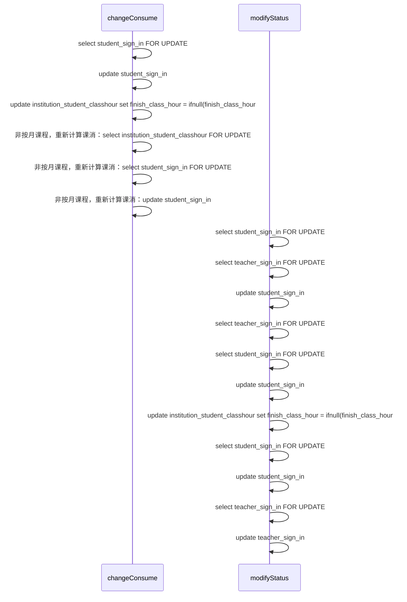
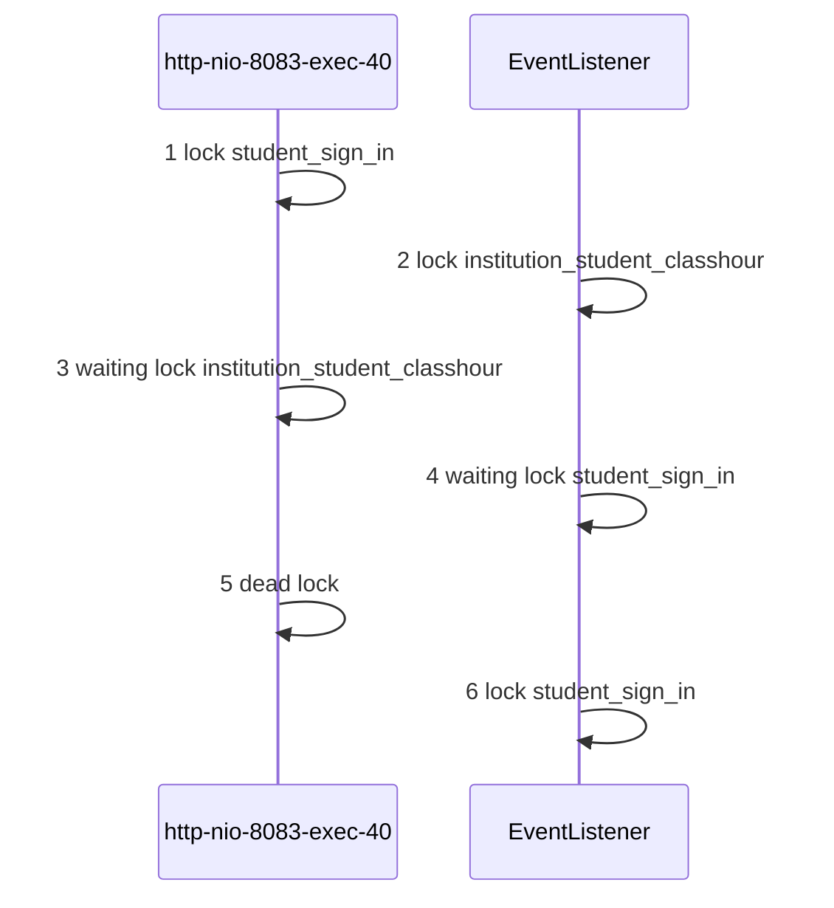

# 记一次奇异的mysql死锁问题

阿楚人像摄影课

小樱妙妙

发生时间：16:35:54


## 死锁产生

```json
{
  timestamp: "1555494346507", 
  status: 500, 
  error: "Internal Server Error",
  exception: "org.springframework.dao.DeadlockLoserDataAccessException",
  message: "↵### Error updating database.  Cause: com.mysql.jdbc.exceptions.jdbc4.MySQLTransactionRollbackException: Deadlock found when trying to get lock; try restarting transaction↵### The error may involve defaultParameterMap↵### The error occurred while setting parameters↵### SQL: update institution_student_classhour         set finish_class_hour = ifnull(finish_class_hour,0) + ?,                       init_class_consume=ifnull(init_class_consume,0)+?,                                 init_class_hour=ifnull(init_class_hour,0)+?,                   del_lock=1,         gmt_modify = now()         where course_id = ?         and student_id in          (               ?          )          and course_fee_type in (1,2)↵### Cause: com.mysql.jdbc.exceptions.jdbc4.MySQLTransactionRollbackException: Deadlock found when trying to get lock; try restarting transaction↵; SQL []; Deadlock found when trying to get lock; try restarting transaction; nested exception is com.mysql.jdbc.exceptions.jdbc4.MySQLTransactionRollbackException: Deadlock found when trying to get lock; try restarting transaction" 
}
```

## 分析MySQL日志

当我看到异常的时候，发现发生了死锁，首先去数据库查看死锁相关日志。

```mysql
show engine innodb status\G
```

得到了一下信息

```verilog
------------------------
LATEST DETECTED DEADLOCK
------------------------
2019-04-28 16:35:54 0x2b35f4081700
*** (1) TRANSACTION:
TRANSACTION 6669450, ACTIVE 2 sec starting index read
mysql tables in use 1, locked 1
LOCK WAIT 17 lock struct(s), heap size 1136, 18 row lock(s), undo log entries 15
MySQL thread id 11638758, OS thread handle 47514753963776, query id 134840522 10.1.64.225 xiaomai statistics
SELECT /* UseMaster=false */  id,student_id,teacher_id,class_id,class_name,class_hour,status,gmt_create,gmt_modify,inst_id,sign_id,course_type,course_id,sign_date,makeup_status,checked_class_hour,student_temp_status,sign_rule,price,remark,course_fee_type,is_trial,del,leave_type,is_leave_consume,teacher_ids,class_room_id,class_room_name,extra_time,sign_remark,remedial_sign_status,remedial_sign_in_id  FROM student_sign_in  WHERE       (  id in
              (
                158731
              ) ) FOR UPDATE
*** (1) WAITING FOR THIS LOCK TO BE GRANTED:
RECORD LOCKS space id 276 page no 4099 n bits 144 index PRIMARY of table `xiaomai`.`student_sign_in` trx id 6669450 lock_mode X locks rec but not gap waiting
Record lock, heap no 76 PHYSICAL RECORD: n_fields 38; compact format; info bits 0
 0: len 8; hex 8000000000026c0b; asc       l ;;
 1: len 6; hex 00000065c488; asc    e  ;;
 2: len 7; hex 66000002b70ebf; asc f      ;;
 3: len 8; hex 8e8d046491000060; asc    d   `;;
 4: SQL NULL;
 5: len 8; hex 8e8d042db1800060; asc    -   `;;
 6: len 21; hex e998bfe6a59ae4babae5838fe69184e5bdb1e8afbe; asc                      ;;
 7: len 4; hex 80000064; asc    d;;
 8: len 4; hex 80000005; asc     ;;
 9: len 5; hex 99a2b91432; asc     2;;
 10: len 5; hex 99a2f908f4; asc      ;;
 11: len 8; hex 8d8dc32674c00064; asc    &t  d;;
 12: len 30; hex 35353335393064302d643736372d343634632d623536362d306136326238; asc 553590d0-d767-464c-b566-0a62b8; (total 36 bytes);
 13: len 4; hex 80000003; asc     ;;
 14: len 8; hex 8e8d04111a000060; asc        `;;
 15: len 5; hex 99a2b25000; asc    P ;;
 16: len 4; hex 80000001; asc     ;;
 17: len 4; hex 80000000; asc     ;;
 18: len 4; hex 80000000; asc     ;;
 19: len 4; hex 80000002; asc     ;;
 20: len 4; hex 80000000; asc     ;;
 21: len 0; hex ; asc ;;
 22: len 4; hex 80000002; asc     ;;
 23: SQL NULL;
 24: SQL NULL;
 25: SQL NULL;
 26: len 1; hex 80; asc  ;;
 27: len 4; hex 80000000; asc     ;;
 28: SQL NULL;
 29: len 4; hex 80000000; asc     ;;
 30: len 19; hex 31303438343939303039383030333732333230; asc 1048499009800372320;;
 31: len 8; hex 8000000000000000; asc         ;;
 32: SQL NULL;
 33: len 5; hex 99a2f8b9e9; asc      ;;
 34: SQL NULL;
 35: len 4; hex 80000002; asc     ;;
 36: SQL NULL;
 37: SQL NULL;

*** (2) TRANSACTION:
TRANSACTION 6669448, ACTIVE 2 sec starting index read
mysql tables in use 1, locked 1
4 lock struct(s), heap size 1136, 2 row lock(s), undo log entries 1
MySQL thread id 11638765, OS thread handle 47510727431936, query id 134840562 10.1.64.225 xiaomai updating
update institution_student_classhour
        set finish_class_hour = ifnull(finish_class_hour,0) + -100,
         
            init_class_consume=ifnull(init_class_consume,0)+0,
         
         
            init_class_hour=ifnull(init_class_hour,0)+0,
         
        del_lock=1,
        gmt_modify = now()
        where course_id = 1048498759744356448
        and student_id in
         (  
            1048499118223130720
         ) 
        and course_fee_type in (1,2)
*** (2) HOLDS THE LOCK(S):
RECORD LOCKS space id 276 page no 4099 n bits 144 index PRIMARY of table `xiaomai`.`student_sign_in` trx id 6669448 lock_mode X locks rec but not gap
Record lock, heap no 76 PHYSICAL RECORD: n_fields 38; compact format; info bits 0
 0: len 8; hex 8000000000026c0b; asc       l ;;
 1: len 6; hex 00000065c488; asc    e  ;;
 2: len 7; hex 66000002b70ebf; asc f      ;;
 3: len 8; hex 8e8d046491000060; asc    d   `;;
 4: SQL NULL;
 5: len 8; hex 8e8d042db1800060; asc    -   `;;
 6: len 21; hex e998bfe6a59ae4babae5838fe69184e5bdb1e8afbe; asc                      ;;
 7: len 4; hex 80000064; asc    d;;
 8: len 4; hex 80000005; asc     ;;
 9: len 5; hex 99a2b91432; asc     2;;
 10: len 5; hex 99a2f908f4; asc      ;;
 11: len 8; hex 8d8dc32674c00064; asc    &t  d;;
 12: len 30; hex 35353335393064302d643736372d343634632d623536362d306136326238; asc 553590d0-d767-464c-b566-0a62b8; (total 36 bytes);
 13: len 4; hex 80000003; asc     ;;
 14: len 8; hex 8e8d04111a000060; asc        `;;
 15: len 5; hex 99a2b25000; asc    P ;;
 16: len 4; hex 80000001; asc     ;;
 17: len 4; hex 80000000; asc     ;;
 18: len 4; hex 80000000; asc     ;;
 19: len 4; hex 80000002; asc     ;;
 20: len 4; hex 80000000; asc     ;;
 21: len 0; hex ; asc ;;
 22: len 4; hex 80000002; asc     ;;
 23: SQL NULL;
 24: SQL NULL;
 25: SQL NULL;
 26: len 1; hex 80; asc  ;;
 27: len 4; hex 80000000; asc     ;;
 28: SQL NULL;
 29: len 4; hex 80000000; asc     ;;
 30: len 19; hex 31303438343939303039383030333732333230; asc 1048499009800372320;;
 31: len 8; hex 8000000000000000; asc         ;;
 32: SQL NULL;
 33: len 5; hex 99a2f8b9e9; asc      ;;
 34: SQL NULL;
 35: len 4; hex 80000002; asc     ;;
 36: SQL NULL;
 37: SQL NULL;

*** (2) WAITING FOR THIS LOCK TO BE GRANTED:
RECORD LOCKS space id 205 page no 1412 n bits 384 index student_id_course_id_index of table `xiaomai`.`institution_student_classhour` trx id 6669448 lock_mode X locks rec but not gap waiting
Record lock, heap no 197 PHYSICAL RECORD: n_fields 4; compact format; info bits 0
 0: len 8; hex 8e8d046491000060; asc    d   `;;
 1: len 8; hex 8e8d04111a000060; asc        `;;
 2: len 4; hex 80000002; asc     ;;
 3: len 8; hex 8e8d0464a4000060; asc    d   `;;

*** WE ROLL BACK TRANSACTION (2)
------------
TRANSACTIONS
------------
Trx id counter 6670185
Purge done for trx's n:o < 6670184 undo n:o < 0 state: running but idle
History list length 37
LIST OF TRANSACTIONS FOR EACH SESSION:
---TRANSACTION 328974465189744, not started
0 lock struct(s), heap size 1136, 0 row lock(s)
---TRANSACTION 328974465187920, not started
0 lock struct(s), heap size 1136, 0 row lock(s)
---TRANSACTION 328974465187008, not started
0 lock struct(s), heap size 1136, 0 row lock(s)
---TRANSACTION 328974465186096, not started
0 lock struct(s), heap size 1136, 0 row lock(s)
---TRANSACTION 328974465182448, not started
0 lock struct(s), heap size 1136, 0 row lock(s)
---TRANSACTION 328974465174240, not started
0 lock struct(s), heap size 1136, 0 row lock(s)
---TRANSACTION 328974465173328, not started
0 lock struct(s), heap size 1136, 0 row lock(s)
---TRANSACTION 328974465188832, not started
0 lock struct(s), heap size 1136, 0 row lock(s)
---TRANSACTION 328974465175152, not started
0 lock struct(s), heap size 1136, 0 row lock(s)
---TRANSACTION 328974465185184, not started
0 lock struct(s), heap size 1136, 0 row lock(s)
---TRANSACTION 328974465184272, not started
0 lock struct(s), heap size 1136, 0 row lock(s)
---TRANSACTION 328974465181536, not started
0 lock struct(s), heap size 1136, 0 row lock(s)
---TRANSACTION 328974465180624, not started
0 lock struct(s), heap size 1136, 0 row lock(s)
---TRANSACTION 328974465179712, not started
0 lock struct(s), heap size 1136, 0 row lock(s)
---TRANSACTION 328974465178800, not started
0 lock struct(s), heap size 1136, 0 row lock(s)
---TRANSACTION 328974465177888, not started
0 lock struct(s), heap size 1136, 0 row lock(s)
---TRANSACTION 328974465176976, not started
0 lock struct(s), heap size 1136, 0 row lock(s)
---TRANSACTION 328974465176064, not started
0 lock struct(s), heap size 1136, 0 row lock(s)
---TRANSACTION 328974465183360, not started
0 lock struct(s), heap size 1136, 0 row lock(s)
--------
```

分析上述日志，得出以下结论：

- tx1 : student_sign_in for update 持有当前锁
- tx2 : institution_student_classhour 持有当前锁
- tx2 : student_sign_in for update 等待当前锁
- tx1 : update institution_student_classhour 想要获得锁，造成死锁


## 分析代码逻辑

光看mysql日志只能知道哪几条sql导致了死锁，然后需要查看SQL所对应的业务代码存在哪些问题。而且根据死锁发生的前提条件来分析。

- 互斥条件：每个资源一次只能一个事务线程使用
- 请求与保持条件：一个请求因为资源阻塞时，对于已占有的资源保持不放
- 循环等待


代码逻辑如下：



梳理了代码逻辑之后发现并不满足上述的循环等待的条件。

看代码解决不了问题，证明肯定存在其他的线程执行的代码和此处的代码存在竞争关系。光看爆出死锁相关的代码解决不了问题。

因此我在每一个加锁的代码上添加日志，每一条日志对应一个不同的编号。然后发布到测试环境重现死锁。（很多业务场景的死锁是很难重现的，幸亏我遇到的这个死锁场景比较容易重现）

重现之后，就要梳理代码日志了。

## 梳理代码日志

查看代码日志，罗列了几个主要的时间点对应的线程添加的锁。

| 时间点       | 线程                  | 添加的行锁                                 |
| ------------ | --------------------- | ------------------------------------------ |
| 16:35:52.844 | http-nio-8083-exec-40 | lock student_sign_in                       |
| 16:35:52.892 | EventListener#5-0-C-1 | lock institution_student_classhour         |
| 16:35:52.918 | http-nio-8083-exec-40 | waiting lock institution_student_classhour |
| 16:35:54.369 | http-nio-8083-exec-40 | dead lock 发生死锁                         |
| 16:35:54.751 | EventListener#5-0-C-1 | lock student_sign_in                       |

根据上述日志信息，发现线程 http-nio-8083-exec-40 发生了死锁。而在发生死锁之前，添加了student_sign_in的行锁，线程 EventListener#5-0-C-1 添加了institution_student_classhour行锁，此时线程http-nio-8083-exec-40尝试添加institution_student_classhour的行锁就需要等待，但还未发生死锁。之后发现在发生死锁之后线程EventListener#5-0-C-1获得了student_sign_in行锁，可以分析得出，线程 EventListener#5-0-C-1 在发生死锁之前肯定也是在尝试获取student_sign_in的行锁。执行顺序如下图：




到此，可以知道这两个线程针对institution_student_classhour和student_sign_in的加锁顺序不同导致了死锁。然后通过日志找到线程对应的代码，统一加锁顺序就可以解决这个问题。

终于，死锁问题被解决了。