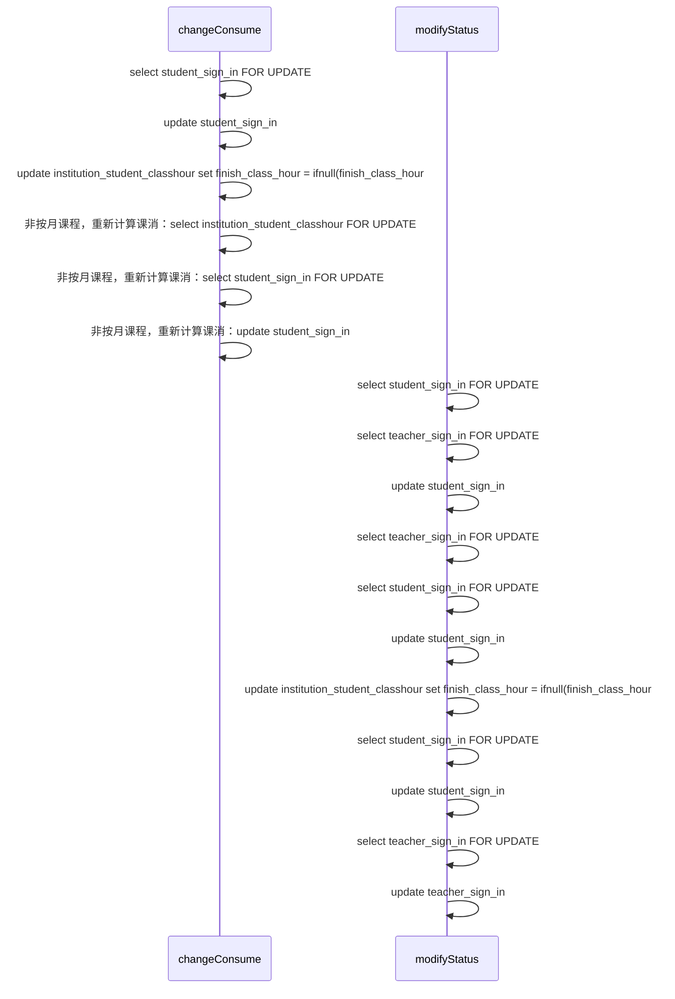

```yaml
title: 记一次奇异的mysql死锁问题
date: 2019-04-19 10:55:56
tags: 问题
categories: 问题
```


# 记一次奇异的mysql死锁问题

## 死锁产生

```json
{
  timestamp: "1555494346507", 
  status: 500, 
  error: "Internal Server Error",
  exception: "org.springframework.dao.DeadlockLoserDataAccessException",
  message: "↵### Error updating database.  Cause: com.mysql.jdbc.exceptions.jdbc4.MySQLTransactionRollbackException: Deadlock found when trying to get lock; try restarting transaction↵### The error may involve defaultParameterMap↵### The error occurred while setting parameters↵### SQL: update institution_student_classhour         set finish_class_hour = ifnull(finish_class_hour,0) + ?,                       init_class_consume=ifnull(init_class_consume,0)+?,                                 init_class_hour=ifnull(init_class_hour,0)+?,                   del_lock=1,         gmt_modify = now()         where course_id = ?         and student_id in          (               ?          )          and course_fee_type in (1,2)↵### Cause: com.mysql.jdbc.exceptions.jdbc4.MySQLTransactionRollbackException: Deadlock found when trying to get lock; try restarting transaction↵; SQL []; Deadlock found when trying to get lock; try restarting transaction; nested exception is com.mysql.jdbc.exceptions.jdbc4.MySQLTransactionRollbackException: Deadlock found when trying to get lock; try restarting transaction" 
}
```

## 分析MySQL日志

当我看到异常的时候，发现发生了死锁，首先去数据库查看死锁相关日志。

```mysql
show engine innodb status\G
```

得到了一下信息

```verilog
=====================================
2019-04-18 15:03:31 0x2b3714081700 INNODB MONITOR OUTPUT
=====================================
Per second averages calculated from the last 54 seconds
-----------------
BACKGROUND THREAD
-----------------
srv_master_thread loops: 1233548 srv_active, 0 srv_shutdown, 13897331 srv_idle
srv_master_thread log flush and writes: 15130879
----------
SEMAPHORES
----------
OS WAIT ARRAY INFO: reservation count 249169
OS WAIT ARRAY INFO: signal count 6705941
RW-shared spins 0, rounds 4667959, OS waits 131410
RW-excl spins 0, rounds 7439448, OS waits 58022
RW-sx spins 70887, rounds 2711483, OS waits 14036
Spin rounds per wait: 4667959.00 RW-shared, 7439448.00 RW-excl, 38.25 RW-sx
------------------------
LATEST DETECTED DEADLOCK
------------------------
2019-04-18 14:34:31 0x2b3570081700
*** (1) TRANSACTION:
TRANSACTION 6161411, ACTIVE 2 sec starting index read
mysql tables in use 1, locked 1
LOCK WAIT 7 lock struct(s), heap size 1136, 4 row lock(s), undo log entries 1
MySQL thread id 10969582, OS thread handle 47506499573504, query id 127296858 updating
update institution_student_classhour
        set finish_class_hour = ifnull(finish_class_hour,0) + -100,
         
            init_class_consume=ifnull(init_class_consume,0)+0,
         
         
            init_class_hour=ifnull(init_class_hour,0)+0,
         
        del_lock=1,
        gmt_modify = now()
        where course_id = 1048498759744356448
        and student_id in
         (  
            1048499118223130720
         ) 
        and course_fee_type in (1,2)
*** (1) WAITING FOR THIS LOCK TO BE GRANTED:
RECORD LOCKS space id 205 page no 1412 n bits 384 index student_id_course_id_index of table `institution_student_classhour` trx id 6161411 lock_mode X locks rec but not gap waiting
Record lock, heap no 197 PHYSICAL RECORD: n_fields 4; compact format; info bits 0
 0: len 8; hex 8e8d046491000060; asc    d   `;;
 1: len 8; hex 8e8d04111a000060; asc        `;;
 2: len 4; hex 80000002; asc     ;;
 3: len 8; hex 8e8d0464a4000060; asc    d   `;;

*** (2) TRANSACTION:
TRANSACTION 6161414, ACTIVE 2 sec starting index read
mysql tables in use 1, locked 1
19 lock struct(s), heap size 1136, 20 row lock(s), undo log entries 17
MySQL thread id 10969585, OS thread handle 47508512839424, query id 127296922 statistics
SELECT /* UseMaster=false */  id,student_id,teacher_id,class_id,class_name,class_hour,status,gmt_create,gmt_modify,inst_id,sign_id,course_type,course_id,sign_date,makeup_status,checked_class_hour,student_temp_status,sign_rule,price,remark,course_fee_type,is_trial,del,leave_type,is_leave_consume,teacher_ids,class_room_id,class_room_name,extra_time,sign_remark,remedial_sign_status,remedial_sign_in_id  FROM student_sign_in  WHERE       (  id in
              (
                158843
              ) ) FOR UPDATE
*** (2) HOLDS THE LOCK(S):
RECORD LOCKS space id 205 page no 1412 n bits 384 index student_id_course_id_index of table `institution_student_classhour` trx id 6161414 lock_mode X locks rec but not gap
Record lock, heap no 197 PHYSICAL RECORD: n_fields 4; compact format; info bits 0
 0: len 8; hex 8e8d046491000060; asc    d   `;;
 1: len 8; hex 8e8d04111a000060; asc        `;;
 2: len 4; hex 80000002; asc     ;;
 3: len 8; hex 8e8d0464a4000060; asc    d   `;;

*** (2) WAITING FOR THIS LOCK TO BE GRANTED:
RECORD LOCKS space id 276 page no 4101 n bits 136 index PRIMARY of table `student_sign_in` trx id 6161414 lock_mode X locks rec but not gap waiting

*** WE ROLL BACK TRANSACTION (1)

```

分析上述日志，得出以下结论：

- tx1 : student_sign_in for update 持有当前锁
- tx2 : institution_student_classhour 持有当前锁
- tx2 : student_sign_in for update 等待当前锁
- tx1 : update institution_student_classhour 想要获得锁，造成死锁


## 分析代码逻辑

光看mysql日志只能知道哪几条sql导致了死锁，然后需要查看SQL所对应的业务代码存在哪些问题。而且根据死锁发生的前提条件来分析。

- 互斥条件：每个资源一次只能一个事务线程使用
- 请求与保持条件：一个请求因为资源阻塞时，对于已占有的资源保持不放
- 循环等待


代码逻辑如下：



梳理了代码逻辑之后发现并不满足上述的循环等待的条件。

分析到了这里我暂时不知道为什么会造成死锁了，跪求大神分析。